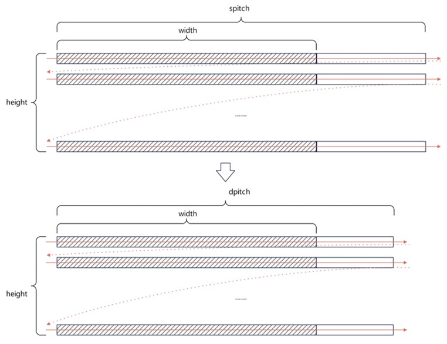

# KUPL开发指南<a name="ZH-CN_TOPIC_0000001889949310"></a>

-   **[概念介绍](#ZH-CN_TOPIC_0000001967070205)**  

-   **[使用指导](#ZH-CN_TOPIC_0000001933989017)**  

-   **[KUPL库函数说明](#ZH-CN_TOPIC_0000002043915589)**  

## 概念介绍<a name="ZH-CN_TOPIC_0000001967070205"></a>

鲲鹏统一并行加速库（Kunpeng Unified Parallel Library，以下简称KUPL）提供了基于鲲鹏平台优化的并行加速基础库函数，所有接口用C/C++、汇编语言实现。本加速库提供包括底层线程管理、任务调度、线程同步、内存申请、共享内存申请、共享内存通信、矩阵编程计算等在内的基础功能，充分发挥鲲鹏处理器的硬件特性，提供高性能的基础接口。

## 使用指导<a name="ZH-CN_TOPIC_0000001933989017"></a>

-   **[使用KUPL加速KML直接求解法](#ZH-CN_TOPIC_0000002076263470)**  

-   **[使用KUPL API进行并行计算加速](#ZH-CN_TOPIC_0000002111902621)**  

-   **[使用KUPL PROF进行全量的函数时序统计](#ZH-CN_TOPIC_0000002195783633)**  

### 使用KUPL加速KML直接求解法<a name="ZH-CN_TOPIC_0000002076263470"></a>

当前版本除了通过线程调度、任务分配等优化对数学库直接法求解器进行加速实现加速效果，还直接对外提供KUPL API进行使用从而提供并行加速能力。KML直接求解法ksolver已采用KUPL动态伸缩的能力对矩阵的部分求解过程进行加速优化，只需要在使用ksolver时通过环境变量的配置即可使能KUPL加速能力，具体使用方式如下。

1.  节点上安装HPCKit，依据《Kunpeng HPCKit 26.2.0 开发指南》编写ksolver\_testcase，编译ksolver\_testcase的时候链接HPCKit中的libksolver.so 。
2.  执行ksolver\_testcase二进制，设置环境变量KML\_DSS\_SCHE\_MODE=KUPL使能KUPL动态伸缩能力，该环境变量默认值为static，表示走静态调度策略，即不进行负载均衡优化。

    命令举例如下：

    ```
    KML_DSS_SCHE_MODE=KUPL OMP_PROC_BIND=close OMP_NUM_THREADS=64 taskset -c 0-63 ksolver_testcase
    ```

    > **说明：** 
    >如果没有出现如下回显信息，说明命令执行成功。出现如下回显的原因是下载HPCKit后，对so目录架构进行了修改。
    >```
    >[warn]: KUPL dynamic mode is not available, fallback to builtin dynamic mode
    >```

### 使用KUPL API进行并行计算加速<a name="ZH-CN_TOPIC_0000002111902621"></a>

KUPL当前对外优化特性分为三大模块，具体为众核并行、数据管理和矩阵编程：

-   众核并行模块对外提供了包含egroup、多线程编程、计算图编程、多队列多流编程等KUPL API用以多线程并行计算加速；
-   数据管理模块对外提供了包含内存管理、共享内存通信等KUPL API用以数据拷贝或通信加速；
-   矩阵编程模块对外提供了张量定义、张量计算等KUPL API用以加速矩阵乘计算。

具体上述KUPL特性模块的优化使能方式，可以参考[KUPL sample代码仓](https://gitcode.com/kunpengcompute/hpckit-sample/tree/main/kupl)。

KUPL sample代码仓中提供了一组使用KUPL优化特性的示例代码及特定场景KUPL最优实现代码，从而供用户快速上手使能KUPL特性。

KUPL sample的根目录包含4个顶层目录，分别对应众核并行模块、数据管理模块、矩阵编程模块及KUPL综合用例，每个模块的顶层目录再包含模块对应重点特性的用例目录，最终用例目录下挂载具体特性用例的sample代码、makefile及readme说明介绍。具体sample运行方式如下。

1.  节点上安装[HPCKit](https://www.hikunpeng.com/developer/hpc/hpckit-download)，HPCKit安装指导请参见《Kunpeng HPCKit 26.2.0 安装指南》。
2.  通过source setvars.sh加载毕昇版本KUPL动态链接库及其他所需环境变量。
3.  Git拉取KUPL sample代码仓代码至本地服务器上。

    **git clone https://gitcode.com/kunpengcompute/hpckit-sample.git**

    **cd kupl**

4.  编译运行KUPL sample代码仓代码，当前支持两种方式：
    -   一键式全量编译安装。
        1.  kupl目录下执行sh build.sh，在所有特性的目录下生成对应特性的可执行二进制。
        2.  根目录下执行如cd mt/graph/到KUPL某一具体特性的目录下。
        3.  执行make run运行生成的二进制得到运行结果。

    -   按需编译安装。
        1.  kupl目录下执行如cd mt/graph/到KUPL某一具体特性的目录下。
        2.  执行make命令令编译生成该特性对应的二进制文件。
        3.  执行make run命令运行生成的二进制得到运行结果。

### 使用KUPL PROF进行全量的函数时序统计<a name="ZH-CN_TOPIC_0000002195783633"></a>

KUPL对外提供profile和trace两个工具，来提供运行时的时序统计，通过动态链接到prof对应的动态链接库来使能profile和trace功能。

1.  节点上安装[HPCkit](https://www.hikunpeng.com/developer/hpc/hpckit-download)，HPCKit安装指导请参见《Kunpeng HPCKit 26.2.0 安装指南》
2.  通过setvars.sh --kupl\_mode=prof链接到prof动态链接库。
3.  运行程序时额外配置环境变量KUPL\_PROF\_LEVEL=statistic来开启特定的函数累计计时，KUPL\_PROF\_LEVEL=trace来开启全量的函数时序统计。
4.  程序运行结束时，如果配置了KUPL\_PROF\_LEVEL=statistic或 KUPL\_PROF\_LEVEL=trace则会在程序运行打印结尾生成函数累计计时profile报告（报告表头字段详情见[表1 函数累计计时profile报告的表头字段说明](#table23040407177)），如果配置了KUPL\_PROF\_LEVEL=trace还可以在程序运行目录下生成ptrace文件，其中包含各个进程中各个线程运行情况的统计文件（以.json文件保存），该文件可以通过chrome://tracing网页（请使用chrome 94以上版本的Chrome浏览器运行）来观看可视化版本报告（即把想要观看的文件导入进网页）。

    **表 1**  函数累计计时profile报告的表头字段说明

|信息名称|描述|
|--|--|
|thread_id|执行线程id|
|msg_id|函数信息号|
|msg|函数信息名称|
|sum(ms)|函数总耗时（毫秒）|
|count|函数执行次数|
|avg(ns)|函数平均耗时（纳秒）|
|max(ns)|函数单次最大耗时（纳秒）|
|min(ns)|函数单次最小耗时（纳秒）|


    **表 2**  函数累计计时profile报告的msg字段支持种类含义说明

|msg信息名称|函数行为|
|--|--|
|task_execute|提交给KUPL的任务执行耗时|
|task_finish|提交给KUPL的任务执行完毕后释放资源耗时|
|sched_add_taskbase|向KUPL底层Sched中提交任务耗时|
|sched_get_taskbase|从KUPL底层Sched中获取任务耗时|


    > **说明：** 
    >通过网页观看可视化版本报告建议使用Chrome浏览器。

## KUPL库函数说明<a name="ZH-CN_TOPIC_0000002043915589"></a>

-   **[函数说明](#ZH-CN_TOPIC_0000002111464725)**  

-   **[环境变量](#ZH-CN_TOPIC_0000002724392989)**  

-   **[函数定义](#ZH-CN_TOPIC_0000002076100294)**  

### 函数说明<a name="ZH-CN_TOPIC_0000002111464725"></a>

KUPL提供了基于鲲鹏平台优化的并行加速基础库函数，所有接口由C/C++、汇编语言实现。其中KUPL库函数包含executor相关函数、多线程编程函数、计算图编程函数、内存拷贝函数、共享内存通信函数、矩阵编程接口函数等，以实现鲲鹏并行计算加速。

### 环境变量<a name="ZH-CN_TOPIC_0000002724392989"></a>

**表 1**  系统配置相关

|环境变量名|变量意义|有效值|默认值|
|--|--|--|--|
|KUPL_ENABLE_VERBOSE|是否打印KUPL配置信息。该环境变量默认值为0，表示不打印配置信息；该环境变量设置为1时，打印配置信息。|0，1|0|
|KUPL_LOG_LEVEL|KUPL日志级别。日志级别可设置为 0 - 4（0：debug，1：info，2：warn，3：error，4：fatal），代表需要打印的日志的最小级别，即当日志级别设置为n时，打印级别大于等于n的日志信息；日志级别越小，打印信息越多。|0 - 4|2|
|KUPL_EXECUTOR_BACKEND|KUPL采用的具体executor后端模式。当KUPL_EXECUTOR_BACKEND=pthread时，选择后端为pthread模式；KUPL_EXECUTOR_BACKEND还支持设定为omp，选择后端为omp模式，用于KUPL和OpenMP混合使用的场景，该模式为中间方案，后续会实现KUPL对接OpenMP方案用于替换。|omp，pthread|omp|
|KUPL_EXECUTOR_COUNT|KUPL全局的exectutor数量。最小值为0，最大值为1024。该环境变量默认值为0，表示全局的exectutor数量将由系统自动设置为KUPL places的数量。|0 - 1024|0|
|KUPL_PLACES|KUPL全局的places配置。指定线程可用的CPU资源，可设置为预定义关键字，也可设置为显式列表。设置为预定义关键字时可设置为cores，sockets，numa_domains三种，分别代表每个place对应单个核心、socket、numa；关键字末尾可添加(num)表示数量，例如cores(4)表示前4个可用的核心。设置为显式列表时基本格式为{place}:<length>[:<stride>]，例如{0,3,6}:4:1 表示 {0,3,6}, {1,4,7}, {2,5,8}, {3,6,9}。该环境变量默认值为cores，即每个place对应单个核心。|预定义关键字，显式列表|cores|
|KUPL_PROC_BIND|KUPL全局的places绑定策略，可设置为false，true，spread，close，master五种策略。其中spread，close，master三种绑定策略分别代表线程尽可能均匀分散到不同的 places，线程紧密聚集在主线程附近的 places，所有线程都绑定到主线程所在的 place；例如4个线程绑定到设置为0-15核的places上，spread策略绑0、4、8、12号核，close策略绑0、1、2、3号核，master策略均绑0核。当环境变量设置为false时，表示不绑定，且后续通过kupl_push_proc_bind接口设置绑定策略将被禁用。该环境变量默认值为true，表示线程绑定，且默认采用spread策略。|false，true，spread，close，master|true|
|KUPL_DISPLAY_AFFINITY|是否打印亲和性配置信息。该环境变量默认值为0，表示不打印亲和性信息；该环境变量设置为1时，打印亲和性信息。具体的，将在初始化时以及亲和性发生变化时打印亲和性信息。|0，1|0|


**表 2**  调度相关

|环境变量名|变量意义|有效值|默认值|
|--|--|--|--|
|KUPL_SCHED_QUEUE_LENGTH|设置task调度的queue的最大长度。即调度队列中能够暂存任务的数量，能够同时提交多少任务缓存，该环境变量默认值为512。|64 - 102400|512|
|KUPL_ENABLE_YIELD|长时间无法调度获取任务时是否允许yield。该环境变量默认值为1，表示允许线程主动放弃处理器，从而让其他线程有机会运行；该环境变量设置为0时，不允许让出处理器。|0，1|1|
|KUPL_YIELD_COUNT|触发yield前的尝试获取任务次数。最小值为1，最大值为2147483647。该环境变量默认值为2147483647，表示当2147483647次获取任务失败后，将触发yield机制。该环境变量只有KUPL_ENABLE_YIELD设置为1时起效。|1 - 2147483647|2147483647|
|KUPL_SCHED_POLICY|选择task调度策略。KUPL当前支持static_mq与mq两种task调度策略，static_mq调度策略表示只允许当前线程调度本线程队列的task任务，mq调度策略表示允许线程间互相窃取task任务。默认task调度策略为static_mq。|static_mq，mq|static_mq|
|KUPL_EXECUTOR_WAIT_POLICY|控制executor空闲时的线程行为。KUPL当前支持active与passive两种task机制，active表示空闲线程保持活跃状态，持续轮询任务队列，准备立即执行新任务；passive表示空闲线程主动让出CPU资源，进入休眠状态，等待调度唤醒。该环境变量默认值为active。|active，passive|active|


**表 3**  多线程编程相关

|环境变量名|变量意义|有效值|默认值|
|--|--|--|--|
|KUPL_MAX_ACTIVE_LEVELS|KUPL并行域的最大嵌套层数。该环境变量默认值为1，表示KUPL并行计算不允许嵌套并行；该环境变量设置为2时，表示kupl_parallel_for并行计算接口在特定场景与用法下，允许2层嵌套并行。当前嵌套只支持特定编码场景。|1，2|1|
|KUPL_KERNEL_CONCURRENCY|KUPL并行域的默认并发度。最小值为0，最大值为1024。该环境变量默认值为0，表示并行域的默认并发度将由系统自动设置为KUPL executor的数量。|0 - 1024|0|


**表 4**  内存相关

|环境变量名|变量意义|有效值|默认值|
|--|--|--|--|
|KUPL_ENABLE_HUGEPAGES|是否启用大页内存。1表示KUPL在分配内存时，会优先选择大页内存进行分配，若大页内存不足或不存在，则退回至小页内存分配；0则表示KUPL不使用大页内存。|0，1|0|
|KUPL_MPOOL_ALIGN_SIZE|表示KUPL分配的内存的字节对齐，最小值为2，最大值为2048。该环境变量默认值为8，代表KUPL分配的地址按照8字节对齐。|2 - 2048|8|
|KUPL_MEMCPY_MT_THRESHOLD|开启多线程拷贝的阈值。最小值为0，最大值为2147483647。当环境中没有sdma时，通过该阈值选取数据拷贝方法，即拷贝的数据包长小于阈值时，进行glibc拷贝，否则进行多线程拷贝。该环境变量默认值为512KB。|0 - 2147483647|524288|
|KUPL_MEMCPY_SDMA_THRESHOLD|开启SDMA拷贝的阈值。最小值为0，最大值为2147483647。当环境中使能sdma时，通过KUPL_MEMCPY_SDMA_THRESHOLD阈值选取数据拷贝方法，即拷贝的数据包长小于阈值时，进行glibc拷贝，否则进行SDMA拷贝。该环境变量默认值为512KB。|0 - 2147483647|524288|
|KUPL_SHM_TYPE|共享内存类型。当前支持posix，sls，xpmem三种类型，其中posix是使用mmap接口实现的共享内存，xpmem和sls的共享内存实现方式都是地址映射，但sls同时支持大页和OPM。该环境变量默认值为posix。|posix，sls，xpmem|posix|
|KUPL_SHM_ON_PACKAGE|共享内存是否开启OPM。该环境变量默认值为n，表示共享内存不开启OPM；该环境变量设置为y时，共享内存开启OPM。|y，n|n|
|KUPL_SHM_ENABLE_HUGEPAGE|共享内存是否开启大页。该环境变量默认值为n，表示共享内存不开启大页；该环境变量设置为y时，共享内存开启大页。|y，n|n|
|KUPL_ENABLE_MPOOL|是否开启内部mpool。该环境变量默认值为n，表示内部不开启mpool；该环境变量设置为y时，表示内部开启mpool。|y，n|n|


**表 5**  profiling相关

|环境变量名|变量意义|有效值|默认值|
|--|--|--|--|
|KUPL_PTRACE_THREAD_BUFFER_SIZE|KUPL profiling统计信息的buffer大小。通过该环境变量控制统计信息的输出频率，buffer size越大，输出频率越低，输出越慢；buffer size越小，输出频率越高，输出越快。|1-10000000|3355443|
|KUPL_PTRACE_PATH|profiling统计文件的存储路径。确定profile/trace统计文件的存储路径，该路径默认设置为 ./ptrace/。|自定义路径|./ptrace/|
|KUPL_PROF_LEVEL|开启profiling统计的级别。可设置为statistic与trace两种级别，其中statistic代表仅开启profile，trace代表开启profile和trace。|statistic，trace|-|


### 函数定义<a name="ZH-CN_TOPIC_0000002076100294"></a>

-   **[返回值定义](#ZH-CN_TOPIC_0000002111579697)**  

-   **[executor相关函数](#ZH-CN_TOPIC_0000002075945582)**  

-   **[多线程编程函数](#ZH-CN_TOPIC_0000002076100310)**  

-   **[计算图编程函数](#ZH-CN_TOPIC_0000002111464745)**  

-   **[多队列多流编程函数](#ZH-CN_TOPIC_0000002205175113)**  

-   **[内存管理函数](#ZH-CN_TOPIC_0000002111579733)**  

-   **[共享内存通信函数](#ZH-CN_TOPIC_0000002111579741)**  

-   **[矩阵编程接口函数](#ZH-CN_TOPIC_0000002200346694)**  

-   **[公共函数](#ZH-CN_TOPIC_0000002045421225)**  

#### 返回值定义<a name="ZH-CN_TOPIC_0000002111579697"></a>

**表 1**  返回值定义

|ReturnCode|类型|值|描述|
|--|--|--|--|
|KUPL_OK|int|0|执行成功。|
|KUPL_ERROR|int|-1|执行过程出现错误，执行失败。|


#### executor相关函数<a name="ZH-CN_TOPIC_0000002075945582"></a>

-   **[概念说明](#ZH-CN_TOPIC_0000002111464733)**  

-   **[kupl\_get\_num\_executors](#ZH-CN_TOPIC_0000002076100302)**  

-   **[kupl\_get\_executor\_num](#ZH-CN_TOPIC_0000002111579705)**  

-   **[kupl\_egroup\_create](#ZH-CN_TOPIC_0000002075945586)**  

-   **[kupl\_egroup\_destroy](#ZH-CN_TOPIC_0000002111464737)**  

-   **[kupl\_egroup\_borrow](#ZH-CN_TOPIC_0000002076100306)**  

-   **[kupl\_egroup\_return](#ZH-CN_TOPIC_0000002111579713)**  

-   **[kupl\_egroup\_reset](#ZH-CN_TOPIC_0000002075945590)**  

-   **[kupl\_egroup\_barrier](#ZH-CN_TOPIC_0000002111464741)**  

-   **[kupl\_egroup\_fork\_barrier](#ZH-CN_TOPIC_0000002512237486)**  

-   **[kupl\_egroup\_join\_barrier](#ZH-CN_TOPIC_0000002512397466)**  

-   **[kupl\_push\_proc\_bind](#ZH-CN_TOPIC_0000002750408503)**  

##### 概念说明<a name="ZH-CN_TOPIC_0000002111464733"></a>

KUPL中多线程执行操作行为均由执行器executor来运行。该章节介绍了与executor相关的函数操作，包含获取当前执行器编号以及执行器数等行为；除此之外通过使用egroup实现对等线程组概念，从而细粒度控制多线程并发行为。

相关概念定义如下：

-   executor，表示执行器，可对应业界多线程编程中的线程概念。
-   egroup，表示executor的集合，即执行器的集合。
-   kupl\_egroup\_h，表示egroup数据结构的句柄。

本章内容涉及KUPL\_EXECUTOR\_BACKEND环境变量，具体说明见[环境变量](#ZH-CN_TOPIC_0000002724392989)。下述接口demo均为pthread后端下KUPL实现，因此需显式配置KUPL\_EXECUTOR\_BACKEND=pthread方可执行。

##### kupl\_get\_num\_executors<a name="ZH-CN_TOPIC_0000002076100302"></a>

获取kupl executor数量。

**接口定义<a name="section1334418594115"></a>**

int kupl\_get\_num\_executors\(\);

**参数<a name="section14697817104115"></a>**

无

**返回值<a name="section024853118416"></a>**

返回kupl executor数量。

**示例<a name="section16494175244115"></a>**

```
#include <stdio.h> 
#include "kupl.h" 

int main() 
{ 
    int num = kupl_get_num_executors(); 
    printf("kupl executor number = %d\n", num); 
    return 0; 
}
```

运行结果如下。

```
kupl executor number = 128
```

> **说明：** 
>上述示例打印了executor执行器的总数；运行结果以实际为准，上述结果仅供参考。

##### kupl\_get\_executor\_num<a name="ZH-CN_TOPIC_0000002111579705"></a>

获取当前执行该函数的kupl executor编号。

**接口定义<a name="section29333399458"></a>**

int kupl\_get\_executor\_num\(\);

**参数<a name="section2169553184510"></a>**

无。

**返回值<a name="section123914174619"></a>**

返回当前执行该函数的kupl executor编号。

**示例<a name="section1594910193461"></a>**

```
#include <stdio.h> 
#include "kupl.h" 

int main()
{
    int num = kupl_get_executor_num();
    printf("current kupl executor id = %d\n", num);
    return 0;
}
```

运行结果如下。

```
current kupl executor id = 0
```

> **说明：** 
>上述示例打印了当前executor执行器的编号。运行结果以实际为准，上述结果仅供参考。

##### kupl\_egroup\_create<a name="ZH-CN_TOPIC_0000002075945586"></a>

创建kupl egroup，即kupl executor的集合。

**接口定义<a name="section88051335165314"></a>**

kupl\_egroup\_h kupl\_egroup\_create\(int \*executors, int executors\_num\);

**参数<a name="section9299145175312"></a>**

**表 1**  参数定义

|参数名|类型|描述|输入/输出|
|--|--|--|--|
|executors|int *|组成egroup的executor，具体参数传入方式为将需要构成集合的执行器的编号赋值给该数组约束：0≤executors[i]≤kupl_get_num_executors()|输入|
|executors_num|int|egroup中executor数量约束：0≤executors_num≤kupl_get_num_executors()|输入|


**返回值<a name="section76021111175810"></a>**

-   成功：返回创建的egroup
-   失败：返回nullptr

**示例<a name="section8369192515588"></a>**

```
#include <stdio.h> 
#include "kupl.h" 

int main() 
{ 
    int executor_num = kupl_get_num_executors(); 
    int executors[executor_num]; 
    for (int i =0; i < executor_num; i++) {
        executors[i] = i;
    } 
    kupl_egroup_h egroup = kupl_egroup_create(executors, executor_num);
    kupl_egroup_destroy(egroup); 
    return 0; 
}
```

> **说明：** 
>上述示例演示了创建、销毁一个egroup的流程。kupl\_egroup\_create函数创建了一个包含所有executor执行器的egroup。

##### kupl\_egroup\_destroy<a name="ZH-CN_TOPIC_0000002111464737"></a>

销毁kupl egroup。

**接口定义<a name="section318817344186"></a>**

void kupl\_egroup\_destroy\(kupl\_egroup\_h group\);

**参数<a name="section5102122492418"></a>**

**表 1**  参数定义

|参数名|类型|描述|输入/输出|
|--|--|--|--|
|group|kupl_egroup_h|需要销毁的egroup|输入|


**示例<a name="section135891728122511"></a>**

```
#include <stdio.h> 
#include "kupl.h" 

int main() 
{ 
    int executor_num = kupl_get_num_executors(); 
    int executors[executor_num]; 
    for (int i =0; i < executor_num; i++) {
        executors[i] = i;
    } 
    kupl_egroup_h egroup = kupl_egroup_create(executors, executor_num);
    kupl_egroup_destroy(egroup); 
    return 0; 
}
```

> **说明：** 
>上述示例演示了创建、销毁一个egroup的流程。kupl\_egroup\_destroy函数销毁了一个通过kupl\_egroup\_create 函数创建的egroup。

##### kupl\_egroup\_borrow<a name="ZH-CN_TOPIC_0000002076100306"></a>

将src egroup中所有的executor资源移动至dest egroup中。

**接口定义<a name="section186466362274"></a>**

int kupl\_egroup\_borrow\(kupl\_egroup\_h dest, kupl\_egroup\_h src\);

**参数<a name="section204781457142717"></a>**

**表 1**  参数定义

|参数名|类型|描述|输入/输出|
|--|--|--|--|
|dest|kupl_egroup_h|需要取用executor的egroup|输入/输出|
|src|kupl_egroup_h|给出executor的egroup|输入/输出|


**返回值<a name="section158659159291"></a>**

-   成功：返回取用executor后的dest egroup大小
-   失败：返回KUPL\_ERROR

**示例<a name="section1199604018414"></a>**

```
#include <stdio.h> 
#include "kupl.h" 

int main() 
{ 
    int executor_num = kupl_get_num_executors(); 
    int n1 = executor_num / 2; 
    int n2 = executor_num - executor_num / 2;
    int executors1[n1], executors2[n2]; 
    for (int i =0; i < n1; i++) {
        executors1[i] = i;
    } 
    for (int i =0; i < n2; i++) {
        executors2[i] = i + n1;
    } 
    kupl_egroup_h egroup1 = kupl_egroup_create(executors1, n1); 
    kupl_egroup_h egroup2 = kupl_egroup_create(executors2, n2); 
    printf("egroup1 : %d executors\n", n1); 
    n1 = kupl_egroup_borrow(egroup1, egroup2); 
    printf("egroup1 : %d executors\n", n1); 
    kupl_egroup_destroy(egroup1); 
    kupl_egroup_destroy(egroup2); 
    return 0; 
}
```

运行结果如下。

```
egroup1 : 2 executors
egroup1 : 4 executors
```

> **说明：** 
>上述示例演示了创建的egroup1取用egroup2中所有的executor的流程，运行结果打印了取用前与取用后egroup1中的executor数量，由此可见kupl\_egroup\_borrow函数使egroup1取用了egroup2的所有executors。

##### kupl\_egroup\_return<a name="ZH-CN_TOPIC_0000002111579713"></a>

src egroup向dest egroup归还executors。

**接口定义<a name="section196098120481"></a>**

int kupl\_egroup\_return\(kupl\_egroup\_h dest, kupl\_egroup\_h src\);

**参数<a name="section6746437114814"></a>**

|参数名|类型|描述|输入/输出|
|--|--|--|--|
|dest|kupl_egroup_h|被归还executor的egroup|输入/输出|
|src|kupl_egroup_h|需要归还executor的egroup|输入/输出|


**返回值<a name="section1165710184915"></a>**

-   成功：返回被归还executor后的dest egroup大小
-   失败：返回KUPL\_ERROR

**示例<a name="section1281317229494"></a>**

```
#include <stdio.h> 
#include "kupl.h" 

int main() 
{ 
    int executor_num = kupl_get_num_executors(); 
    int n1 = executor_num / 2; 
    int n2 = executor_num - executor_num / 2;
    int executors1[n1], executors2[n2]; 
    for (int i =0; i < n1; i++) {
        executors1[i] = i;
    } 
    for (int i =0; i < n2; i++) {
        executors2[i] = i + n1;
    } 
    kupl_egroup_h egroup1 = kupl_egroup_create(executors1, n1); 
    kupl_egroup_h egroup2 = kupl_egroup_create(executors2, n2); 
    printf("egroup2 : %d executors\n", n2); 
    n1 = kupl_egroup_borrow(egroup1, egroup2); 
    n2 = kupl_egroup_return(egroup2, egroup1); 
    printf("egroup2 : %d executors\n", n2); 
    kupl_egroup_destroy(egroup1); 
    kupl_egroup_destroy(egroup2); 
    return 0; 
}
```

运行结果如下。

```
egroup2 : 2 executors
egroup2 : 4 executors
```

> **说明：** 
>上述示例演示了创建的egroup1取用egroup2中executor后，重新向egroup2归还所有executor的流程，运行结果打印了最开始与取用、归还后egroup2中的executor数量，最终kupl\_egroup\_return函数将egroup1中所有executor都归还给了egroup2。

##### kupl\_egroup\_reset<a name="ZH-CN_TOPIC_0000002075945590"></a>

重置egroup至创建时的状态。

**接口定义<a name="section3569216175120"></a>**

void kupl\_egroup\_reset\(kupl\_egroup\_h group\);

**参数<a name="section19224311511"></a>**

|参数名|类型|描述|输入/输出|
|--|--|--|--|
|group|kupl_egroup_h|需要重置的egroup对象，egroup为nullptr时，默认barrier全局|输入/输出|


**示例<a name="section1219894919512"></a>**

```
#include <stdio.h>  
#include "kupl.h"  

int main()  
{  
    int executor_num = kupl_get_num_executors();  
    int n1 = executor_num/2;  
    int n2 = executor_num - executor_num/2; 
    int executors1[n1], executors2[n2];  
    for (int i =0; i < n1; i++) { 
        executors1[i] = i; 
    }  
    for (int i =0; i < n2; i++) { 
        executors2[i] = i + n1; 
    }  
    kupl_egroup_h egroup1 = kupl_egroup_create(executors1, n1);  
    kupl_egroup_h egroup2 = kupl_egroup_create(executors2, n2);  
    n1 = kupl_egroup_borrow(egroup1, egroup2);  
    kupl_egroup_reset(egroup1);  
    kupl_egroup_reset(egroup2); 
    kupl_egroup_destroy(egroup1);  
    kupl_egroup_destroy(egroup2);  
    return 0;  
}
```

> **说明：** 
>上述示例演示了创建egroup1与egroup2后，通过kupl\_egroup\_borrow函数改变egroup1与egroup2，最终通过kupl\_egroup\_reset函数将egroup1与egroup2都重置为创建时的状态。

##### kupl\_egroup\_barrier<a name="ZH-CN_TOPIC_0000002111464741"></a>

同步egroup中所有executor都到达该位置后，executor行为才继续执行。

**接口定义<a name="section1950819234261"></a>**

void kupl\_egroup\_barrier\(kupl\_egroup\_h group\);

**参数<a name="section1373194016264"></a>**

**表 1**  参数定义

|参数名|类型|描述|输入/输出|
|--|--|--|--|
|group|kupl_egroup_h|执行barrier操作的egroup对象|输入|


**示例<a name="section49926610271"></a>**

```
#include <stdio.h>
#include "kupl.h"

static inline void task_int_loop(kupl_nd_range_t *nd_range, void *args, int tid, int tnum)
{
    printf("before barrier: tid %d \n", tid);
    kupl_egroup_barrier(nullptr);
    printf("after barrier: tid %d \n", tid);
}

int main()
{
    const int num_threads = kupl_get_num_executors();
    kupl_nd_range_t range;
    int lower = 0, upper = num_threads;
    KUPL_1D_RANGE_INIT(range, 0, num_threads);
    int executors[num_threads];
    for (int i = 0; i < num_threads; i++) {
        executors[i] = i;
    }
    kupl_egroup_h eg = kupl_egroup_create(executors, num_threads);
    kupl_parallel_for_desc_t desc = {
        .field_mask = KUPL_PARALLEL_FOR_DESC_FIELD_DEFAULT,
        .range = &range,
        .egroup = eg,
        .concurrency = num_threads,
        .policy = KUPL_LOOP_POLICY_STATIC
    };
    kupl_parallel_for(&desc, task_int_loop, nullptr);
    kupl_egroup_destroy(eg);
    return 0;
}
```

运行结果如下。

```
before barrier: tid 2
before barrier: tid 0
before barrier: tid 1
before barrier: tid 3
after barrier: tid 1
after barrier: tid 0
after barrier: tid 2
after barrier: tid 3
```

> **说明：** 
>上述示例演示了在omp并行区域中kupl\_egroup\_barrier函数的作用。根据运行结果，所有线程的before barrier打印完毕后，所有线程的after barrier才开始打印。由此，kupl\_egroup\_barrier函数此处的作用是同步egroup中所有executor都到达执行完毕before barrier的打印后，代码才继续执行。

##### kupl\_egroup\_fork\_barrier<a name="ZH-CN_TOPIC_0000002512237486"></a>

本接口提供一种非全局强制同步的同步语义，仅保证部分同步逻辑，具体表现在：

对于调用该接口的所有线程，主线程不阻塞，直接往下执行；子线程阻塞等待主线程到达后，才继续往下执行。

**接口定义<a name="section1950819234261"></a>**

void kupl\_egroup\_fork\_barrier\(kupl\_egroup\_h group\);

**参数<a name="section1373194016264"></a>**

**表 1**  参数定义

|参数名|类型|描述|输入/输出|
|--|--|--|--|
|group|kupl_egroup_h|执行fork barrier操作的egroup对象|输入|


**示例<a name="section49926610271"></a>**

```
#include <stdio.h>
#include "kupl.h"

static inline void task_int_loop(kupl_nd_range_t *nd_range, void *args, int tid, int tnum)
{
    printf("before barrier: tid %d \n", tid);
    kupl_egroup_join_barrier(nullptr);
    kupl_egroup_fork_barrier(nullptr);
    printf("after barrier: tid %d \n", tid);
}

int main()
{
    const int num_threads = kupl_get_num_executors();
    int executors[num_threads];
    for (int i = 0; i < num_threads; i++) {
        executors[i] = i;
    }
    kupl_egroup_h eg = kupl_egroup_create(executors, num_threads);
    kupl_parallel_for_desc_t desc = {
        .field_mask = KUPL_PARALLEL_FOR_DESC_FIELD_DEFAULT,
        .range = nullptr,
        .egroup = eg,
        .concurrency = num_threads,
        .policy = KUPL_LOOP_POLICY_STATIC
    };
    kupl_parallel_for(&desc, task_int_loop, nullptr);
    kupl_egroup_destroy(eg);
    return 0;
}
```

运行结果如下。

```
before barrier: tid 2
before barrier: tid 0
before barrier: tid 1
before barrier: tid 3
after barrier: tid 1
after barrier: tid 0
after barrier: tid 2
after barrier: tid 3
```

> **说明：** 
>上述示例演示了在并行区域中kupl\_egroup\_fork\_barrier函数的作用。根据运行结果，所有线程的before barrier打印完毕后，所有线程的after barrier才开始打印。由此，kupl\_egroup\_fork\_barrier函数的作用是主线程executor到达该位置后，子线程executor行为才继续执行；此处与kupl\_egroup\_join\_barrier函数搭配使用，实现egroup中所有executor的同步。

##### kupl\_egroup\_join\_barrier<a name="ZH-CN_TOPIC_0000002512397466"></a>

本接口提供一种非全局强制同步的同步语义，仅保证部分同步逻辑，具体表现在：

对于调用该接口的所有线程，子线程不阻塞，直接往下执行；主线程阻塞等待所有子线程到达后，才继续往下执行。

**接口定义<a name="section1950819234261"></a>**

void kupl\_egroup\_join\_barrier\(kupl\_egroup\_h group\);

**参数<a name="section1373194016264"></a>**

**表 1**  参数定义

|参数名|类型|描述|输入/输出|
|--|--|--|--|
|group|kupl_egroup_h|执行join barrier操作的egroup对象|输入|


**示例<a name="section49926610271"></a>**

```
#include <stdio.h>
#include "kupl.h"

static inline void task_int_loop(kupl_nd_range_t *nd_range, void *args, int tid, int tnum)
{
    printf("before barrier: tid %d \n", tid);
    kupl_egroup_join_barrier(nullptr);
    kupl_egroup_fork_barrier(nullptr);
    printf("after barrier: tid %d \n", tid);
}

int main()
{
    const int num_threads = kupl_get_num_executors();
    int executors[num_threads];
    for (int i = 0; i < num_threads; i++) {
        executors[i] = i;
    }
    kupl_egroup_h eg = kupl_egroup_create(executors, num_threads);
    kupl_parallel_for_desc_t desc = {
        .field_mask = KUPL_PARALLEL_FOR_DESC_FIELD_DEFAULT,
        .range = nullptr,
        .egroup = eg,
        .concurrency = num_threads,
        .policy = KUPL_LOOP_POLICY_STATIC
    };
    kupl_parallel_for(&desc, task_int_loop, nullptr);
    kupl_egroup_destroy(eg);
    return 0;
}
```

运行结果如下。

```
before barrier: tid 2
before barrier: tid 0
before barrier: tid 1
before barrier: tid 3
after barrier: tid 1
after barrier: tid 0
after barrier: tid 2
after barrier: tid 3
```

> **说明：** 
>上述示例演示了在并行区域中kupl\_egroup\_join\_barrier函数的作用。根据运行结果，所有线程的before barrier打印完毕后，所有线程的after barrier才开始打印。由此，kupl\_egroup\_join\_barrier函数的作用是子线程executor都到达该位置后，主线程executor行为才继续执行；此处与kupl\_egroup\_fork\_barrier函数搭配使用，实现egroup中所有executor的同步。

##### kupl\_push\_proc\_bind<a name="ZH-CN_TOPIC_0000002750408503"></a>

设置KUPL places绑定策略。可设置为spread，close，master三种策略，具体策略说明见[环境变量](#ZH-CN_TOPIC_0000002724392989)中KUPL\_PROC\_BIND环境变量的说明。该接口仅在KUPL\_PROC\_BIND环境变量不为false时，能够被启用。

**接口定义<a name="section1073010388236"></a>**

void kupl\_push\_proc\_bind\(kupl\_proc\_bind\_t proc\_bind\);

**参数<a name="section116191628556"></a>**

|参数名|类型|描述|输入/输出|
|--|--|--|--|
|proc_bind|kupl_proc_bind_t|KUPL places绑定策略，当前可设置为：KUPL_PROC_BIND_MASTER，表示所有线程都绑定到主线程所在的place。KUPL_PROC_BIND_CLOSE，表示线程紧密聚集在主线程附近的places。KUPL_PROC_BIND_SPREAD，表示线程尽可能均匀分散到不同的places。|输入|


**示例<a name="section14476164812254"></a>**

```
#include <stdio.h>
#include "kupl.h"

int main()
{
    printf("proc bind spread\n");
    kupl_push_proc_bind(KUPL_PROC_BIND_SPREAD);
    printf("proc bind master\n");
    kupl_push_proc_bind(KUPL_PROC_BIND_MASTER);
    printf("proc bind close\n");
    kupl_push_proc_bind(KUPL_PROC_BIND_CLOSE);
    return 0;
}
```

> **说明：** 
>-   上述示例演示了设置KUPL places绑定策略的流程。
>-   上述kupl\_push\_proc\_bind函数设置places绑定策略，先后将绑定策略设置为spread、master与close。在环境变量KUPL\_DISPLAY\_AFFINITY=1且KUPL\_PROC\_BIND不设置为false的情况下，能够通过打印获取不同绑定策略下的亲和性绑定信息。

#### 多线程编程函数<a name="ZH-CN_TOPIC_0000002076100310"></a>

-   **[概念说明](#ZH-CN_TOPIC_0000002111579717)**  

-   **[kupl\_get\_thread\_num](#ZH-CN_TOPIC_0000002723327847)**  

-   **[kupl\_get\_kernel\_concurrency\_local](#ZH-CN_TOPIC_0000002750322747)**  

-   **[kupl\_set\_kernel\_concurrency\_local](#ZH-CN_TOPIC_0000002750402823)**  

-   **[kupl\_get\_kernel\_concurrency](#ZH-CN_TOPIC_0000002720762958)**  

-   **[kupl\_set\_kernel\_concurrency](#ZH-CN_TOPIC_0000002720922876)**  

-   **[kupl\_parallel\_for](#ZH-CN_TOPIC_0000002075945594)**  

-   **[kupl::parallel\_for](#ZH-CN_TOPIC_0000002373565418)**  

-   **[kupl\_parallel\_for\_reduce](#ZH-CN_TOPIC_0000002593755455)**  

-   **[kupl\_in\_parallel](#ZH-CN_TOPIC_0000002601709429)**  

##### 概念说明<a name="ZH-CN_TOPIC_0000002111579717"></a>

多线程编程是通过parallel for等多线程编程函数，使得一个进程中可以并发多个线程，每个线程并行执行不同的任务，进而提升性能。KUPL库提供了支持并行的kupl\_parallel\_for多线程编程函数。

具体的数据结构将在对应函数中进行详细说明。

本章内容涉及KUPL\_MAX\_ACTIVE\_LEVELS环境变量，具体说明见[环境变量](#ZH-CN_TOPIC_0000002724392989)。

##### kupl\_get\_thread\_num<a name="ZH-CN_TOPIC_0000002723327847"></a>

获取在当前并行域中的线程编号。

**接口定义<a name="section1073010388236"></a>**

int kupl\_get\_thread\_num\(\);

**返回值<a name="section208247117255"></a>**

-   在并行域内：在当前并行域中的线程编号
-   不在并行域内：返回0

**示例<a name="section14476164812254"></a>**

```
#include <stdio.h>
#include <assert.h>
#include "kupl.h"

static void task_in_parallel(kupl_nd_range_t *nd_range, void *args, int tid, int tnum)
{
    int thread_num = kupl_get_thread_num();
    assert(thread_num == tid);
}

int main()
{
    kupl_parallel_for_desc_t desc = {
        .field_mask = KUPL_PARALLEL_FOR_DESC_FIELD_DEFAULT,
        .range = nullptr,
        .egroup = nullptr,
        .concurrency = 4,
        .policy = KUPL_LOOP_POLICY_STATIC
    };
    kupl_parallel_for(&desc, task_in_parallel, nullptr);
}
```

> **说明：** 
>-   上述示例演示了开启并行域并获取在当前在并行域中的线程编号的流程。
>-   上述在并行域内调用kupl\_get\_thread\_num函数，因此得到的线程编号与tid的值相同。

##### kupl\_get\_kernel\_concurrency\_local<a name="ZH-CN_TOPIC_0000002750322747"></a>

获取当前线程作为主线程去调用算子时支持的多线程并发度的值。

**接口定义<a name="section157868163116"></a>**

int kupl\_get\_kernel\_concurrency\_local\(\);

**返回值<a name="section631015463517"></a>**

-   返回当前线程的算子并发度的值
-   算子并发度值未设置时返回kupl\_get\_kernel\_concurrency\(\);

**示例<a name="section119591136815"></a>**

```
#include <stdio.h> 
#include "kupl.h" 

int main() 
{ 
    kupl_set_kernel_concurrency_local(2); 
    int num = kupl_get_kernel_concurrency_local();
    printf("local kupl kernel concurrency = %d\n", num); 
    return 0; 
}
```

运行结果如下。

```
local kupl kernel concurrency = 2
```

> **说明：** 
>-   上述示例设置并打印了当前线程的算子并发度的值。
>-   上述kupl\_get\_kernel\_concurrency\_local函数获取了当前线程的算子并发度。

##### kupl\_set\_kernel\_concurrency\_local<a name="ZH-CN_TOPIC_0000002750402823"></a>

设置当前线程作为主线程用于调用算子时支持的多线程并发度。

**接口定义<a name="section157868163116"></a>**

void kupl\_set\_kernel\_concurrency\_local\(int num\);

**参数<a name="section119591136815"></a>**

**表 1**  参数定义

|参数名|类型|描述|输入/输出|
|--|--|--|--|
|num|int|需要设置的当前线程的算子并发度的值约束：1≤num≤kupl_get_num_executors()。当输入不在约束范围内时，内部设置num为kupl_get_num_executors()|输入|


**示例<a name="section139721521623"></a>**

```
#include <stdio.h> 
#include "kupl.h" 

int main() 
{ 
    kupl_set_kernel_concurrency_local(2); 
    int num = kupl_get_kernel_concurrency_local();
    printf("local kupl kernel concurrency = %d\n", num); 
    return 0; 
}
```

运行结果如下。

```
local kupl kernel concurrency = 2
```

> **说明：** 
>-   上述示例设置并打印了当前线程的算子并发度的值。
>-   上述kupl\_set\_kernel\_concurrency\_local函数将算子并发度设置为2。

##### kupl\_get\_kernel\_concurrency<a name="ZH-CN_TOPIC_0000002720762958"></a>

获取设置的当前实际并发度的值。

**接口定义<a name="section22171338145817"></a>**

int kupl\_get\_kernel\_concurrency\(\);

**返回值<a name="section1284155165818"></a>**

返回当前实际并发度的值

当前不在并行域内时将返回1。

**示例<a name="section174761424165915"></a>**

```
#include <stdio.h> 
#include "kupl.h" 

int main() 
{ 
    kupl_set_kernel_concurrency(2); 
    int num = kupl_get_kernel_concurrency();
    printf("kupl kernel concurrency = %d\n", num); 
    return 0; 
}
```

运行结果如下。

```
kupl kernel concurrency = 1
```

> **说明：** 
>上述示例打印了当前并发度的值；上述kupl\_get\_kernel\_concurrency函数获取了当前的实际并发度。

##### kupl\_set\_kernel\_concurrency<a name="ZH-CN_TOPIC_0000002720922876"></a>

设置全局的算子并发度。

**接口定义<a name="section2557134318548"></a>**

void kupl\_set\_kernel\_concurrency\(int num\);

**参数<a name="section116191628556"></a>**

|参数名|类型|描述|输入/输出|
|--|--|--|--|
|num|int|需要设置的算子并发度的值约束：1≤num≤kupl_get_num_executors()；当输入不在约束范围内时，内部设置num为kupl_get_num_executors()|输入|


**示例<a name="section153811225185510"></a>**

```
#include <stdio.h> 
#include "kupl.h" 

int main() 
{ 
    kupl_set_kernel_concurrency(2); 
    int num = kupl_get_kernel_concurrency();
    printf("kupl kernel concurrency = %d\n", num); 
    return 0; 
}
```

运行结果如下。

```
kupl kernel concurrency = 2
```

> **说明：** 
>-   上述示例设置并打印了全局算子并发度的值。上述kupl\_set\_kernel\_concurrency函数将算子并发度设置为2。
>-   除了通过kupl\_set\_kernel\_concurrency函数接口设置算子并发度外，还可以通过环境变量KUPL\_KERNEL\_CONCURRENCY来设置算子并发度。

##### kupl\_parallel\_for<a name="ZH-CN_TOPIC_0000002075945594"></a>

创建parallel for并行循环。

**接口定义<a name="section8991221172920"></a>**

int kupl\_parallel\_for\(kupl\_parallel\_for\_desc\_t \*desc, kupl\_pf\_func\_t func, void \*args\);

**参数<a name="section14867475300"></a>**

**表 1**  参数定义

|参数名|类型|描述|输入/输出|
|--|--|--|--|
|desc|kupl_parallel_for_desc_t *|parallel for循环任务的描述，指向kupl_parallel_for_desc_t结构体的指针，具体见下方kupl_parallel_for_desc_t数据结构表|输入|
|func|kupl_pf_func_t|parallel for循环任务的函数，该函数必须定义为如下形式：void (*kupl_pf_func_t)(kupl_nd_range_t *nd_range, void *args, int tid, int tnum)；其中args为该结构体传入的args参数，nd_range表示经过kupl_parallel_for内部处理后该函数实际执行的循环区域，tid与tnum表示当前函数执行所在线程编号与总线程数|输入|
|args|void *|func函数需要传入的参数|输入|


**表 2**  kupl\_parallel\_for\_desc\_t的数据结构定义

|参数名|类型|描述|
|--|--|--|
|field_mask|uint64_t|结构体中有效字段的掩码，使用kupl_parallel_for_desc_field中的位标识。此掩码中未指定的字段将被忽略。当前所有字段都为必填项。|
|range|kupl_nd_range_t *|parallel for范围，指向kupl_nd_range_t结构体的指针，请参见表3|
|egroup|kupl_egroup_h|执行for循环任务的egroup，即能在哪个egroup中的executor执行器上执行；可设置为空指针，即不指定egroup|
|concurrency|int|for循环任务的并发度；可设置为KUPL_CONCURRENCY_DEFAULT，即不指定并发度|
|policy|kupl_loop_policy_type_t|parallel for任务遵循的切分策略，当前可设置为KUPL_LOOP_POLICY_STATIC，表示静态切分策略：平均切KUPL_LOOP_POLICY_DYNAMIC，表示动态切分策略，KUPL_LOOP_POLICY_TASK，表示所有任务会被静态切分但会被以task形式提交用于动态调度|


**表 3**  kupl\_nd\_range\_t的数据结构定义

|参数名|类型|描述|
|--|--|--|
|dim|int|parallel for范围的维度，最大值为KUPL_MAX_DIM_SIZE，当前为3|
|nd_range|kupl_range_t[]|每个维度的具体范围，例如nd_range[0]表示维度0的范围；nd_range数组大小为KUPL_MAX_DIM_SIZE；kupl_range_t数据结构说明具体见下表|


**表 4**  kupl\_range\_t的数据结构定义

|参数名|类型|描述|
|--|--|--|
|lower|int64_t|parallel for循环的起始值，即范围的下限|
|upper|int64_t|parallel for循环的结束值，即范围的上限|
|step|int64_t|parallel for循环的步长，即每次循环增大的值|
|blocksize|int64_t|任务拆分后，每次执行一个block，每个block包含的最小迭代次数是blocksize，可以使用KUPL_BLOCKSIZE_DEFAULT表示默认blocksize。当前静态切分策略下blocksize不生效，kupl会按线程数均分数据。只有动态切分和task切分策略下生效，blocksize默认值为1。|


由于kupl\_nd\_range\_t的数据结构较为复杂，因此在允许用户自行配置数据结构的同时，也提供了相应的宏，以供用户便捷地配置维度为1的kupl\_nd\_range\_t。具体的宏如[表 kupl\_nd\_range\_t的宏定义](#table185621811174414)所示。

注：大于一维的任务总数要保证小于int上限，即总blocks < 2^31 - 1

**表 5**  kupl\_nd\_range\_t的宏定义

|宏|描述|
|--|--|
|KUPL_1D_RANGE_INIT(_range, _col_begin, _col_end)|配置维度为1、步长为1的parallel for范围具体功能：将_range的维度设置为1；将(_range).nd_range[0]的下限，上限，步长，块大小分别设置为_col_begin、_col_end、1、KUPL_BLOCKSIZE_DEFAULT|
|KUPL_STRIDE_1D_RANGE_INIT(_range, _col_begin, _col_end, _col_step, _col_blocksize)|配置维度为1的parallel for范围具体功能：将_range的维度设置为1；将(_range).nd_range[0]的下限，上限，步长，块大小分别设置为_col_begin、_col_end、_col_step、_col_blocksize|
|KUPL_2D_RANGE_INIT(_range, _row_begin, _row_end, _col_begin, _col_end)|配置维度为2、步长为1的parallel for范围具体功能：将_range的维度设置为2；将(_range).nd_range[0]的下限、上限、步长、块大小分别设置为_col_begin、_col_end、1、KUPL_BLOCKSIZE_DEFAULT；将(_range).nd_range[1]的上限、下限、步长、块大小分别设置为_row_begin、_row_end、1、KUPL_BLOCKSIZE_DEFAULT|
|KUPL_STRIDE_2D_RANGE_INIT(_range, _row_begin, _row_end, _row_step, _row_blocksize, _col_begin, _col_end, _col_step, _col_blocksize)|配置维度为2的parallel for范围具体功能：将_range的维度设置为2；将(_range).nd_range[0]的下限、上限、步长、块大小分别设置为_col_begin、_col_end、_col_step、_col_blocksize；将(_range).nd_range[1]的上限、下限、步长、块大小分别设置为_row_begin、_row_end、_row_step、_row_blocksize|
|KUPL_3D_RANGE_INIT(_range, _page_begin, _page_end, _row_begin, _row_end, _col_begin, _col_end)|配置维度为3、步长为1的parallel for范围具体功能：将_range的维度设置为3；将(_range).nd_range[0]的下限、上限、步长、块大小分别设置为_col_begin、_col_end、1、KUPL_BLOCKSIZE_DEFAULT；将(_range).nd_range[1]的下限、上限、步长、块大小分别设置为_row_begin、_row_end、1、KUPL_BLOCKSIZE_DEFAULT；将(_range).nd_range[2]的下限、上限、步长、块大小分别设置为_page_begin、_page_end、1、KUPL_BLOCKSIZE_DEFAULT|
|KUPL_STRIDE_3D_RANGE_INIT(_range, _page_begin, _page_end, _page_step, _page_blocksize, _row_begin, _row_end, _row_step, _row_blocksize, _col_begin, _col_end, _col_step, _col_blocksize)|配置维度为3的parallel for范围具体功能：将_range的维度设置为3；将(_range).nd_range[0]的下限、上限、步长、块大小分别设置为_col_begin、_col_end、_col_step、_col_blocksize;  将(_range).nd_range[1]的下限、上限、步长、块大小分别设置为_row_begin、_row_end、_row_step、_row_blocksize; 将(_range).nd_range[2]的下限、上限、步长、块大小分别设置为_page_begin、_page_end、_page_step、_page_blocksize|


**返回值<a name="section114781591571"></a>**

-   成功：返回KUPL\_OK
-   失败：返回KUPL\_ERROR

**示例<a name="section191932517582"></a>**

一维示例：

```
#include <stdio.h>
#include <pthread.h>
#include "kupl.h"
static inline void task_in_loop(kupl_nd_range_t *nd_range, void *args, int tid, int tnum)
{
    for (int64_t i = nd_range->nd_range[0].lower; i < nd_range->nd_range[0].upper; i += nd_range->nd_range[0].step) {
        printf("pthread %lu: task_in_loop exe %d job\n", pthread_self(), i);
    }
}
int main()
{
    const int num_threads = kupl_get_num_executors();
    int count = num_threads;
    kupl_nd_range_t range;
    KUPL_1D_RANGE_INIT(range, 0, count);
    int executors[num_threads];
    for (int i = 0; i < num_threads; i++) {
        executors[i] = i;
    }
    kupl_egroup_h eg = kupl_egroup_create(executors, num_threads);
    kupl_parallel_for_desc_t desc = {
        .field_mask = KUPL_PARALLEL_FOR_DESC_FIELD_DEFAULT,
        .range = &range,
        .egroup = eg,
        .concurrency = num_threads,
        .policy = KUPL_LOOP_POLICY_STATIC
    };
    kupl_parallel_for(&desc, task_in_loop, nullptr);
    kupl_egroup_destroy(eg);
}
```

运行结果如下。

```
pthread 281473368858656: task_in_loop exe 0 job
pthread 281473335971872: task_in_loop exe 2 job
pthread 281473344426016: task_in_loop exe 1 job
pthread 281473327517728: task_in_loop exe 3 job
```

三维示例：

```
#include <stdio.h>
#include <pthread.h>
#include "kupl.h"
static inline void task_in_loop(kupl_nd_range_t *nd_range, void *args, int tid, int tnum)
{
    for (int64_t i = nd_range->nd_range[0].lower; i < nd_range->nd_range[0].upper; i += nd_range->nd_range[0].step) {
        for (int64_t j = nd_range->nd_range[1].lower; j < nd_range->nd_range[1].upper; j += nd_range->nd_range[1].step) {
            for (int64_t k = nd_range->nd_range[2].lower; k < nd_range->nd_range[2].upper; k += nd_range->nd_range[2].step) {
                printf("pthread %lu: task_in_loop exe [%d : %d : %d] job\n", pthread_self(), i, j, k);
            }
        }
    }
}
int main()
{
    const int num_threads = kupl_get_num_executors();
    int count = num_threads;
    kupl_nd_range_t range;
    KUPL_3D_RANGE_INIT(range, 0, count, 0, count, 0, count);
    int executors[num_threads];
    for (int i = 0; i < num_threads; i++) {
        executors[i] = i;
    }
    kupl_egroup_h eg = kupl_egroup_create(executors, num_threads);
    kupl_parallel_for_desc_t desc = {
        .field_mask = KUPL_PARALLEL_FOR_DESC_FIELD_DEFAULT,
        .range = &range,
        .egroup = eg,
        .concurrency = num_threads,
        .policy = KUPL_LOOP_POLICY_STATIC
    };
    kupl_parallel_for(&desc, task_in_loop, nullptr);
    kupl_egroup_destroy(eg);
}
```

运行结果如下。

```
pthread 281472966852640: task_in_loop exe [0 : 0 : 0] job
pthread 281472966852640: task_in_loop exe [0 : 0 : 1] job
pthread 281472966852640: task_in_loop exe [0 : 1 : 0] job
pthread 281472966852640: task_in_loop exe [0 : 1 : 1] job
pthread 281472950931488: task_in_loop exe [1 : 0 : 0] job
pthread 281472950931488: task_in_loop exe [1 : 0 : 1] job
pthread 281472950931488: task_in_loop exe [1 : 1 : 0] job
pthread 281472950931488: task_in_loop exe [1 : 1 : 1] job
```

> **说明：** 
>上述示例演示了KUPL执行parallel for循环任务的流程。上述示例中，首先通过KUPL\_1D\_RANGE\_INIT宏配置了parallel for范围，定义了1维的step步长为1，范围从0到count的for循环描述；其次配置了parallel for任务描述，任务的函数为task\_int\_loop，参数为空，并发度为执行器数量、使用所有执行器；最终通过kupl\_parallel\_for函数执行for循环。注：以上运行结果以实际为准，上述结果仅供参考。

嵌套并行示例：

```
#include <stdio.h>
#include <pthread.h>
#include "kupl.h"
static kupl_egroup_h g_egroup;
kupl_parallel_for_desc_t desc1;

static inline void task_in_loop(kupl_nd_range_t *nd_range, void *args, int tid, int tnum)
{
    for (int64_t i = nd_range->nd_range[0].lower; i < nd_range->nd_range[0].upper; i += nd_range->nd_range[0].step) {
        printf("pthread %lu: tid: %d task_in_loop exe %d job\n", pthread_self(), tid, i);
    }
}
static void task_pf_in_parallel(kupl_nd_range_t *nd_range, void *args, int tid, int tnum)
{
    if (tid == 0) {
        kupl_parallel_for(&desc1, task_in_loop, nullptr);
    }
    kupl_egroup_barrier(g_egroup);
}
int main()
{
    const int num_threads = kupl_get_num_executors();
    int count = num_threads;
    kupl_nd_range_t range;
    KUPL_1D_RANGE_INIT(range, 0, count);
    int executors[num_threads];
    for (int i = 0; i < num_threads; i++) {
        executors[i] = i;
    }
    g_egroup = kupl_egroup_create(executors, num_threads);
    kupl_parallel_for_desc_t desc = {
        .field_mask = KUPL_PARALLEL_FOR_DESC_FIELD_DEFAULT,
        .range = nullptr,
        .egroup = g_egroup,
        .concurrency = num_threads,
        .policy = KUPL_LOOP_POLICY_STATIC
    };
    desc1 = {
        .field_mask = KUPL_PARALLEL_FOR_DESC_FIELD_DEFAULT,
        .range = &range,
        .egroup = g_egroup,
        .concurrency = num_threads,
        .policy = KUPL_LOOP_POLICY_STATIC
    };
    kupl_parallel_for(&desc, task_pf_in_parallel, nullptr);
    kupl_egroup_destroy(g_egroup);
}
```

运行结果如下。

```
pthread 281473563349024: tid: 0 task_in_loop exe 0 job
pthread 281473519043968: tid: 3 task_in_loop exe 3 job
pthread 281473527502080: tid: 2 task_in_loop exe 2 job
pthread 281473535960192: tid: 1 task_in_loop exe 1 job
```

> **说明：** 
>上述示例演示了特定编码场景下，KUPL执行嵌套并行任务的流程。将环境变量KUPL\_MAX\_ACTIVE\_LEVELS设置为2的情况下，按照上述示例的编码方式，能够实现2层嵌套并行任务。
>上述示例中，首先通过kupl\_parallel\_for函数开启外层的并行域；其次，在本次kupl\_parallel\_for调用中，每个线程执行的任务函数内，0号线程再次调用kupl\_parallel\_for函数执行并行计算任务，且在每个线程函数的结尾调用kupl\_egroup\_barrier接口；由此，实现了KUPL执行嵌套并行任务的流程。当前KUPL嵌套并行只支持上述特定场景，内层嵌套能够复用外层kupl\_parallel\_for的线程，进行计算。

##### kupl::parallel\_for<a name="ZH-CN_TOPIC_0000002373565418"></a>

创建parallel for并行循环。相较于[kupl\_parallel\_for](#ZH-CN_TOPIC_0000002075945594)接口而言，该接口通过lambda函数特性捕获parallel for回调函数的入参， 避免用户入参封装行为，提高接口易用性。

**接口定义<a name="section78161936337"></a>**

kupl::parallel\_for\(kupl\_parallel\_for\_desc\_t \*desc, const pf\_lambda &func\);

类型定义

using pf\_lambda = std::function<void\(const kupl\_nd\_range\_t \*nd\_range, const int tid, const int tnum\)\>;

**表 1**  参数定义

|参数名|类型|描述|输入/输出|
|--|--|--|--|
|desc|kupl_parallel_for_desc_t *|parallel for循环任务的描述，指向kupl_parallel_for_desc_t结构体的指针，具体见下方kupl_parallel_for_desc_t数据结构表|输入|
|func|pf_lambda|parallel for循环任务的函数，该函数必须定义为如下形式： std::function<void(const kupl_nd_range_t *nd_range, const int tid, const int tnum)>；其中nd_range表示经过kupl_parallel_for内部处理后该函数实际执行的循环区域，tid与tnum表示当前函数执行所在线程编号与总线程数|输入|


**表 2**  kupl\_parallel\_for\_desc\_t的数据结构定义

|参数名|类型|描述|
|--|--|--|
|field_mask|uint64_t|结构体中有效字段的掩码，使用kupl_parallel_for_desc_field中的位标识。此掩码中未指定的字段将被忽略。当前所有字段都为必填项，可以使用KUPL_PARALLEL_FOR_DESC_FIELD_DEFAULT表示所有字段都生效。具体可设置的掩码：KUPL_PARALLEL_FOR_DESC_FIELD_RANGE：range生效KUPL_PARALLEL_FOR_DESC_FIELD_EGROUP：egroup生效KUPL_PARALLEL_FOR_DESC_FIELD_CONCURRENCY：concurrency生效KUPL_PARALLEL_FOR_DESC_FIELD_POLICY: policy生效KUPL_PARALLEL_FOR_DESC_FIELD_DEFAULT:上述所有字段都生效|
|range|kupl_nd_range_t *|parallel for范围，指向kupl_nd_range_t结构体的指针，具体见下方kupl_nd_range_t数据结构表。|
|egroup|kupl_egroup_h|执行for循环任务的egroup，即能在哪个egroup中的executor执行器上执行；可设置为空指针，即不指定egroup。|
|concurrency|int|for循环任务的并发度；可设置为KUPL_CONCURRENCY_DEFAULT，即不指定并发度。|
|policy|kupl_loop_policy_type_t|parallel for任务遵循的切分策略，当前可设置为KUPL_LOOP_POLICY_STATIC，表示静态切分策略：平均切。KUPL_LOOP_POLICY_DYNAMIC，表示动态切分策略。KUPL_LOOP_POLICY_TASK，表示所有任务会被静态切分但会被以task形式提交用于动态调度。|


**表 3**  kupl\_nd\_range\_t的数据结构定义

|参数名|类型|描述|
|--|--|--|
|dim|int|parallel for范围的维度，最大值为KUPL_MAX_DIM_SIZE，当前为3|
|nd_range|kupl_range_t[]|每个维度的具体范围，例如nd_range[0]表示维度0的范围；nd_range数组大小为KUPL_MAX_DIM_SIZE；kupl_range_t数据结构说明具体见下表|


**表 4**  kupl\_nd\_range\_t的数据结构定义

|参数名|类型|描述|
|--|--|--|
|dim|int|parallel for范围的维度，最大值为KUPL_MAX_DIM_SIZE，当前为3|
|nd_range|kupl_range_t[]|每个维度的具体范围，例如nd_range[0]表示维度0的范围；nd_range数组大小为KUPL_MAX_DIM_SIZE；kupl_range_t数据结构说明具体见下表|


**表 5**  kupl\_range\_t的数据结构定义

|参数名|类型|描述|
|--|--|--|
|lower|int64_t|parallel for循环的起始值，即范围的下限|
|upper|int64_t|parallel for循环的结束值，即范围的上限|
|step|int64_t|parallel for循环的步长，即每次循环增大的值|
|blocksize|int64_t|。任务拆分后，每次执行一个block，每个block包含的最小迭代次数是blocksize，可以使用KUPL_BLOCKSIZE_DEFAULT表示默认blocksize。当前静态切分策略下blocksize不生效，kupl会按线程数均分数据。只有动态切分和task切分策略下生效，blocksize默认值为1。|


由于kupl\_nd\_range\_t的数据结构较为复杂，因此在允许用户自行配置数据结构的同时，也提供了相应的宏，以供用户便捷地配置维度为1的kupl\_nd\_range\_t。具体的宏如[表 kupl\_nd\_range\_t的宏定义](#table185621811174414)所示。

注：大于一维的任务总数要保证小于int上限，即总blocks < 2^31 - 1

**表 6**  kupl\_nd\_range\_t的宏定义

|宏|描述|
|--|--|
|KUPL_1D_RANGE_INIT(_range, _col_begin, _col_end)|配置维度为1、步长为1的parallel for范围具体功能：将_range的维度设置为1；将(_range).nd_range[0]的下限，上限，步长，块大小分别设置为_col_begin、_col_end、1、KUPL_BLOCKSIZE_DEFAULT|
|KUPL_STRIDE_1D_RANGE_INIT(_range, _col_begin, _col_end, _col_step, _col_blocksize)|配置维度为1的parallel for范围具体功能：将_range的维度设置为1；将(_range).nd_range[0]的下限，上限，步长，块大小分别设置为_col_begin、_col_end、_col_step、_col_blocksize|
|KUPL_2D_RANGE_INIT(_range, _row_begin, _row_end, _col_begin, _col_end)|配置维度为2、步长为1的parallel for范围具体功能：将_range的维度设置为2；将(_range).nd_range[0]的下限、上限、步长、块大小分别设置为_col_begin、_col_end、1、KUPL_BLOCKSIZE_DEFAULT；将(_range).nd_range[1]的上限、下限、步长、块大小分别设置为_row_begin、_row_end、1、KUPL_BLOCKSIZE_DEFAULT|
|KUPL_STRIDE_2D_RANGE_INIT(_range, _row_begin, _row_end, _row_step, _row_blocksize, _col_begin, _col_end, _col_step, _col_blocksize)|配置维度为2的parallel for范围具体功能：将_range的维度设置为2；将(_range).nd_range[0]的下限、上限、步长、块大小分别设置为_col_begin、_col_end、_col_step、_col_blocksize；将(_range).nd_range[1]的上限、下限、步长、块大小分别设置为_row_begin、_row_end、_row_step、_row_blocksize|
|KUPL_3D_RANGE_INIT(_range, _page_begin, _page_end, _row_begin, _row_end, _col_begin, _col_end)|配置维度为3、步长为1的parallel for范围具体功能：将_range的维度设置为3；将(_range).nd_range[0]的下限、上限、步长、块大小分别设置为_col_begin、_col_end、1、KUPL_BLOCKSIZE_DEFAULT；将(_range).nd_range[1]的下限、上限、步长、块大小分别设置为_row_begin、_row_end、1、KUPL_BLOCKSIZE_DEFAULT；将(_range).nd_range[2]的下限、上限、步长、块大小分别设置为_page_begin、_page_end、1、KUPL_BLOCKSIZE_DEFAULT|
|KUPL_STRIDE_3D_RANGE_INIT(_range, _page_begin, _page_end, _page_step, _page_blocksize, _row_begin, _row_end, _row_step, _row_blocksize, _col_begin, _col_end, _col_step, _col_blocksize)|配置维度为3的parallel for范围具体功能：将_range的维度设置为3；将(_range).nd_range[0]的下限、上限、步长、块大小分别设置为_col_begin、_col_end、_col_step、_col_blocksize;  将(_range).nd_range[1]的下限、上限、步长、块大小分别设置为_row_begin、_row_end、_row_step、_row_blocksize; 将(_range).nd_range[2]的下限、上限、步长、块大小分别设置为_page_begin、_page_end、_page_step、_page_blocksize|


**返回值<a name="section114781591571"></a>**

-   成功：返回KUPL\_OK
-   失败：返回KUPL\_ERROR

**示例<a name="section19164103419230"></a>**

```
#include <atomic>
#include <assert.h>
#include "kupl.h"

int main()
{
    int count = 10;
    kupl_nd_range_t range;
    KUPL_1D_RANGE_INIT(range, 0, count);
    kupl_parallel_for_desc_t desc = {
        .field_mask = KUPL_PARALLEL_FOR_DESC_FIELD_DEFAULT,
        .range = &range,
        .egroup = nullptr,
        .concurrency = count,
        .policy = KUPL_LOOP_POLICY_STATIC,
    };

    std::atomic<size_t> sum(0);
    const size_t loop_size = 1000000;
    size_t sum_cal = (1 + loop_size) * loop_size / 2;
    size_t *data = (size_t *)malloc(loop_size * sizeof(loop_size));
    for (size_t i = 0; i < loop_size; i++) {
        data[i] = i + 1;
    }

    int ret = kupl::parallel_for(&desc, [&](const kupl_nd_range_t *nd_range, int tid, int tnum) {
        int start_index = nd_range->nd_range[0].lower * (loop_size / count);
        size_t local_sum = 0;
        for (size_t i = 0; i < loop_size / count; i++) {
            local_sum += data[start_index + i];
        }
        sum += local_sum;
    });
    assert(ret == KUPL_OK);
    assert(sum.load() == sum_cal);
    printf("sum: %lu\n", sum.load());
}
```

运行结果如下。

```
sum: 500000500000
```

> **说明：** 
>上述示例演示了使用kupl::parallel\_for并行计算1-1000000的和。首先通过KUPL\_1D\_RANGE\_INIT宏配置了parallel for范围，定义了1维的step步长为1，范围从0到count的for循环描述；其次配置了parallel for任务描述，并发度为count、使用所有执行器，使用静态切分策略；最终通过kupl\_parallel\_for函数执行for循环。注：以上运行结果以实际为准，上述结果仅供参考。

##### kupl\_parallel\_for\_reduce<a name="ZH-CN_TOPIC_0000002593755455"></a>

执行并行归约。

**接口定义<a name="section8991221172920"></a>**

int kupl\_parallel\_for\_reduce\(kupl\_parallel\_for\_desc\_t \*desc, kupl\_pf\_reduce\_func\_t func, void \*args,

kupl\_reduce\_args\_t \*rd\_args\);

**参数<a name="section186531026124014"></a>**

**表 1**  参数定义

|参数名|类型|描述|输入/输出|
|--|--|--|--|
|desc|kupl_parallel_for_desc_t *|并行迭代任务的描述，指向kupl_parallel_for_desc_t结构体的指针，具体参考 kupl_parallel_for 章节的定义|输入|
|func|kupl_pf_reduce_func_t|并行规约的函数，该函数必须定义为如下形式：void (*kupl_pf_reduce_func_t)(kupl_nd_range_t *nd_range, void *args, int tid, int tnum,kupl_reduce_args_t *rd_args)；其中nd_range表示经过kupl_parallel_for内部处理后该函数实际执行的循环区域，args为该结构体传入的args参数，tid与tnum表示当前函数执行所在线程编号与总线程数，rd_args 表示规约参数的线程副本，具体定义参考下方kupl_reduce_args_t的定义|输入|
|args|void *|func函数需要传入的参数|输入|
|rd_args|kupl_reduce_args_t *|规约参数，定义了总的规约操作数，具体规约操作的数据类型，规约操作类型，以及规约数据地址。|输入输出|


**表 2**  kupl\_reduce\_args\_t的数据结构定义

|参数名|类型|描述|
|--|--|--|
|num|int|规约操作的数量|
|items|kupl_reduce_item_t *|指向具体规约操作定义的指针，详细定义请参见下方|


**表 3**  kupl\_reduce\_item\_t的数据结构定义

|参数名|类型|描述|
|--|--|--|
|buffer|void *|规约操作的数据地址|
|type|kupl_datatype_t|规约操作的数据类型，包括：KUPL_DATATYPE_INT,KUPL_DATATYPE_FLOAT,KUPL_DATATYPE_DOUBLE,KUPL_DATATYPE_FLOAT_COMPLEX,KUPL_DATATYPE_DOUBLE_COMPLEX|
|op|kupl_reduce_op_t|规约操作的操作类型，包括：KUPL_RD_ADD,KUPL_RD_SUB,KUPL_RD_MAX,KUPL_RD_MIN|


**返回值<a name="section114781591571"></a>**

-   成功：返回KUPL\_OK
-   失败：返回KUPL\_ERROR

**示例<a name="section14677201959"></a>**

一维示例：

```
#include <stdio.h>
#include <pthread.h>
#include "kupl.h"
static inline void task_in_loop_reduce(kupl_nd_range_t *nd_range, void *args, int tid, int tnum, kupl_reduce_args_t *rd_args)
{
    int *data = (int *)args;
    int localsum = 0;
    for (int i = nd_range->nd_range[0].lower; i < nd_range->nd_range[0].upper; i += nd_range->nd_range[0].step) {
        localsum += data[i];
    }
    *(int *)rd_args->items[0].buffer += localsum;
}

int main()
{
    const int n = 100;
    int data[n];
    for (int i = 0; i < n; i++) {
        data[i] = i + 1;
    }
    kupl_nd_range_t range;
    KUPL_1D_RANGE_INIT(range, 0, n);


    kupl_parallel_for_desc_t desc = {
        .field_mask = KUPL_PARALLEL_FOR_DESC_FIELD_DEFAULT,
        .range = &range,
        .egroup = NULL,
        .concurrency = 4,
        .policy = KUPL_LOOP_POLICY_STATIC
    };
    int sum_int = 0;
    kupl_reduce_item_t param_int[1] = {{ .buffer = &sum_int, .type = KUPL_DATATYPE_INT, .op = KUPL_RD_ADD }};
    kupl_reduce_args_t rd_args_int = { .num = 1, .items = param_int };
    kupl_parallel_for_reduce(&desc, task_in_loop_reduce, data, &rd_args_int);
    printf("sum: %d\n", sum_int);
}
```

运行结果如下。

```
sum: 5050
```

> **说明：** 
>上述示例演示了KUPL执行并行规约的流程，计算了数组 data 中所有数值1-100求和的值。

##### kupl\_in\_parallel<a name="ZH-CN_TOPIC_0000002601709429"></a>

判断当前是否在并行域内。

**接口定义<a name="section1073010388236"></a>**

bool kupl\_in\_parallel\(\);

**返回值<a name="section208247117255"></a>**

-   在并行域内：返回true
-   不在并行域内：返回false

**示例<a name="section14476164812254"></a>**

```
#include <stdio.h>
#include <assert.h>
#include "kupl.h"

static void task_int_parallel(kupl_nd_range_t *nd_range, void *args, int tid, int tnum)
{
    bool in_parallel = kupl_in_parallel();
    assert(in_parallel == true);
}

int main()
{
    kupl_parallel_for_desc_t desc = {
        .field_mask = KUPL_PARALLEL_FOR_DESC_FIELD_DEFAULT,
        .range = nullptr,
        .egroup = nullptr,
        .concurrency = 4,
        .policy = KUPL_LOOP_POLICY_STATIC
    };
    kupl_parallel_for(&desc, task_int_parallel, nullptr);
}
```

> **说明：** 
>-   上述示例演示了开启并行域并判断当前是否在并行域内的流程。
>-   上述在并行域内调用kupl\_in\_parallel函数，因此得到true的结果。

#### 计算图编程函数<a name="ZH-CN_TOPIC_0000002111464745"></a>

-   **[概念说明](#ZH-CN_TOPIC_0000002076100314)**  

-   **[kupl\_graph\_create](#ZH-CN_TOPIC_0000002076100318)**  

-   **[kupl\_graph\_destroy](#ZH-CN_TOPIC_0000002111579725)**  

-   **[kupl\_graph\_submit](#ZH-CN_TOPIC_0000002075945602)**  

-   **[kupl::graph\_submit\(task\)](#ZH-CN_TOPIC_0000002483082669)**  

-   **[kupl::graph\_submit\(taskloop\)](#ZH-CN_TOPIC_0000002450002788)**  

-   **[kupl\_graph\_wait](#ZH-CN_TOPIC_0000002111464753)**  

-   **[kupl\_sgraph\_create](#ZH-CN_TOPIC_0000002076100322)**  

-   **[kupl\_sgraph\_destroy](#ZH-CN_TOPIC_0000002111579729)**  

-   **[kupl\_sgraph\_add\_node](#ZH-CN_TOPIC_0000002075945606)**  

-   **[kupl::sgraph\_add\_node](#ZH-CN_TOPIC_0000002483122685)**  

-   **[kupl\_sgraph\_add\_dep](#ZH-CN_TOPIC_0000002111464757)**  

##### 概念说明<a name="ZH-CN_TOPIC_0000002076100314"></a>

使用计算图编程首先需要了解图相关的概念，其中graph，即动态图；task，即添加到动态图中的需要执行的任务；sgraph，即静态图；sgraph node，即静态图节点，通常一个静态图节点对应一个任务，静态图节点之间可以定义依赖关系。

具体地说，动态图和静态图的主要区别在于是否可复用，往动态图中添加task任务，KUPL底层executor会基于sched动态执行task任务实现尽可能的负载均衡效果；而静态图则是一张可复用的图，可以通过向其中添加sgraph node并添加sgraph node之间的依赖关系定义一张静态图，将静态图提交给动态图后静态图中的节点任务才能够被KUPL执行，且执行完后静态图不会被销毁。

另外， kupl\_graph\_h表示graph数据结构的句柄，kupl\_task\_h表示task数据结构的句柄，kupl\_sgraph\_h表示static graph数据结构的句柄，kupl\_sgraph\_node\_h表示sgraph node数据结构的句柄。

##### kupl\_graph\_create<a name="ZH-CN_TOPIC_0000002076100318"></a>

创建一个kupl动态图。通过向kupl动态图中添加task任务，可实现多任务并行执行效果，从而发挥鲲鹏硬件多核能力。

**接口定义<a name="section95713975119"></a>**

kupl\_graph\_h kupl\_graph\_create\(kupl\_egroup\_h egroup\);

**参数<a name="section123097258516"></a>**

**表 1**  参数定义

|参数名|类型|描述|输入/输出|
|--|--|--|--|
|egroup|kupl_egroup_h|该graph使用的executor的集合，可设置为KUPL_ALL_EXECUTORS，即使用全部可用的executors|输入|


**返回值<a name="section13671114114537"></a>**

-   成功：返回创建的kupl图
-   失败：返回nullptr

**示例<a name="section18869114105416"></a>**

```
#include <stdio.h> 
#include "kupl.h" 

int main() 
{ 
    int executor_num = kupl_get_num_executors(); 
    int executors[executor_num]; 
    for (int i =0; i < executor_num; i++) {
        executors[i] = i;
    } 
    kupl_egroup_h egroup = kupl_egroup_create(executors, executor_num);
    kupl_graph_h graph = kupl_graph_create(egroup); 
    kupl_graph_destroy(graph);
    kupl_egroup_destroy(egroup);
    return 0;         
}
```

> **说明：** 
>上述示例演示了创建egroup、graph图并最后销毁的流程。上述kupl\_graph\_create函数创建了使用全部executor的graph图。

##### kupl\_graph\_destroy<a name="ZH-CN_TOPIC_0000002111579725"></a>

销毁一个kupl动态图。

**接口定义<a name="section1651393418317"></a>**

void kupl\_graph\_destroy\(kupl\_graph\_h graph\);

**参数<a name="section1750065017314"></a>**

**表 1**  参数定义

|参数名|类型|描述|输入/输出|
|--|--|--|--|
|graph|kupl_graph_h|需要销毁的kupl graph|输入|


**示例<a name="section71171640446"></a>**

```
#include <stdio.h> 
#include "kupl.h" 

int main() 
{ 
    int executor_num = kupl_get_num_executors(); 
    int executors[executor_num]; 
    for (int i =0; i < executor_num; i++) {
        executors[i] = i;
    } 
    kupl_egroup_h egroup = kupl_egroup_create(executors, executor_num);
    kupl_graph_h graph = kupl_graph_create(egroup); 
    kupl_graph_destroy(graph);
    kupl_egroup_destroy(egroup);
    return 0;         
}
```

> **说明：** 
>上述示例演示了创建egroup、graph图并最后销毁的流程。上述kupl\_graph\_destroy函数销毁了之前创建的graph图。

##### kupl\_graph\_submit<a name="ZH-CN_TOPIC_0000002075945602"></a>

向kupl图中添加task任务，从而供KUPL底层executor获取任务进行执行。

**接口定义<a name="section4457553176"></a>**

int kupl\_graph\_submit\(kupl\_graph\_h graph, kupl\_task\_info\_t \*info\);

**参数<a name="section15224133031714"></a>**

**表 1**  参数定义

|参数名|类型|描述|输入/输出|
|--|--|--|--|
|graph|kupl_graph_h|需要向其中添加task的kupl graph|输入|
|info|kupl_task_info_t *|需要添加的task的信息，具体见下表|输入|


**表 2**  kupl\_task\_info\_t 的数据结构

|参数名|类型|描述|
|--|--|--|
|type|kupl_task_type_t|task 的具体类型，可以设置为：KUPL_TASK_TYPE_SINGLE：动态图 taskKUPL_TASK_TYPE_SGRAPH：静态图 taskKUPL_TASK_TYPE_TASKLOOP: taskloop|
|desc|void *|task 类型所对应的描述，可以设置为：kupl_task_desc_t *：动态图 task 对应的描述，具体见下表kupl_sgraph_task_desc_t *：静态图 task 对应的描述，具体见下表kupl_taskloop_desc_t *: taskloop 对应的描述，具体见下表|


**表 3**  kupl\_task\_desc\_t的数据结构

|参数名|类型|描述|
|--|--|--|
|field_mask|uint32_t|掩码，用于指定结构体中哪些值有效，不设置掩码情况下仅func、args参数生效，其他需要设置掩码。具体可设置的掩码：KUPL_TASK_DESC_FIELD_PRIORITY：priority生效KUPL_TASK_DESC_FIELD_DEP：dep生效KUPL_TASK_DESC_FIELD_NAME：name生效KUPL_TASK_DESC_FIELD_FLAG：flag生效|
|func|void (*kupl_task_func_t)(void *args)|task的函数，task任务需要执行的具体函数|
|args|void *|func函数需要传入的参数|
|name|const char *|需要配置掩码KUPL_TASK_DESC_FIELD_NAME后才生效；task任务的名字|
|priority|int|需要配置掩码KUPL_TASK_DESC_FIELD_PRIORITY后才生效；task任务的优先级，数值越大，优先级越高|
|ndep|size_t|需要配置掩码KUPL_TASK_DESC_FIELD_DEP后才生效；动态图task中dep_list中的depends数量，即任务传入的用于任务间依赖的参数数量|
|dep_list|kupl_task_dep_t *|需要配置掩码KUPL_TASK_DESC_FIELD_DEP后才生效；动态图task中的depends 的列表，即任务传入的用于任务间依赖的参数列表|
|flag|uint32_t|需要配置掩码KUPL_TASK_DESC_FIELD_FLAG后才生效；task任务的flag，可设置为KUPL_TASK_FLAG_IMM，表示直接执行task，不需要调度|


**表 4**  kupl\_task\_dep\_t的数据结构

|参数名|类型|描述|
|--|--|--|
|base_addr|const void *|dep参数的地址|
|type|kupl_task_dep_type_t|dep的具体类型，可以设置为：KUPL_TASK_DEP_TYPE_IN：作为任务的输入参数KUPL_TASK_DEP_TYPE_OUT：作为任务的输出参数KUPL_TASK_DEP_TYPE_INOUT：作为任务的输入输出参数KUPL_TASK_DEP_TYPE_ALL：该参数依赖之前的所有任务|


**表 5**  kupl\_sgraph\_task\_desc\_t的数据结构

|参数名|类型|描述|
|--|--|--|
|sgraph|kupl_sgraph_h|需要提交的静态图|
|name|const char *|需要配置掩码KUPL_SGRAPH_TASK_DESC_FIELD_NAME后才能生效；静态图task的名字|
|priority|int|需要配置掩码KUPL_SGRAPH_TASK_DESC_FIELD_PRIORITY后才能生效；静态图task的优先级，数值越大，优先级越高|
|flag|uint32_t|需要配置掩码KUPL_SGRAPH_TASK_DESC_FIELD_FLAG后才能生效；静态图task的flag，可设置为KUPL_SGRAPH_TASK_FLAG_IMM，表示直接执行静态图任务，不需要调度|
|field_mask|uint64_t|掩码，用于指定结构体中哪些值有效，不设置掩码情况下仅sgraph参数生效，其他需要设置掩码。具体可设置的掩码：KUPL_SGRAPH_TASK_DESC_FIELD_NAME：name生效KUPL_SGRAPH_TASK_DESC_FIELD_PRIORITY：priority生效KUPL_SGRAPH_TASK_DESC_FIELD_FLAG：flag生效|


**表 6**  kupl\_taskloop\_desc\_t 的数据结构

|参数名|类型|描述|
|--|--|--|
|field_mask|uint64_t|结构体中有效字段的掩码，使用kupl_taskloop_desc_field中的位标识。此掩码中未指定的字段将被忽略。当前所有字段都为必填项。具体可设置的掩码：KUPL_TASKLOOP_DESC_FIELD_RANGE：range生效KUPL_TASKLOOP_DESC_FIELD_EGROUP：egroup生效KUPL_TASKLOOP_DESC_FIELD_DEFAULT：上述字段都生效|
|func|void (*kupl_taskloop_func_t)(kupl_nd_range_t *nd_range, void *args)|taskloop 任务需要执行的具体函数|
|args|void *|func 函数需要传入的参数|
|range|kupl_nd_range_t *|taskloop 范围，详细使用方式见 kupl_parallel_for 章节|
|egroup|kupl_egroup_h|执行 taskloop 任务的 egroup，即表示该任务可在指定的 egroup 中的 executor 执行器上执行|


**返回值<a name="section131422442014"></a>**

-   成功：返回KUPL\_OK
-   失败：返回KUPL\_ERROR

**示例<a name="section892814522018"></a>**

```
#include <stdio.h> 
#include "kupl.h" 
#include <assert.h>

static inline void task_str(void *args)
{
    printf("graph task test.\n");
}

int main() 
{ 
    int executor_num = kupl_get_num_executors(); 
    int executors[executor_num]; 
    for (int i = 0; i < executor_num; i++) {
        executors[i] = i;
    } 
    kupl_egroup_h egroup = kupl_egroup_create(executors, executor_num);
    kupl_graph_h graph = kupl_graph_create(egroup); 
    kupl_task_desc_t task_desc = {
        .field_mask = KUPL_TASK_DESC_FIELD_FLAG,
        .func = task_str,
        .args = NULL, 
        .flag = KUPL_TASK_FLAG_IMM,
    };
    kupl_task_info_t info = {
        .type = KUPL_TASK_TYPE_SINGLE,
        .desc = &task_desc,
    };

    int ret = kupl_graph_submit(graph, &info);
    assert(ret == KUPL_OK);

    kupl_graph_wait(graph);
    kupl_graph_destroy(graph);
    kupl_egroup_destroy(egroup);
    return 0;         
}
```

运行结果如下。

```
graph task test.
```

> **说明：** 
>上述示例演示了向graph图提交task的流程。上述kupl\_graph\_submit函数提交的task的函数为task\_str，函数不需要参数，task设置了flag生效且flag值设置为KUPL\_TASK\_FLAG\_IMM；不需要获取特定的task。

##### kupl::graph\_submit\(task\)<a name="ZH-CN_TOPIC_0000002483082669"></a>

向kupl图中添加动态图task，即提交执行task任务。

相较于[kupl\_graph\_submit](#ZH-CN_TOPIC_0000002075945602)接口而言，该接口通过lambda函数特性捕获kupl\_graph\_submit提交任务回调函数的入参， 避免用户入参封装行为，提高接口易用性。

**接口定义<a name="section4457553176"></a>**

int kupl::graph\_submit\(kupl\_graph\_h graph, kupl\_task\_desc\_t \*desc, const std::function<void\(void\)\> &func\);

**参数<a name="section15224133031714"></a>**

**表 1**  参数定义

|参数名|类型|描述|输入/输出|
|--|--|--|--|
|graph|kupl_graph_h|需要向其中添加动态图task的kupl graph|输入|
|desc|kupl_task_desc_t *|需要添加的动态图task的描述，具体见下表|输入|
|func|std::function<void(void)>|task的函数，task任务需要执行的具体函数|输入|


**表 2**  kupl\_task\_desc\_t的数据结构

|参数名|类型|描述|
|--|--|--|
|field_mask|uint64_t|掩码，用于指定结构体中哪些值有效，参数生效需要设置掩码。具体可设置的掩码：KUPL_TASK_DESC_FIELD_NAME：name生效KUPL_TASK_DESC_FIELD_DEP：dep生效KUPL_TASK_DESC_FIELD_PRIORITY：priority生效KUPL_TASK_DESC_FIELD_FLAG：flag生效|
|name|const char *|需要配置掩码KUPL_TASK_DESC_FIELD_NAME后才生效；task任务的名字|
|priority|int|需要配置掩码KUPL_TASK_DESC_FIELD_PRIORITY后才生效；task任务的优先级，数值越大，优先级越高|
|ndep|size_t|需要配置掩码KUPL_TASK_DESC_FIELD_DEP后才生效；动态图task中dep_list中的depends数量，即任务传入的用于任务间依赖的参数数量|
|dep_list|kupl_task_dep_t *|需要配置掩码KUPL_TASK_DESC_FIELD_DEP后才生效；动态图task中的depends 的列表，即任务传入的用于任务间依赖的参数列表|
|flag|uint32_t|需要配置掩码KUPL_TASK_DESC_FIELD_FLAG后才生效；task任务的flag，可设置为KUPL_TASK_FLAG_IMM，表示直接执行task，不需要调度|


**表 3**  kupl\_task\_dep\_t的数据结构

|参数名|类型|描述|
|--|--|--|
|base_addr|const void *|dep参数的地址|
|type|kupl_task_dep_type_t|dep的具体类型，可以设置为：KUPL_TASK_DEP_TYPE_IN：作为任务的输入参数KUPL_TASK_DEP_TYPE_OUT：作为任务的输出参数KUPL_TASK_DEP_TYPE_INOUT：作为任务的输入输出参数KUPL_TASK_DEP_TYPE_ALL：该参数依赖之前的所有任务|


**返回值<a name="section131422442014"></a>**

-   成功：返回KUPL\_OK
-   失败：返回KUPL\_ERROR

**示例<a name="section892814522018"></a>**

```
#include <stdio.h> 
#include "kupl.h" 
#include <assert.h>

int main() 
{ 
    int executor_num = kupl_get_num_executors(); 
    int executors[executor_num]; 
    for (int i = 0; i < executor_num; i++) {
        executors[i] = i;
    } 
    kupl_egroup_h egroup = kupl_egroup_create(executors, executor_num);
    kupl_graph_h graph = kupl_graph_create(egroup); 
    kupl_task_desc_t task_desc = {
        .field_mask = KUPL_TASK_DESC_FIELD_FLAG,
        .flag = KUPL_TASK_FLAG_IMM,             
    };          
    int ret = kupl::graph_submit(graph, &task_desc, []() {
        printf("graph task test\n");
    }); 
    assert(ret == KUPL_OK);

    kupl_graph_wait(graph);
    kupl_graph_destroy(graph);
    kupl_egroup_destroy(egroup);
    return 0;
}
```

运行结果如下。

```
graph task test
```

> **说明：** 
>上述示例演示了向graph图提交task的流程。上述kupl::graph\_submit函数提交task的函数，打印对应信息。

##### kupl::graph\_submit\(taskloop\)<a name="ZH-CN_TOPIC_0000002450002788"></a>

向kupl图中添加taskloop，即提交执行taskloop任务。

相较于[kupl\_graph\_submit](#ZH-CN_TOPIC_0000002075945602)接口而言，该接口通过lambda函数特性捕获kupl\_graph\_submit提交任务回调函数的入参， 避免用户入参封装行为，提高接口易用性。

相较于[kupl::graph\_submit\(task\)](#ZH-CN_TOPIC_0000002483082669)接口而言，该接口提交任务为taskloop类型。两者的差异主要在函数接口的入参上，采用C++函数重载的能力进行实现。

**接口定义<a name="section4457553176"></a>**

int kupl::graph\_submit\(kupl\_graph\_h graph, kupl\_taskloop\_desc\_t\* desc, const std::function<void\(const kupl\_nd\_range\_t \*\)\> &func\);

**参数<a name="section15224133031714"></a>**

**表 1**  参数定义

|参数名|类型|描述|输入/输出|
|--|--|--|--|
|graph|kupl_graph_h|需要向其中添加taskloop的kupl graph|输入|
|desc|kupl_taskloop_desc_t *|需要添加的taskloop的描述，具体见下表|输入|
|func|std::function<void(const kupl_nd_range_t *)>|taskloop的函数，taskloop任务需要执行的具体函数|输入|


**表 2**  kupl\_taskloop\_desc\_t 的数据结构

|参数名|类型|描述|
|--|--|--|
|field_mask|uint64_t|结构体中有效字段的掩码，使用kupl_taskloop_desc_field中的位标识。此掩码中未指定的字段将被忽略。当前所有字段都为必填项。具体可设置的掩码：KUPL_TASKLOOP_DESC_FIELD_RANGE：range生效KUPL_TASKLOOP_DESC_FIELD_EGROUP：egroup生效KUPL_TASKLOOP_DESC_FIELD_DEFAULT：上述字段都生效|
|range|kupl_nd_range_t *|taskloop 范围，详细使用方式见 kupl_parallel_for 章节|
|egroup|kupl_egroup_h|执行 taskloop 任务的 egroup，即能在哪个 egroup 中的 executor 执行器上执行|


**返回值<a name="section131422442014"></a>**

-   成功：返回KUPL\_OK
-   失败：返回KUPL\_ERROR

**示例<a name="section892814522018"></a>**

```
#include <stdio.h> 
#include "kupl.h" 
#include <assert.h>

int main() 
{ 
    int executor_num = kupl_get_num_executors(); 
    int executors[executor_num]; 
    for (int i = 0; i < executor_num; i++) {
        executors[i] = i;
    } 
    kupl_egroup_h egroup = kupl_egroup_create(executors, executor_num);
    kupl_graph_h graph = kupl_graph_create(egroup); 
    kupl_nd_range_t range;
    KUPL_1D_RANGE_INIT(range, 0, executor_num);
    kupl_taskloop_desc_t taskloop_desc = {
        .field_mask = KUPL_TASKLOOP_DESC_FIELD_DEFAULT,
        .range = &range,
        .egroup = egroup
    };
    int ret = kupl::graph_submit(graph, &taskloop_desc, [](const kupl_nd_range_t *nd_range) {
        printf("graph taskloop test\n");
    }); 
    assert(ret == KUPL_OK);

    kupl_graph_wait(graph);
    kupl_egroup_destroy(egroup);
    return 0;
}
```

运行结果如下。

```
graph taskloop test.
graph taskloop test.
graph taskloop test.
graph taskloop test.
```

> **说明：** 
>上述示例演示了向graph图提交taskloop的流程。

##### kupl\_graph\_wait<a name="ZH-CN_TOPIC_0000002111464753"></a>

等待直到kupl图中的所有task都完成。

**接口定义<a name="section787763114330"></a>**

void kupl\_graph\_wait\(kupl\_graph\_h graph\);

**参数<a name="section0742447153314"></a>**

**表 1**  参数定义

|参数名|类型|描述|输入/输出|
|--|--|--|--|
|graph|kupl_graph_h|需要等待执行其中task的kupl graph|输入|


**示例<a name="section514216136345"></a>**

```
#include <stdio.h> 
#include "kupl.h" 
#include <assert.h>

static inline void task_str(void *args)
{
    printf("graph task test.\n");
}

int main() 
{ 
    int executor_num = kupl_get_num_executors(); 
    int executors[executor_num]; 
    for (int i = 0; i < executor_num; i++) {
        executors[i] = i;
    } 
    kupl_egroup_h egroup = kupl_egroup_create(executors, executor_num);
    kupl_graph_h graph = kupl_graph_create(egroup); 
    kupl_task_desc_t task_desc = {
        .field_mask = KUPL_TASK_DESC_FIELD_FLAG,
        .func = task_str,
        .args = NULL, 
        .flag = KUPL_TASK_FLAG_IMM,
    };
    kupl_task_info_t info = {
        .type = KUPL_TASK_TYPE_SINGLE,
        .desc = &task_desc,
    };

    int ret = kupl_graph_submit(graph, &info);
    assert(ret == KUPL_OK);

    kupl_graph_wait(graph);
    kupl_graph_destroy(graph);
    kupl_egroup_destroy(egroup);
    return 0;         
}
```

运行结果如下。

```
graph task test.
```

> **说明：** 
>上述示例演示了向graph图提交task、并等待直到graph图的全部task执行完成的流程。上述 kupl\_graph\_wait函数等待graph图中所有task都执行完成，才继续往下执行。

##### kupl\_sgraph\_create<a name="ZH-CN_TOPIC_0000002076100322"></a>

创建一个kupl静态图。静态图相较于动态图而言可以被复用，通过往静态图中添加任务节点及给任务节点添加依赖的方式，可使得静态图具备解决一类特定问题的能力。

**接口定义<a name="section1388168183618"></a>**

kupl\_sgraph\_h kupl\_sgraph\_create\(\);

**参数<a name="section178931721143612"></a>**

无

**返回值<a name="section728383193619"></a>**

-   成功：返回创建的静态图
-   失败：返回nullptr

**示例<a name="section7591055193615"></a>**

```
#include <stdio.h> 
#include "kupl.h" 

int main() 
{ 
    kupl_sgraph_h sgraph = kupl_sgraph_create();
    kupl_sgraph_destroy(sgraph);
    return 0;
}
```

> **说明：** 
>上述示例演示了创建静态图并最后销毁的流程。上述 kupl\_sgraph\_create函数创建了一个静态图。

##### kupl\_sgraph\_destroy<a name="ZH-CN_TOPIC_0000002111579729"></a>

销毁一个kupl静态图。

**接口定义<a name="section148014895212"></a>**

void kupl\_sgraph\_destroy\(kupl\_sgraph\_h sgraph\);

**参数<a name="section7579162317528"></a>**

**表 1**  参数定义

|参数名|类型|描述|输入/输出|
|--|--|--|--|
|sgraph|kupl_sgraph_h|需要销毁的静态图|输入|


**示例<a name="section20664350155220"></a>**

```
#include <stdio.h> 
#include "kupl.h" 

int main() 
{ 
    kupl_sgraph_h sgraph = kupl_sgraph_create();
    kupl_sgraph_destroy(sgraph);
    return 0;
}
```

> **说明：** 
>上述示例演示了创建static graph并最后销毁的流程。上述 kupl\_sgraph\_destroy函数销毁了之前创建的静态图。

##### kupl\_sgraph\_add\_node<a name="ZH-CN_TOPIC_0000002075945606"></a>

向kupl静态图中添加 sgraph node节点，即添加任务节点。

**接口定义<a name="section395201693518"></a>**

kupl\_sgraph\_node\_h kupl\_sgraph\_add\_node\(kupl\_sgraph\_h sgraph, kupl\_sgraph\_node\_desc\_t \*desc\);

**参数<a name="section8762533153517"></a>**

**表 1**  参数定义

|参数名|类型|描述|输入/输出|
|--|--|--|--|
|sgraph|kupl_sgraph_h|需要向其中添加sgraph node的静态图|输入/输出|
|desc|kupl_sgraph_node_desc_t *|需要添加的sgraph node的描述，具体见下表|输入|


**表 2**  kupl\_sgraph\_node\_desc\_t的数据结构

|参数名|类型|描述|
|--|--|--|
|field_mask|uint64_t|掩码，用于指定结构体中哪些值有效，不设置掩码情况下仅func、args参数生效，其他需要设置掩码。具体可设置的掩码：KUPL_SGRAPH_NODE_DESC_FIELD_NAME: name生效KUPL_SGRAPH_NODE_DESC_FIELD_PRIORITY: priority生效KUPL_SGRAPH_NODE_DESC_FIELD_FLAG: flag生效KUPL_SGRAPH_NODE_DESC_FIELD_EGROUP: egroup生效|
|func|kupl_sgraph_node_func_t|sgraph node节点的函数，该节点提交执行后需要执行的具体函数|
|args|void *|func函数需要传入的参数|
|name|const char *|需要配置掩码KUPL_SGRAPH_NODE_DESC_FIELD_NAME后才能生效；该节点的名字|
|priority|int|需要配置掩码KUPL_SGRAPH_NODE_DESC_FIELD_PRIORITY后才能生效；该节点的优先级，数值越大，优先级越高|
|flag|uint32_t|需要配置掩码 KUPL_SGRAPH_NODE_DESC_FIELD_FLAG后才能生效；该节点的flag，可设置为 KUPL_SGRAPH_NODE_FLAG_IMM，表示提交后将直接执行该节点|
|egroup|kupl_egroup_h|指定当前sgraph node的亲和性信息|


**返回值<a name="section639171113914"></a>**

-   成功：返回添加的 sgraph node节点
-   失败：返回nullptr

**示例<a name="section9505919163910"></a>**

```
#include <stdio.h> 
#include "kupl.h" 

static inline void task_str(void *args)
{
    printf("static graph task test.\n");
}

int main() 
{ 
    kupl_graph_h graph = kupl_graph_create(nullptr);

    kupl_sgraph_h sgraph = kupl_sgraph_create();
    kupl_sgraph_node_desc_t node_desc = {
        .func = task_str,
        .args = NULL,
    };
    kupl_sgraph_node_h node = kupl_sgraph_add_node(sgraph, &node_desc);

    kupl_sgraph_task_desc_t task_desc = {
        .sgraph = sgraph,
    };
    kupl_task_info_t info = {
        .type = KUPL_TASK_TYPE_SGRAPH,
        .desc = &task_desc,
    };
    kupl_graph_submit(graph, &info);

    kupl_graph_wait(graph);
    kupl_graph_destroy(graph);
    kupl_sgraph_destroy(sgraph);
    return 0;         
}
```

运行结果如下。

```
static graph task test.
```

> **说明：** 
>上述示例演示了在静态图中添加gnode，并通过提交静态图执行的流程。上述 kupl\_sgraph\_add\_node 函数向静态图sgraph中添加了sgraph node节点，该sgraph node节点的函数为task\_str，函数不需要参数。

##### kupl::sgraph\_add\_node<a name="ZH-CN_TOPIC_0000002483122685"></a>

向kupl静态图中添加 sgraph node节点，即添加任务节点。相较于[kupl\_sgraph\_add\_node](#ZH-CN_TOPIC_0000002075945606)接口而言，该接口通过lambda函数特性捕获kupl\_sgraph\_add\_node提交任务节点回调函数的入参， 避免用户入参封装行为，提高接口易用性。

**接口定义<a name="section395201693518"></a>**

kupl\_sgraph\_node\_h sgraph\_add\_node\(kupl\_sgraph\_h sgraph, kupl\_sgraph\_node\_desc\_t \*desc, const std::function<void\(void\)\> &func\);

**参数<a name="section8762533153517"></a>**

**表 1**  参数定义

|参数名|类型|描述|输入/输出|
|--|--|--|--|
|sgraph|kupl_sgraph_h|需要向其中添加sgraph node的静态图|输入/输出|
|desc|kupl_sgraph_node_desc_t *|需要添加的sgraph node的描述，具体见下表|输入|
|func|std::function<void(void)>|sgraph node节点的函数，该节点提交执行后需要执行的具体函数|输入|


**表 2**  kupl\_sgraph\_gnode\_desc\_t的数据结构

|参数名|类型|描述|
|--|--|--|
|field_mask|uint64_t|掩码，用于指定结构体中哪些值有效。具体可设置的掩码：KUPL_SGRAPH_NODE_DESC_FIELD_NAME: name生效KUPL_SGRAPH_NODE_DESC_FIELD_PRIORITY: priority生效KUPL_SGRAPH_NODE_DESC_FIELD_FLAG: flag生效KUPL_SGRAPH_NODE_DESC_FIELD_EGROUP: egroup生效|
|name|const char *|需要配置掩码KUPL_SGRAPH_NODE_DESC_FIELD_NAME 后才能生效；该节点的名字|
|priority|int|需要配置掩码KUPL_SGRAPH_NODE_DESC_FIELD_PRIORITY后才能生效；该节点的优先级，数值越大，优先级越高|
|flag|uint32_t|需要配置掩码 KUPL_SGRAPH_NODE_DESC_FIELD_FLAG后才能生效；该节点的flag，可设置为 KUPL_SGRAPH_NODE_FLAG_IMM，表示提交后将直接执行该节点|
|egroup|kupl_egroup_h|指定当前sgraph node的亲和性信息|


**返回值<a name="section639171113914"></a>**

-   成功：返回添加的 sgraph node节点
-   失败：返回nullptr

**示例<a name="section9505919163910"></a>**

```
#include <stdio.h> 
#include "kupl.h" 

int main() 
{ 
    kupl_graph_h graph = kupl_graph_create(nullptr);

    kupl_sgraph_h sgraph = kupl_sgraph_create();
    kupl_sgraph_node_desc_t node_desc = {
        .field_mask = KUPL_SGRAPH_NODE_DESC_FIELD_NAME,
        .name = "sgraph_task",
    };
    kupl_sgraph_node_h node = kupl::sgraph_add_node(sgraph, &node_desc, []() {
        printf("sgraph task test\n");
    }); 

    kupl_sgraph_task_desc_t task_desc = {
        .sgraph = sgraph,
    };
    kupl_task_info_t info = {
        .type = KUPL_TASK_TYPE_SGRAPH,
        .desc = &task_desc,
    };
    kupl_graph_submit(graph, &info);

    kupl_graph_wait(graph);
    kupl_graph_destroy(graph);
    kupl_sgraph_destroy(sgraph);
    return 0;         
}
```

运行结果如下。

```
sgraph task test
```

> **说明：** 
>上述示例演示了在静态图中添加gnode，并通过提交静态图执行的流程。上述kupl::sgraph\_add\_node函数向静态图sgraph中添加了sgraph node节点，该sgraph node节点的函数不需要参数。

##### kupl\_sgraph\_add\_dep<a name="ZH-CN_TOPIC_0000002111464757"></a>

为kupl静态图中的两个节点添加依赖关系，从而描述任务之间的执行先后顺序。

**接口定义<a name="section92571977413"></a>**

int kupl\_sgraph\_add\_dep\(kupl\_sgraph\_node\_h precede, kupl\_sgraph\_node\_h succeed\);

**参数<a name="section1730182518414"></a>**

**表 1**  参数定义

|参数名|类型|描述|输入/输出|
|--|--|--|--|
|precede|kupl_sgraph_node_h|添加依赖关系的前继节点|输入|
|succeed|kupl_sgraph_node_h|添加依赖关系的后继节点|输入|


**返回值<a name="section1837937104215"></a>**

成功：返回KUPL\_OK

失败：返回KUPL\_ERROR

**示例<a name="section1045165217487"></a>**

```
#include <stdio.h> 
#include "kupl.h" 

void func1(void *args)
{
    printf("gnode1 task finished\n");
}

void func2(void *args)
{
    printf("gnode2 task finished\n");
}

int main() 
{ 
    kupl_graph_h graph = kupl_graph_create(nullptr);

    kupl_sgraph_h sgraph = kupl_sgraph_create();
    kupl_sgraph_node_desc_t node1_desc = {
        .func = func1,
        .args = NULL,
    };
    kupl_sgraph_node_h node1 = kupl_sgraph_add_node(sgraph, &node1_desc);
    kupl_sgraph_node_desc_t node2_desc = {
        .func = func2,
        .args = NULL,
    };
    kupl_sgraph_node_h node2 = kupl_sgraph_add_node(sgraph, &node2_desc);
    kupl_sgraph_add_dep(node1, node2);

    kupl_sgraph_task_desc_t subgraph_task_desc = {
        .sgraph = sgraph,
    };
    kupl_task_info_t info = {
        .type = KUPL_TASK_TYPE_SGRAPH,
        .desc = &subgraph_task_desc,
    };
    kupl_graph_submit(graph, &info);

    kupl_graph_wait(graph);
    kupl_graph_destroy(graph);
    kupl_sgraph_destroy(sgraph);
    return 0;         
}
```

运行结果如下。

```
gnode1 task finished
gnode2 task finished
```

> **说明：** 
>上述示例演示了在静态图中添加node1、node2两个节点，并且为node1、node2两个节点添加依赖关系，最终通过提交静态图执行的流程。上述kupl\_sgraph\_add\_dep函数添加了node1到node2的依赖关系，即node1为前继节点、node2为后继节点；根据运行结果得以验证函数功能，node1的任务先执行完毕，再执行node2的任务。

#### 多队列多流编程函数<a name="ZH-CN_TOPIC_0000002205175113"></a>

-   **[概念说明](#ZH-CN_TOPIC_0000002205140725)**  

-   **[kupl\_queue\_create](#ZH-CN_TOPIC_0000002169894248)**  

-   **[kupl\_get\_queue\_priority\_range](#ZH-CN_TOPIC_0000002473091789)**  

-   **[kupl\_queue\_create\_with\_priority](#ZH-CN_TOPIC_0000002439611912)**  

-   **[kupl\_queue\_destroy](#ZH-CN_TOPIC_0000002169734472)**  

-   **[kupl\_queue\_wait](#ZH-CN_TOPIC_0000002205175117)**  

-   **[kupl\_queue\_wait\_event](#ZH-CN_TOPIC_0000002205140729)**  

-   **[kupl\_queue\_submit](#ZH-CN_TOPIC_0000002169894252)**  

-   **[kupl::queue\_submit\(item\)](#ZH-CN_TOPIC_0000002449843180)**  

-   **[kupl::queue\_submit\(kernel\)](#ZH-CN_TOPIC_0000002300859105)**  

-   **[kupl\_event\_create](#ZH-CN_TOPIC_0000002169734480)**  

-   **[kupl\_event\_destroy](#ZH-CN_TOPIC_0000002205175121)**  

-   **[kupl\_event\_record](#ZH-CN_TOPIC_0000002205140733)**  

-   **[kupl\_event\_wait](#ZH-CN_TOPIC_0000002169894256)**  

-   **[kupl\_event\_query](#ZH-CN_TOPIC_0000002169734484)**  

-   **[kupl\_queue\_acquire](#ZH-CN_TOPIC_0000002574754479)**  

-   **[kupl\_queue\_wait\_all](#ZH-CN_TOPIC_0000002544074270)**  

##### 概念说明<a name="ZH-CN_TOPIC_0000002205140725"></a>

使用多队列多流编程首先需要了解队列和事件相关的概念，其中queue表示队列，event表示事件。事件可以理解为队列中的一个时间戳，算子可以通过kupl\_queue\_submit接口提交执行。KUPL还提供了对事件和队列分别进行同步的能力。

##### kupl\_queue\_create<a name="ZH-CN_TOPIC_0000002169894248"></a>

创建一个 kupl 队列。

**接口定义<a name="section95713975119"></a>**

kupl\_queue\_h kupl\_queue\_create\(void\);

**参数<a name="section104001935191110"></a>**

无

**返回值<a name="section1792714484116"></a>**

成功：返回创建的 queue

失败：返回nullptr

**示例<a name="section1936015915125"></a>**

```
#include <stdio.h> 
#include "kupl.h" 

int main() 
{ 
    kupl_queue_h queue = kupl_queue_create(); 
    kupl_queue_destroy(queue); 
    return 0; 
}
```

> **说明：** 
>上述示例演示了创建、销毁一个 queue 的流程。kupl\_queue\_create 函数创建了一个可复用的 queue。

##### kupl\_get\_queue\_priority\_range<a name="ZH-CN_TOPIC_0000002473091789"></a>

获取队列的优先级范围，默认队列优先级最小值为0，队列优先级最大值为3。

**接口定义<a name="section7155141812135"></a>**

int kupl\_get\_queue\_priority\_range\(int \*least\_priority, int \*greatest\_priority\);

**参数<a name="section1143617321133"></a>**

|参数名|类型|描述|输入/输出|
|--|--|--|--|
|least_priority|int *|队列优先级的最小值|输出|
|greatest_priority|int *|队列优先级的最大值|输出|


返回值

成功：返回 KUPL\_OK

失败：返回 KUPL\_ERROR

**示例<a name="section1651438148"></a>**

```
#include <stdio.h> 
#include "kupl.h" 

int main() 
{
    int least_priority;
    int greatest_priority;
    kupl_get_queue_priority_range(&least_priority, &greatest_priority); 
    printf("kupl queue priority range: [%d, %d]\n", least_priority, greatest_priority);
    return 0; 
}
```

> **说明：** 
>上述示例演示了获取队列的优先级范围的流程。kupl\_get\_queue\_priority\_range能够获取队列优先级的最小值与最大值。

##### kupl\_queue\_create\_with\_priority<a name="ZH-CN_TOPIC_0000002439611912"></a>

创建一个kupl优先级队列。

**接口定义<a name="section95713975119"></a>**

kupl\_queue\_h kupl\_queue\_create\_with\_priority\(int priority\);

**环境变量<a name="section132891826133710"></a>**

KUPL通过环境变量KUPL\_ENABLE\_PRIORITY来控制是否启用优先级。

环境变量KUPL\_ENABLE\_PRIORITY设置为1时，代表开启优先级功能；环境变量KUPL\_ENABLE\_PRIORITY设置为0时，代表优先级功能未开启。

**参数<a name="section1143617321133"></a>**

|参数名|类型|描述|输入/输出|
|--|--|--|--|
|priority|int|队列优先级的值|输入|


**返回值<a name="section1792714484116"></a>**

成功：返回创建的 queue

失败：返回nullptr

**示例<a name="section1936015915125"></a>**

```
#include <stdio.h> 
#include "kupl.h" 

int main() 
{ 
    int least_priority;
    int greatest_priority;
    kupl_get_queue_priority_range(&least_priority, &greatest_priority); 
    int priority = least_priority;
    kupl_queue_h queue = kupl_queue_create_with_priority(priority); 
    kupl_queue_destroy(queue); 
    return 0; 
}
```

> **说明：** 
>上述示例演示了创建、销毁一个优先级queue的流程。kupl\_queue\_create\_with\_priority函数创建了一个可复用的优先级queue。

##### kupl\_queue\_destroy<a name="ZH-CN_TOPIC_0000002169734472"></a>

销毁一个 kupl 队列。

**接口定义<a name="section7155141812135"></a>**

void kupl\_queue\_destroy\(kupl\_queue\_h queue\);

**参数<a name="section1143617321133"></a>**

|参数名|类型|描述|输入/输出|
|--|--|--|--|
|queue|kupl_queue_h|需要销毁的 queue 对象|输入|


**返回值<a name="section1792714484116"></a>**

无

**示例<a name="section1651438148"></a>**

```
#include <stdio.h> 
#include "kupl.h" 

int main() 
{ 
    kupl_queue_h queue = kupl_queue_create(); 
    kupl_queue_destroy(queue); 
    return 0; 
}
```

> **说明：** 
>上述示例演示了创建、销毁一个 queue 的流程。kupl\_queue\_destroy 函数将 kupl\_queue\_create 创建的 queue 销毁。

##### kupl\_queue\_wait<a name="ZH-CN_TOPIC_0000002205175117"></a>

同步一个 kupl 队列，等待队列上的 item / kernel 全部执行结束。

**接口定义<a name="section787763114330"></a>**

int kupl\_queue\_wait\(kupl\_queue\_h queue\);

**参数<a name="section0742447153314"></a>**

**表 1**  参数定义

|参数名|类型|描述|输入/输出|
|--|--|--|--|
|queue|kupl_queue_h|需要同步的 queue|输入|


**返回值<a name="section1792714484116"></a>**

成功：返回 KUPL\_OK

失败：返回 KUPL\_ERROR

**示例<a name="section514216136345"></a>**

```
#include <stdio.h> 
#include <assert.h>
#include "kupl.h" 

static inline void kernel_func(void *args)
{
    printf("kernel exec.\n");
}

int main() 
{ 
    kupl_queue_h queue = kupl_queue_create();
    kupl_queue_item_desc_t desc = {
        .field_mask = KUPL_QUEUE_ITEM_DESC_FIELD_NAME,
        .func = kernel_func,
        .args = NULL,
        .name = "kernel_name"
    };
    kupl_queue_submit(queue, &desc); 
    int ret = kupl_queue_wait(queue);
    assert(ret == KUPL_OK);
    kupl_queue_destroy(queue);
    return 0;         
}
```

运行结果如下。

```
kernel exec.
```

> **说明：** 
>上述示例演示了向 queue 提交 item，并等待直到 queue 上全部 item 执行完成的流程。上述kupl\_queue\_wait 函数等待 queue 中所有 item 都执行完成，才继续往下执行。

##### kupl\_queue\_wait\_event<a name="ZH-CN_TOPIC_0000002205140729"></a>

同步 queue 与一个 event，常用于两个 queue 之间的同步。

**接口定义<a name="section787763114330"></a>**

int kupl\_queue\_wait\_event\(kupl\_queue\_h queue, kupl\_event\_h event\);

**参数<a name="section0742447153314"></a>**

**表 1**  参数定义

|参数名|类型|描述|输入/输出|
|--|--|--|--|
|queue|kupl_queue_h|需要同步的 queue|输入|
|event|kupl_event_h|需要同步的 event|输入|


**返回值<a name="section1792714484116"></a>**

成功：返回 KUPL\_OK

失败：返回 KUPL\_ERROR

**示例<a name="section514216136345"></a>**

```
#include <stdio.h> 
#include <assert.h>
#include "kupl.h" 

static inline void kernel_func(void *args)
{
    printf("kernel exec.\n");
}

int main() 
{ 
    kupl_queue_h q1 = kupl_queue_create();
    kupl_queue_h q2 = kupl_queue_create();
    kupl_event_h event = kupl_event_create();

    kupl_queue_item_desc_t desc = {
        .field_mask = KUPL_QUEUE_ITEM_DESC_FIELD_NAME,
        .func = kernel_func,
        .args = NULL,
        .name = "kernel_name"
    };
    kupl_queue_submit(q1, &desc);
    kupl_event_record(event, q1);
    int ret = kupl_queue_wait_event(q2, event);
    assert(ret == KUPL_OK);

    kupl_event_destroy(event);
    kupl_queue_destroy(q2);
    kupl_queue_destroy(q1);
    return 0;
}
```

运行结果如下。

```
kernel exec.
```

> **说明：** 
>上述示例演示了向 q1 提交 item，并在 q1 和 q2 之间进行同步的流程。上述 kupl\_queue\_wait\_event 函数等待 q1 中的 item 执行完成继续执行。

##### kupl\_queue\_submit<a name="ZH-CN_TOPIC_0000002169894252"></a>

向queue提交需要执行的item。

**接口定义<a name="section787763114330"></a>**

int kupl\_queue\_submit\(kupl\_queue\_h queue, kupl\_queue\_item\_desc\_t \*desc\);

**参数<a name="section0742447153314"></a>**

**表 1**  参数定义

|参数名|类型|描述|输入/输出|
|--|--|--|--|
|queue|kupl_queue_h|执行 item 的 queue|输入|
|desc|kupl_queue_item_desc_t|queue_item 的描述|输入|


**表 2**  kupl\_queue\_item\_desc\_t 的数据结构

|参数名|类型|描述|
|--|--|--|
|field_mask|uint64_t|结构体中有效字段的掩码，使用kupl_queue_item_desc_field中的位标识。此掩码中未指定的字段将被忽略。具体可设置的掩码：KUPL_QUEUE_ITEM_DESC_FIELD_NAME：name生效KUPL_QUEUE_ITEM_DESC_FIELD_EGROUP：egroup生效KUPL_QUEUE_ITEM_DESC_FIELD_ARGS_SIZE：args_size生效|
|func|kupl_queue_item_func_t|queue_item 的函数指针|
|args|void *|queue_item 的参数|
|name|const char *|queue_item 的名字|
|egroup|kupl_egroup_h|指定当前queue_item的亲和性信息|
|args_size|size_t|需要拷贝的 args 参数大小|


kupl\_queue\_item\_func\_t的定义

void \(\*kupl\_queue\_item\_func\_t\)\(void \*args\);

**返回值<a name="section1792714484116"></a>**

成功：返回 KUPL\_OK

失败：返回 KUPL\_ERROR

**示例<a name="section514216136345"></a>**

```
#include <stdio.h> 
#include <assert.h>
#include "kupl.h" 

static inline void kernel_func(void *args)
{
    printf("kernel exec.\n");
}

int main() 
{ 
    kupl_queue_h queue = kupl_queue_create();
    kupl_queue_item_desc_t desc = {
        .field_mask = KUPL_QUEUE_ITEM_DESC_FIELD_NAME,
        .func = kernel_func,
        .args = NULL,
        .name = "kernel_name"
    };
    int ret = kupl_queue_submit(queue, &desc); 
    assert(ret == KUPL_OK);
    kupl_queue_wait(queue);
    kupl_queue_destroy(queue);
    return 0;         
}
```

运行结果如下。

```
kernel exec.
```

> **说明：** 
>上述示例演示了向 queue 提交 item，并等待直到 queue 上全部 item 执行完成的流程。上述kupl\_queue\_submit 函数向 queue 上提交需要执行的 item。

##### kupl::queue\_submit\(item\)<a name="ZH-CN_TOPIC_0000002449843180"></a>

向queue提交需要执行的item。相较于[kupl\_queue\_submit](#ZH-CN_TOPIC_0000002169894252)接口而言，该接口通过lambda函数特性捕获kupl\_queue\_submit提交item回调函数的入参，避免用户入参封装行为，提高接口易用性。

**接口定义<a name="section787763114330"></a>**

int queue\_submit\(kupl\_queue\_h queue, kupl\_queue\_item\_desc\_t \*desc, const std::function<void\(void\)\> &func\);

**参数<a name="section0742447153314"></a>**

**表 1**  参数定义

|参数名|类型|描述|输入/输出|
|--|--|--|--|
|queue|kupl_queue_h|执行 item 的 queue|输入|
|desc|kupl_queue_item_desc_t|queue_item 的描述|输入|
|func|const std::function<void(void)>|queue_item 的函数指针|输入|


**表 2**  kupl\_queue\_item\_desc\_t 的数据结构

|参数名|类型|描述|
|--|--|--|
|field_mask|uint64_t|结构体中有效字段的掩码，使用kupl_queue_item_desc_field中的位标识。此掩码中未指定的字段将被忽略。具体可设置的掩码：KUPL_QUEUE_ITEM_DESC_FIELD_NAME：name生效KUPL_QUEUE_ITEM_DESC_FIELD_EGROUP：egroup生效|
|func|kupl_queue_item_func_t|queue_item 的函数指针|
|args|void *|queue_item 的参数|
|name|const char *|queue_item 的名字|
|egroup|kupl_egroup_h|指定当前queue_item的亲和性信息|


**返回值<a name="section1792714484116"></a>**

成功：返回KUPL\_OK

失败：返回KUPL\_ERROR

**示例<a name="section514216136345"></a>**

```
#include <stdio.h> 
#include <assert.h>
#include "kupl.h" 

int main() 
{ 
    kupl_queue_h queue = kupl_queue_create();
    kupl_queue_item_desc_t desc = {
        .field_mask = KUPL_QUEUE_ITEM_DESC_FIELD_NAME,
        .name = "func_name"
    };
    int ret = kupl::queue_submit(queue, &desc, []() {
        printf("queue submit test\n");
    }); 
    assert(ret == KUPL_OK);
    kupl_queue_wait(queue);
    kupl_queue_destroy(queue);
    return 0;         
}
```

运行结果如下。

```
queue submit test
```

> **说明：** 
>上述示例演示了向queue提交item，并等待直到queue上全部任务执行完成的流程。上述kupl\_queue\_submit函数向queue上提交需要执行的item。

##### kupl::queue\_submit\(kernel\)<a name="ZH-CN_TOPIC_0000002300859105"></a>

向 queue 提交需要执行的 kernel。相较于[kupl::queue\_submit\(item\)](#ZH-CN_TOPIC_0000002449843180)接口而言，该接口语义为提交kernel至queue上，kernel是指提交至队列执行的并行计算任务。两者的差异主要在函数接口的入参上，采用C++函数重载的能力进行实现。

> **说明：** 
>该接口需要使用 C++ 编译器, range 目前只支持 1d。

**接口定义<a name="section787763114330"></a>**

int kupl::queue\_submit\(kupl\_queue\_h queue, kupl\_queue\_kernel\_desc\_t \*desc, const std::function<void\(const kupl\_nd\_range\_t \*\)\> &kernel\);

**参数<a name="section0742447153314"></a>**

**表 1**  参数定义

|参数名|类型|描述|输入/输出|
|--|--|--|--|
|queue|kupl_queue_h|执行 kernel 的 queue|输入|
|desc|kupl_queue_kernel_desc_t|kernel 的描述|输入|
|kernel|const std::function<void(const kupl_nd_range_t *)>|kernel 的内容，一般是 lambda 表达式|输入|


**表 2**  kupl\_queue\_kernel\_desc\_t 的数据结构

|参数名|类型|描述|
|--|--|--|
|field_mask|uint64_t|kernel 描述的掩码，用于表示哪些参数启用，必选。不开启选项时填 0。可用选项：KUPL_QUEUE_KERNEL_DESC_FIELD_NAME|
|range|kupl_nd_range_t *|kernel 的 range 信息，必选|
|egroup|kupl_egroup_h|kernel 可用的 executor 信息，必选|
|name|const char *|kernel 的名字，可选|


**返回值<a name="section1792714484116"></a>**

成功：返回 KUPL\_OK

失败：返回 KUPL\_ERROR

**示例<a name="section514216136345"></a>**

```
#include <atomic>
#include <assert.h>
#include "kupl.h"

int main() {
    auto queue = kupl_queue_create();
    const int num_executors = 10;
    kupl_nd_range_t range;
    KUPL_1D_RANGE_INIT(range, 0, num_executors);
    int exe[num_executors];
    for (int i = 0; i < num_executors; i++) {
        exe[i] = i;
    }
    kupl_egroup_h egroup = kupl_egroup_create(exe, num_executors);
    kupl_queue_kernel_desc_t desc = {
        .range = &range,
        .egroup = egroup,
        .field_mask = 0,
    };

    std::atomic<size_t> sum(0);
    const size_t count = 1000000;
    size_t sum_cal = (1 + count) * count / 2;
    size_t *data = (size_t *)malloc(count * sizeof(count));
    for (size_t i = 0; i < count; i++) {
        data[i] = i + 1;
    }
    int ret = kupl::queue_submit(queue, &desc, [&](const kupl_nd_range_t *nd_range) {
        int start_index = nd_range->nd_range[0].lower * (count / num_executors);
        for (size_t i = 0; i < count / num_executors; i++) {
            sum += data[start_index + i];
        }
    });
    assert(ret == KUPL_OK);
    kupl_queue_wait(queue);
    assert(sum.load() == sum_cal);
    printf("sum: %lu\n", sum.load());
    kupl_egroup_destroy(egroup);
    kupl_queue_destroy(queue);
}
```

运行结果如下。

```
sum: 500000500000
```

> **说明：** 
>上述示例演示了向 queue 提交 kernel，在 10 个线程上计算一个长度为 1000000 的数组总和，并等待直到 queue 上全部 kernel 执行完成的流程，最终和直接计算的结果相比较，并输出结果。

##### kupl\_event\_create<a name="ZH-CN_TOPIC_0000002169734480"></a>

创建一个可以复用的 kupl 事件。

**接口定义<a name="section95713975119"></a>**

kupl\_event\_h kupl\_event\_create\(void\);

**参数<a name="section104001935191110"></a>**

无

**返回值<a name="section1792714484116"></a>**

成功：返回创建的 event

失败：返回nullptr

**示例<a name="section1936015915125"></a>**

```
#include <stdio.h> 
#include "kupl.h" 

int main() 
{ 
    kupl_event_h event = kupl_event_create(); 
    kupl_event_destroy(event); 
    return 0; 
}
```

> **说明：** 
>上述示例演示了创建、销毁一个 event 的流程。kupl\_event\_create 函数创建了一个可复用的 event。

##### kupl\_event\_destroy<a name="ZH-CN_TOPIC_0000002205175121"></a>

销毁一个 event 事件。

**接口定义<a name="section7155141812135"></a>**

void kupl\_event\_destroy\(kupl\_event\_h event\);

**参数<a name="section1143617321133"></a>**

|参数名|类型|描述|输入/输出|
|--|--|--|--|
|event|kupl_event_h|需要销毁的 event 对象|输入|


**返回值<a name="section1792714484116"></a>**

无

**示例<a name="section1651438148"></a>**

```
#include <stdio.h> 
#include "kupl.h" 

int main() 
{ 
    kupl_event_h event = kupl_event_create(); 
    kupl_event_destroy(event); 
    return 0; 
}
```

> **说明：** 
>上述示例演示了创建、销毁一个 event 的流程。kupl\_event\_destroy 函数将 kupl\_event\_create 创建的 event 销毁。

##### kupl\_event\_record<a name="ZH-CN_TOPIC_0000002205140733"></a>

将一个 event 事件记录在 queue 队列上，从而用于后续队列间同步行为。

**接口定义<a name="section7155141812135"></a>**

int kupl\_event\_record\(kupl\_event\_h event, kupl\_queue\_h queue\);

**参数<a name="section1143617321133"></a>**

|参数名|类型|描述|输入/输出|
|--|--|--|--|
|event|kupl_event_h|需要记录的 event 对象|输入|
|queue|kupl_queue_h|承载记录的 queue 对象|输入|


**返回值<a name="section1792714484116"></a>**

成功：返回 KUPL\_OK

失败：返回 KUPL\_ERROR

**示例<a name="section1651438148"></a>**

```
#include <stdio.h> 
#include <assert.h>
#include "kupl.h" 

int main() 
{ 
    kupl_event_h event = kupl_event_create();
    kupl_queue_h queue = kupl_queue_create();

    int ret = kupl_event_record(event, queue);
    assert(ret == KUPL_OK);

    kupl_queue_destroy(queue);
    kupl_event_destroy(event);
    return 0; 
}
```

> **说明：** 
>上述示例演示了记录一个 event 的流程。kupl\_event\_record 函数将 kupl\_event\_create 创建的 event 记录在由 kupl\_queue\_create 创建的 queue 上。

##### kupl\_event\_wait<a name="ZH-CN_TOPIC_0000002169894256"></a>

同步 event，直到 event 之前所有的 kernel 执行完成。

**接口定义<a name="section787763114330"></a>**

int kupl\_event\_wait\(kupl\_event\_h event\);

**参数<a name="section0742447153314"></a>**

**表 1**  参数定义

|参数名|类型|描述|输入/输出|
|--|--|--|--|
|event|kupl_event_h|需要同步的 event|输入|


**返回值<a name="section1792714484116"></a>**

成功：返回 KUPL\_OK

失败：返回 KUPL\_ERROR

**示例<a name="section514216136345"></a>**

```
#include <stdio.h> 
#include <assert.h>
#include "kupl.h" 

static inline void kernel_func(void *args)
{
    printf("kernel exec.\n");
}

int main() 
{ 
    kupl_event_h event = kupl_event_create();
    kupl_queue_h queue = kupl_queue_create();

    kupl_queue_item_desc_t desc = {
        .func = kernel_func,
        .args = NULL,
        .name = "kernel_name"
    };
    kupl_queue_submit(queue, &desc); 
    kupl_event_record(event, queue);
    int ret = kupl_event_wait(event);
    assert(ret == KUPL_OK);

    kupl_queue_destroy(queue);
    kupl_event_destroy(event);
    return 0;         
}
```

运行结果如下。

```
kernel exec.
```

> **说明：** 
>上述示例演示了向 queue 提交 kernel，并等待直到  kernel 执行完成的流程。上述 kupl\_event\_wait 函数等待 event 之前所有 kernel 都执行完成，才继续往下执行。

##### kupl\_event\_query<a name="ZH-CN_TOPIC_0000002169734484"></a>

查询 event 状态。

**接口定义<a name="section95713975119"></a>**

int kupl\_queue\_query\(void\);

**参数<a name="section104001935191110"></a>**

无

**返回值<a name="section1792714484116"></a>**

event 被创建：KUPL\_EVENT\_STATUS\_CREATED

event 被提交：KUPL\_EVENT\_STATUS\_SUBMITTED

event 完成：KUPL\_EVENT\_STATUS\_COMPLETE

查询失败：KUPL\_ERROR

**示例<a name="section514216136345"></a>**

```
#include <stdio.h> 
#include <assert.h>
#include "kupl.h" 

int main() 
{ 
    kupl_event_h event = kupl_event_create();

    int ret = kupl_event_query(event);
    assert(ret == KUPL_EVENT_STATUS_CREATED);

    kupl_event_destroy(event);
    return 0;         
}
```

> **说明：** 
>上述示例演示了创建一个 event，并查询其状态的流程。上述 kupl\_event\_query 函数将返回 event 当前的状态。

##### kupl\_queue\_acquire<a name="ZH-CN_TOPIC_0000002574754479"></a>

使用序号获取队列句柄

**接口定义<a name="section95713975119"></a>**

kupl\_queue\_h kupl\_queue\_acquire\(int index\);

**参数<a name="section0742447153314"></a>**

**表 1**  参数定义

|参数名|类型|描述|输入/输出|
|--|--|--|--|
|index|int|队列的序号使用 KUPL_ASYNC_SYNC 表示同步队列|输入|


**返回值<a name="section1792714484116"></a>**

成功：返回 queue 句柄

失败：返回 nullptr

**示例<a name="section1936015915125"></a>**

```
#include <stdio.h> 
#include "kupl.h" 

int main() 
{ 
    kupl_queue_h queue = kupl_queue_acquire(1); 
    kupl_queue_destroy(queue); 
    return 0; 
}
```

> **说明：** 
>上述示例演示了获取一个序号为 1 的队列句柄，然后销毁的流程。获取队列后可以不销毁，在程序结束后会自动销毁。

##### kupl\_queue\_wait\_all<a name="ZH-CN_TOPIC_0000002544074270"></a>

同步所有使用 kupl\_queue\_acquire 接口创建的队列

**接口定义<a name="section95713975119"></a>**

int kupl\_queue\_wait\_all\(\);

**参数<a name="section104001935191110"></a>**

无

**返回值<a name="section1792714484116"></a>**

成功：返回 KUPL\_OK

失败：返回 KUPL\_ERROR

**示例<a name="section1936015915125"></a>**

```
#include <stdio.h> 
#include "kupl.h" 

static inline void kernel_func(void *args)
{
    printf("kernel exec.\n");
}

int main() 
{ 
    kupl_queue_h q1 = kupl_queue_acquire(1); 
    kupl_queue_h q2 = kupl_queue_acquire(2); 
    kupl_queue_item_desc_t desc = {
        .field_mask = KUPL_QUEUE_ITEM_DESC_FIELD_NAME,
        .func = kernel_func,
        .args = NULL,
        .name = "kernel_name"
    };
    kupl_queue_submit(q1, &desc); 
    kupl_queue_submit(q2, &desc); 
    kupl_queue_wait_all(); 
    return 0; 
}
```

> **说明：** 
>上述示例演示了获取序号为 1 和 2 的队列句柄，并分别提交一个 item，最后用 kupl\_queue\_wait\_all 进行同步。

#### 内存管理函数<a name="ZH-CN_TOPIC_0000002111579733"></a>

-   **[概念说明](#ZH-CN_TOPIC_0000002075945610)**  

-   **[kupl\_malloc](#ZH-CN_TOPIC_0000002179819768)**  

-   **[kupl\_free](#ZH-CN_TOPIC_0000002179660040)**  

-   **[kupl\_mlock](#ZH-CN_TOPIC_0000002215140369)**  

-   **[kupl\_munlock](#ZH-CN_TOPIC_0000002215025961)**  

-   **[kupl\_memcpy](#ZH-CN_TOPIC_0000002111464765)**  

-   **[kupl\_memcpy2d](#ZH-CN_TOPIC_0000002076100334)**  

-   **[kupl\_memcpy\_async](#ZH-CN_TOPIC_0000002179819772)**  

-   **[kupl\_memcpy2d\_async](#ZH-CN_TOPIC_0000002179660044)**  

-   **[kupl\_hbw\_malloc](#ZH-CN_TOPIC_0000002245344504)**  

-   **[kupl\_hbw\_free](#ZH-CN_TOPIC_0000002280583357)**  

-   **[kupl\_hbw\_verify](#ZH-CN_TOPIC_0000002245504336)**  

-   **[kupl\_hbw\_check\_available](#ZH-CN_TOPIC_0000002280463417)**  

-   **[kupl\_hbw\_get\_policy](#ZH-CN_TOPIC_0000002245344508)**  

-   **[kupl\_hbw\_set\_policy](#ZH-CN_TOPIC_0000002280583361)**  

-   **[kupl\_mem\_copyin](#ZH-CN_TOPIC_0000002571065150)**  

-   **[kupl\_mem\_copyout](#ZH-CN_TOPIC_0000002571224792)**  

-   **[kupl\_mem\_query](#ZH-CN_TOPIC_0000002601904285)**  

-   **[kupl\_mem\_is\_present](#ZH-CN_TOPIC_0000002601744339)**  

##### 概念说明<a name="ZH-CN_TOPIC_0000002075945610"></a>

KUPL库提供了内存操作的相关函数，例如内存拷贝的相关函数kupl\_memcpy、kupl\_memcpy2d等。

本章内容涉及KUPL\_ENABLE\_HUGEPAGES、KUPL\_MPOOL\_ALIGN\_SIZE环境变量，具体说明见[环境变量](#ZH-CN_TOPIC_0000002724392989)。

##### kupl\_malloc<a name="ZH-CN_TOPIC_0000002179819768"></a>

使用特定分配策略分配内存，并尽可能地锁住申请的内存。

**接口定义<a name="section157868163116"></a>**

void\* kupl\_malloc\(kupl\_mem\_kind\_t kind, size\_t size\);

**参数<a name="section119591136815"></a>**

**表 1**  参数定义

|参数名|类型|描述|输入/输出|
|--|--|--|--|
|kind|kupl_mem_kind_t|需要使用的内存分配策略|输入|
|size|size_t|需要申请的内存大小|输入|


**表 2**  kupl\_mem\_kind\_t的枚举数据结构定义

|枚举值|描述|
|--|--|
|KUPL_MEM_DEFAULT|使用系统默认的分配策略分配内存|
|KUPL_MEM_LARGE_CAP|从最近的高容量内存节点上申请内存，如果分配失败，则分配返回nullptr并报错|
|KUPL_MEM_HIGH_BW|从最近的高带宽内存节点上申请内存，如果分配失败，则分配返回nullptr并报错|


**返回值<a name="section0985131317128"></a>**

-   成功：返回申请得到的内存的指针
-   失败：返回nullptr

**示例<a name="section139721521623"></a>**

```
#include <stdio.h> 
#include <stdlib.h>
#include "kupl.h" 

int main() 
{ 
    int len = 1024; 
    char *data = (char *)kupl_malloc(KUPL_MEM_DEFAULT, len);
    if (data == nullptr) {
        return 0;
    }
    kupl_free(KUPL_MEM_DEFAULT, data); 
    return 0; 
}
```

> **说明：** 
>-   上述示例演示了申请锁住的内存并释放该内存的流程。
>-   上述kupl\_malloc函数申请大小为len的内存空间并尽可能锁住，使用的内存分配策略为系统默认的分配策略。
>-   kupl\_malloc函数会在条件允许的情况下锁住申请的内存；其中环境中包含SDMA设备是锁住申请的内存的必要条件。

##### kupl\_free<a name="ZH-CN_TOPIC_0000002179660040"></a>

取消锁定内存，并释放内存。

**接口定义<a name="section157868163116"></a>**

void kupl\_free\(kupl\_mem\_kind\_t kind, void \*ptr\);

**参数<a name="section119591136815"></a>**

**表 1**  参数定义

|参数名|类型|描述|输入/输出|
|--|--|--|--|
|kind|kupl_mem_kind_t|需要使用的内存分配策略|输入|
|ptr|void*|需要释放的内存的指针|输入|


**示例<a name="section139721521623"></a>**

```
#include <stdio.h> 
#include <stdlib.h>
#include "kupl.h" 

int main() 
{ 
    int len = 1024; 
    char *data = (char *)kupl_malloc(KUPL_MEM_DEFAULT, len);
    if (data == nullptr) {
        return 0;
    }
    kupl_free(KUPL_MEM_DEFAULT, data); 
    return 0; 
}
```

> **说明：** 
>-   上述示例演示了申请锁住的内存并释放该内存的流程。
>-   上述kupl\_free函数取消data指向的内存锁定并释放内存，使用的内存分配策略为系统默认的分配策略。
>-   kupl\_free函数会在发现内存被锁住时取消锁定，并释放内存；否则直接释放内存。

##### kupl\_mlock<a name="ZH-CN_TOPIC_0000002215140369"></a>

锁住buffer所在的内存页表。

**接口定义<a name="section157868163116"></a>**

int kupl\_mlock\(void \*buffer, size\_t count\);

**参数<a name="section119591136815"></a>**

**表 1**  参数定义

|参数名|类型|描述|输入/输出|
|--|--|--|--|
|buffer|void*|需要锁定的内存指针|输入|
|count|size_t|需要锁定的内存大小|输入|


**返回值<a name="section0985131317128"></a>**

-   成功：返回KUPL\_OK
-   失败：返回KUPL\_ERROR

**示例<a name="section139721521623"></a>**

```
#include <stdio.h> 
#include <stdlib.h>
#include "kupl.h" 

int main() 
{ 
    int len = 1024; 
    char *data = (char *)malloc(len);
    if (data == nullptr) {
        return 0;
    }
    kupl_mlock(data, len);
    kupl_munlock(data, len);
    free(data);
    return 0; 
}
```

> **说明：** 
>-   上述示例演示了申请内存、锁住内存、取消锁定并最终释放内存的流程。
>-   上述kupl\_mlock函数用于锁住data指向的内存。
>-   kupl\_mlock函数会锁住内存。其中环境中包含sdma设备是成功锁住内存的必要条件。

##### kupl\_munlock<a name="ZH-CN_TOPIC_0000002215025961"></a>

取消锁定内存页表。

**接口定义<a name="section157868163116"></a>**

int kupl\_munlock\(void \*buffer, size\_t count\);

**参数<a name="section119591136815"></a>**

**表 1**  参数定义

|参数名|类型|描述|输入/输出|
|--|--|--|--|
|buffer|void*|需要取消锁定的内存指针|输入|
|count|size_t|需要取消锁定的内存大小|输入|


**返回值<a name="section0985131317128"></a>**

-   成功：返回KUPL\_OK
-   失败：返回KUPL\_ERROR

**示例<a name="section139721521623"></a>**

```
#include <stdio.h> 
#include <stdlib.h>
#include "kupl.h" 

int main() 
{ 
    int len = 1024; 
    char *data = (char *)malloc(len);
    if (data == nullptr) {
        return 0;
    }
    kupl_mlock(data, len);
    kupl_munlock(data, len);
    free(data);
    return 0; 
}
```

> **说明：** 
>-   上述示例演示了申请内存、锁住内存、取消锁定并最终释放内存的流程。
>-   上述kupl\_munlock函数用于取消锁定data指向的内存。
>-   kupl\_munlock函数会取消锁定内存。其中环境中包含sdma设备是成功取消锁定的必要条件。

##### kupl\_memcpy<a name="ZH-CN_TOPIC_0000002111464765"></a>

内存拷贝，将src位置的内存拷贝到dst位置。

**接口定义<a name="section157868163116"></a>**

int kupl\_memcpy\(void \*dst, const void \*src, size\_t count\);

> **说明：** 
>-   当前kupl memcpy支持的最大拷贝长度为UINT32\_MAX，即count值不超过UINT32\_MAX。
>-   count 需要小于 src 和 dst 所指向内存的真实大小。

**环境变量<a name="section132891826133710"></a>**

KUPL通过环境变量KUPL\_MEMCPY\_MT\_THRESHOLD与KUPL\_MEMCPY\_SDMA\_THRESHOLD来确认多线程memcpy能力的包大小阈值以及sdma memcpy能力的包大小阈值。多线程memcpy阈值默认为512KB，sdma memcpy阈值默认为512KB。

kupl memcpy共实现3种memcpy方法：单线程glibc memcpy方法、sdma memcpy方法及多线程memcpy方法；当环境中使能sdma时，通过KUPL\_MEMCPY\_SDMA\_THRESHOLD阈值选取memcpy方法，即拷贝的数据包长小于阈值时，进行glibc memcpy，否则进行sdma memcpy；当环境中没有sdma时，通过KUPL\_MEMCPY\_MT\_THRESHOLD阈值选取memcpy方法，即拷贝的数据包长小于阈值时，进行glibc memcpy，否则进行多线程memcpy。

用户可以通过配置KUPL\_MEMCPY\_MT\_THRESHOLD与KUPL\_MEMCPY\_SDMA\_THRESHOLD来设置多线程memcpy与sdma memcpy的阈值；kupl\_memcpy2d接口也采用上述环境变量配置方式控制memcpy方法的选取。

**参数<a name="section119591136815"></a>**

**表 1**  参数定义

|参数名|类型|描述|输入/输出|
|--|--|--|--|
|dst|void *|指向存储复制内容的目标内存位置的指针|输入/输出|
|src|const void *|指向要复制的源内存位置的指针|输入|
|count|size_t|需要复制的内存大小|输入|


**返回值<a name="section83987161014"></a>**

-   成功：返回KUPL\_OK
-   失败：返回KUPL\_ERROR

**示例<a name="section139721521623"></a>**

```
#include <stdio.h> 
#include <stdlib.h>
#include <assert.h>
#include "kupl.h" 

int main() 
{ 
    int len = 1024; 
    char *src = (char *)kupl_malloc(KUPL_MEM_DEFAULT, len);
    char *dest = (char *)kupl_malloc(KUPL_MEM_DEFAULT, len);
    if (src == nullptr || dest == nullptr) {
        goto error;
    }
    for (int i = 0; i < len / sizeof(char); i++) {
        src[i] = i ;
        dest[i] = 0;
    }
    int ret = kupl_memcpy(dest, src, len);
    assert(ret == KUPL_OK);
error:
    kupl_free(KUPL_MEM_DEFAULT, src);
    kupl_free(KUPL_MEM_DEFAULT, dest); 
    return 0; 
}
```

> **说明：** 
>-   上述示例演示了内存拷贝的流程。
>-   上述kupl\_memcpy函数将src数组中的内容复制到dest数组，其中复制的内存大小为len。

##### kupl\_memcpy2d<a name="ZH-CN_TOPIC_0000002076100334"></a>

二维内存拷贝，将src位置的二维内存拷贝到dst位置，具体行为示例如下图所示：



**接口定义<a name="section157868163116"></a>**

int kupl\_memcpy2d\(void \*dst, size\_t dpitch, const void \*src, size\_t spitch, size\_t width, size\_t height\);

> **说明：** 
>-   当前kupl memcpy2d支持的最大宽、高、搬运间隔均不超过UINT32\_MAX，即width、spitch-width、dpitch-width、height上限为UINT32\_MAX。
>-   需分别满足spitch\*height小于 src 所指向内存的真实大小，且dpitch\*height 小于 dst 所指向内存的真实大小。

**环境变量<a name="section132891826133710"></a>**

KUPL通过环境变量KUPL\_MEMCPY\_MT\_THRESHOLD与KUPL\_MEMCPY\_SDMA\_THRESHOLD来确认多线程memcpy能力的包大小阈值以及sdma memcpy能力的包大小阈值。多线程memcpy阈值默认为512KB，sdma memcpy阈值默认为512KB。

kupl memcpy2d共实现3种memcpy方法：单线程glibc memcpy方法、sdma memcpy方法及多线程memcpy方法；当环境中使能sdma时，通过KUPL\_MEMCPY\_SDMA\_THRESHOLD阈值选取memcpy方法，即拷贝的数据包长小于阈值时，进行glibc memcpy，否则进行sdma memcpy；当环境中没有sdma时，通过KUPL\_MEMCPY\_MT\_THRESHOLD阈值选取memcpy方法，即拷贝的数据包长小于阈值时，进行glibc memcpy，否则进行多线程memcpy。

用户可以通过配置KUPL\_MEMCPY\_MT\_THRESHOLD与KUPL\_MEMCPY\_SDMA\_THRESHOLD来设置多线程memcpy与sdma memcpy的阈值；kupl\_memcpy接口也采用上述环境变量配置方式控制memcpy方法的选取。

**参数<a name="section119591136815"></a>**

**表 1**  参数定义

|参数名|类型|描述|输入/输出|
|--|--|--|--|
|dst|void *|指向存储复制内容的目标内存位置的指针|输入/输出|
|dpitch|size_t|目标内存的间距，即每存储width数据的偏移量|输入|
|src|const void *|指向要复制的源内存位置的指针|输入|
|spitch|size_t|源内存的间距，即每取出width数据的偏移量|输入|
|width|size_t|需要拷贝的内存的宽|输入|
|height|size_t|需要拷贝的内存的高|输入|


**返回值<a name="section0985131317128"></a>**

-   成功：返回KUPL\_OK
-   失败：返回KUPL\_ERROR

**示例<a name="section139721521623"></a>**

```
#include <stdio.h> 
#include <stdlib.h>
#include <assert.h>
#include "kupl.h" 

int main() 
{ 
    int len = 65536; 
    double *src = (double *)kupl_malloc(KUPL_MEM_DEFAULT, len);
    double *dest = (double *)kupl_malloc(KUPL_MEM_DEFAULT, len);
    if (src == nullptr || dest == nullptr) {
        goto error;
    }
    for (int i = 0; i < len / sizeof(double); i++) {
        src[i] = i ;
        dest[i] = 0;
    }
    int height = 2, width = 200;
    int spitch = 300, dpitch = 400;
    int ret = kupl_memcpy2d(dest, dpitch, src, spitch, width, height);
    assert(ret == KUPL_OK);
error:
    kupl_free(KUPL_MEM_DEFAULT, src);
    kupl_free(KUPL_MEM_DEFAULT, dest); 
    return 0; 
}
```

> **说明：** 
>-   上述示例演示了二维内存拷贝的流程。
>-   上述kupl\_memcpy2d函数将src数组中的内容复制到dest数组，其中src位置的数据每取出width数据的偏移量为300。
>-   dest位置的数据每存储width数据的偏移量为400。
>-   拷贝数据的宽和高分别为200和2。

##### kupl\_memcpy\_async<a name="ZH-CN_TOPIC_0000002179819772"></a>

异步内存拷贝，异步地将src位置的内存拷贝到dst位置。

**接口定义<a name="section157868163116"></a>**

int kupl\_memcpy\_async\(void \*dst, const void \*src, size\_t count, kupl\_queue\_h queue, kupl\_event\_h event\);

> **说明：** 
>-   当前kupl memcpy\_async支持的最大拷贝长度为UINT32\_MAX，即count值不超过UINT32\_MAX。
>-   count 需要小于 src 和 dst 所指向内存的真实大小。

**环境变量<a name="section132891826133710"></a>**

KUPL通过环境变量KUPL\_MEMCPY\_MT\_THRESHOLD与KUPL\_MEMCPY\_SDMA\_THRESHOLD来确认多线程memcpy能力的包大小阈值以及sdma memcpy能力的包大小阈值。多线程memcpy阈值默认为512KB，sdma memcpy阈值默认为512KB。

kupl异步memcpy共实现3种memcpy方法：单线程glibc memcpy方法、sdma memcpy方法及多线程memcpy方法；当环境中使能sdma时，默认选取sdma memcpy方法；当环境中没有sdma时，通过KUPL\_MEMCPY\_MT\_THRESHOLD阈值选取memcpy方法，即拷贝的数据包长小于阈值时，进行glibc memcpy，否则进行多线程memcpy。

用户可以通过配置KUPL\_MEMCPY\_MT\_THRESHOLD来设置多线程memcpy的阈值；kupl\_memcpy2d\_async接口也采用上述环境变量配置方式控制memcpy方法的选取。

**参数<a name="section119591136815"></a>**

**表 1**  参数定义

|参数名|类型|描述|输入/输出|
|--|--|--|--|
|dst|void *|指向存储复制内容的目标内存位置的指针|输入/输出|
|src|const void *|指向要复制的源内存位置的指针|输入|
|count|size_t|需要复制的内存大小|输入|
|queue|kupl_queue_h|需要将memcpy任务提交到的队列|输入|
|event|kupl_event_h|传递event任务的参数，用于后续同步|输入/输出|


**返回值<a name="section83987161014"></a>**

-   成功：返回KUPL\_OK
-   失败：返回KUPL\_ERROR

**示例<a name="section139721521623"></a>**

```
#include <stdio.h> 
#include <stdlib.h>
#include <assert.h>
#include "kupl.h" 

int main() 
{ 
    int len = 1024; 
    char *src = (char *)kupl_malloc(KUPL_MEM_DEFAULT, len);
    char *dest = (char *)kupl_malloc(KUPL_MEM_DEFAULT, len);
    if (src == nullptr || dest == nullptr) {
        goto malloc_error;
    }
    for (int i = 0; i < len / sizeof(char); i++) {
        src[i] = i ;
        dest[i] = 0;
    }
    kupl_queue_h queue = kupl_queue_create();
    kupl_event_h event = kupl_event_create();
    if (queue == nullptr || event == nullptr) {
        goto queue_event_error;
    }
    int ret = kupl_memcpy_async(dest, src, len, queue, event);
    assert(ret == KUPL_OK);
    kupl_event_wait(event);
queue_event_error:
    kupl_event_destroy(event);
    kupl_queue_destroy(queue);
malloc_error:
    kupl_free(KUPL_MEM_DEFAULT, src);
    kupl_free(KUPL_MEM_DEFAULT, dest); 
    return 0; 
}
```

> **说明：** 
>-   上述示例演示了异步内存拷贝的流程。
>-   上述kupl\_memcpy\_async函数将src数组中的内容异步地复制到dest数组，其中复制的内存大小为len，其中event用于异步拷贝、后续的同步。
>-   由于实际上只有sdma memcpy实现了真正的异步memcpy，因此在执行其余memcpy方法时，将打印warning信息。

##### kupl\_memcpy2d\_async<a name="ZH-CN_TOPIC_0000002179660044"></a>

二维异步内存拷贝，异步地将src位置的内存拷贝到dst位置。

**接口定义<a name="section157868163116"></a>**

int kupl\_memcpy2d\_async\(void \*dst, size\_t dpitch, const void \*src, size\_t spitch, size\_t width, size\_t height, kupl\_queue\_h queue, kupl\_event\_h event\);

> **说明：** 
>-   当前kupl memcpy2d\_async支持的最大宽、高、搬运间隔均不超过UINT32\_MAX，即width、spitch-width、dpitch-width、height上限为UINT32\_MAX。。
>-   spitch\*height 与dpitch\*height 需要分别小于 src 和 dst 所指向内存的真实大小。

**环境变量<a name="section132891826133710"></a>**

KUPL通过环境变量KUPL\_MEMCPY\_MT\_THRESHOLD与KUPL\_MEMCPY\_SDMA\_THRESHOLD来确认多线程memcpy能力的包大小阈值以及sdma memcpy能力的包大小阈值。多线程memcpy阈值默认为512KB，sdma memcpy阈值默认为512KB。

kupl二维异步memcpy共实现3种memcpy方法：单线程glibc memcpy方法、sdma memcpy方法及多线程memcpy方法；当环境中使能sdma时，默认选取sdma memcpy方法；当环境中没有sdma时，通过KUPL\_MEMCPY\_MT\_THRESHOLD阈值选取memcpy方法，即拷贝的数据包长小于阈值时，进行glibc memcpy，否则进行多线程memcpy。

用户可以通过配置KUPL\_MEMCPY\_MT\_THRESHOLD来设置多线程memcpy的阈值；kupl\_memcpy\_async接口也采用上述环境变量配置方式控制memcpy方法的选取。

**参数<a name="section119591136815"></a>**

**表 1**  参数定义

|参数名|类型|描述|输入/输出|
|--|--|--|--|
|dst|void *|指向存储复制内容的目标内存位置的指针|输入/输出|
|dpitch|size_t|目标内存的间距，即每存储width数据的偏移量|输入|
|src|const void *|指向要复制的源内存位置的指针|输入|
|spitch|size_t|源内存的间距，即每取出width数据的偏移量|输入|
|width|size_t|需要拷贝的内存的宽|输入|
|height|size_t|需要拷贝的内存的高|输入|
|queue|kupl_queue_h|需要将二维memcpy任务提交到的队列|输入|
|event|kupl_event_h|传递event任务的参数，用于后续同步|输入/输出|


**返回值<a name="section83987161014"></a>**

-   成功：返回KUPL\_OK
-   失败：返回KUPL\_ERROR

**示例<a name="section139721521623"></a>**

```
#include <stdio.h> 
#include <stdlib.h>
#include <assert.h>
#include "kupl.h" 

int main() 
{ 
    int len = 65536; 
    double *src = (double *)kupl_malloc(KUPL_MEM_DEFAULT, len);
    double *dest = (double *)kupl_malloc(KUPL_MEM_DEFAULT, len);
    if (src == nullptr || dest == nullptr) {
        goto malloc_error;
    }
    for (int i = 0; i < len / sizeof(double); i++) {
        src[i] = i ;
        dest[i] = 0;
    }
    int height = 2, width = 200;
    int spitch = 300, dpitch = 400;
    kupl_queue_h queue = kupl_queue_create();
    kupl_event_h event = kupl_event_create();
    if (queue == nullptr || event == nullptr) {
        goto queue_event_error;
    }
    int ret = kupl_memcpy2d_async(dest, dpitch, src, spitch, width, height, queue, event);
    assert(ret == KUPL_OK);
    kupl_event_wait(event);
queue_event_error:
    kupl_event_destroy(event);
    kupl_queue_destroy(queue);
malloc_error:
    kupl_free(KUPL_MEM_DEFAULT, src);
    kupl_free(KUPL_MEM_DEFAULT, dest); 
    return 0; 
}
```

> **说明：** 
>-   上述示例演示了异步二维内存拷贝的流程。
>-   上述kupl\_memcpy2d\_async函数异步地将src数组中的内容复制到dest数组，其中src位置的数据每取出width数据的偏移量为300。
>-   dest位置的数据每存储width数据的偏移量为400。
>-   拷贝数据的宽和高分别为200和2。
>-   上述kupl\_memcpy\_async函数将src数组中的内容异步地复制到dest数组，其中复制的内存大小为len，其中event用于异步拷贝、后续的同步。
>-   由于实际上只有sdma memcpy实现了真正的异步memcpy，因此在执行其余memcpy方法时，将打印warning信息。

##### kupl\_hbw\_malloc<a name="ZH-CN_TOPIC_0000002245344504"></a>

申请OPM内存，并尽可能锁住内存。

**接口定义<a name="section157868163116"></a>**

void\* kupl\_hbw\_malloc\(size\_t size\);

**参数<a name="section119591136815"></a>**

**表 1**  参数定义

|参数名|类型|描述|输入/输出|
|--|--|--|--|
|size|size_t|需要申请的内存大小|输入|


**返回值<a name="section83987161014"></a>**

-   成功：返回申请得到的内存指针
-   失败：返回nullptr

**示例<a name="section139721521623"></a>**

```
#include <stdio.h> 
#include <stdlib.h>
#include "kupl.h" 

int main() 
{ 
    int len = 1024; 
    char *data = (char *)kupl_hbw_malloc(len);
    if (data == nullptr) {
        return 0;
    }
    kupl_hbw_free(data); 
    return 0; 
}
```

> **说明：** 
>-   上述示例演示了申请锁住的OPM内存并释放该内存的流程。
>-   上述kupl\_hbw\_malloc函数申请大小为len的内存空间并尽可能锁住。
>-   kupl\_hbw\_malloc函数会在条件允许的情况下通过内存锁定机制防止被交换到磁盘。其中环境中包含sdma设备是锁定申请的内存的必要条件。
>-   kupl\_hbw\_malloc在无法申请到指定的OPM内存时，会返回nullptr。

##### kupl\_hbw\_free<a name="ZH-CN_TOPIC_0000002280583357"></a>

取消锁定OPM内存，并释放OPM内存。

**接口定义<a name="section157868163116"></a>**

void kupl\_hbw\_free\(void \*ptr\);

**参数<a name="section119591136815"></a>**

**表 1**  参数定义

|参数名|类型|描述|输入/输出|
|--|--|--|--|
|ptr|void*|需要释放的OPM内存的指针|输入|


**示例<a name="section139721521623"></a>**

```
#include <stdio.h> 
#include <stdlib.h>
#include "kupl.h" 

int main() 
{ 
    int len = 1024; 
    char *data = (char *)kupl_hbw_malloc(len);
    if (data == nullptr) {
        return 0;
    }
    kupl_hbw_free(data); 
    return 0; 
}
```

> **说明：** 
>-   上述示例演示了申请锁住的OPM内存并释放该内存的流程。
>-   上述kupl\_hbw\_free函数取消data指向的内存锁定并释放内存。
>-   kupl\_hbw\_free函数会在发现内存被内存锁定机制锁定时取消锁定，并释放内存；否则直接释放内存。

##### kupl\_hbw\_verify<a name="ZH-CN_TOPIC_0000002245504336"></a>

判断内存空间从地址addr开始到addr+size为止是否全部在OPM内。

**接口定义<a name="section157868163116"></a>**

int kupl\_hbw\_verify\(void \*addr, size\_t size, int flags\);

**参数<a name="section119591136815"></a>**

**表 1**  参数定义

|参数名|类型|描述|输入/输出|
|--|--|--|--|
|addr|void*|需要判断的内存的起始地址|输入|
|size|size_t|需要判断的内存大小|输入|
|flags|int|额外的flag信息，可能会影响函数行为，当前可以设置为KUPL_HBW_TOUCH_PAGES或为0（0代表不做额外处理）|输入|


KUPL\_HBW\_TOUCH\_PAGES：表示在验证前会按照操作系统的分页，依次读写所需验证内存空间中的每一页。这项操作会强制操作系统为验证的地址实际分配内存空间并建立页的映射。在用户不能确定所需验证的虚拟内存是否已存在物理页的映射时需要指定该flags。

**返回值<a name="section83987161014"></a>**

-   若整块内存都在OPM中，返回KUPL\_IS\_HBW\_MEMORY。
-   若给定的内存空间中有不属于OPM的部分则返回KUPL\_IS\_NOT\_HBW\_MEMORY。
-   若处理过程中出错返回KUPL\_HBW\_VERIFY\_ERROR。

**示例<a name="section139721521623"></a>**

```
#include <stdio.h> 
#include <stdlib.h>
#include <assert.h>
#include "kupl.h" 

int main() 
{ 
    int len = 1024; 
    char *data = (char *)kupl_hbw_malloc(len);
    if (data == nullptr) {
        return 0;
    }

    int ret = kupl_hbw_verify(data, 1024, KUPL_HBW_TOUCH_PAGES);
    assert(ret == KUPL_IS_HBW_MEMORY);
    kupl_hbw_free(data);
    return 0; 
}
```

> **说明：** 
>-   上述示例演示了申请OPM内存并验证申请的内存是否全部在OPM上的流程。
>-   上述kupl\_hbw\_verify验证的指针的起始地址为kupl\_hbw\_malloc申请得到的地址的起始地址，验证的大小也与申请大小保持一致。
>-   在设置了HBW\_TOUCH\_PAGES后，kupl\_hbw\_verify在验证前会按照操作系统的分页，依次读写所需验证内存空间中的每一页。

##### kupl\_hbw\_check\_available<a name="ZH-CN_TOPIC_0000002280463417"></a>

判断系统中是否存在OPM。

**接口定义<a name="section157868163116"></a>**

int kupl\_hbw\_check\_available\(\);

**返回值<a name="section83987161014"></a>**

-   系统中存在OPM：返回1
-   系统中不存在OPM：返回0

**示例<a name="section139721521623"></a>**

```
#include <stdio.h> 
#include "kupl.h" 

int main() 
{ 
    if (kupl_hbw_check_available()) {
        printf("High Band-Width Memory is available in the system.\n");
    } else {
        printf("Cannot detect High Band-Width Memory in the system.\n");
    }
    return 0;
}
```

> **说明：** 
>-   上述示例演示了判断系统中是否存在OPM的流程。
>-   上述示例中，若系统中存在OPM，则会打印"High Band-Width Memory is available in the system."; 若不存在OPM， 则会打印"Cannot detect High Band-Width Memory in the system."。

##### kupl\_hbw\_get\_policy<a name="ZH-CN_TOPIC_0000002245344508"></a>

获取当前的OPM内存分配策略。

**接口定义<a name="section157868163116"></a>**

kupl\_hbw\_policy\_t kupl\_hbw\_get\_policy\(\);

**返回值<a name="section83987161014"></a>**

-   返回当前的OPM内存分配策略。具体的策略描述见下面的表格。

    **表 1**  kupl\_hbw\_policy\_t 的数据结构定义

|值|描述|
|--|--|
|KUPL_HBW_POLICY_BIND|从最近的NUMA OPM Node上申请内存，如果OPM内存不足，则分配返回nullptr并报错|


**示例<a name="section139721521623"></a>**

```
#include <stdio.h>
#include <assert.h>
#include "kupl.h" 
   
int main() 
{ 
    int ret = kupl_hbw_set_policy(KUPL_HBW_POLICY_BIND);
    assert(ret ==  KUPL_OK);
    kupl_hbw_policy_t policy = kupl_hbw_get_policy();
    assert(policy ==  KUPL_HBW_POLICY_BIND);    
    return 0; 
}
```

> **说明：** 
>-   上述示例演示了设置当前的OPM内存分配策略并获取当前的OPM内存分配策略的流程。
>-   设置和获取的KUPL\_HBW\_POLICY\_BIND表示当前的策略为从最近的NUMA OPM Node上申请内存，如果OPM内存不足，则分配返回nullptr并报错。

##### kupl\_hbw\_set\_policy<a name="ZH-CN_TOPIC_0000002280583361"></a>

设置当前的OPM内存分配策略为指定值

**接口定义<a name="section157868163116"></a>**

int kupl\_hbw\_set\_policy\(kupl\_hbw\_policy\_t policy\);

**参数<a name="section119591136815"></a>**

**表 1**  参数定义

|参数名|类型|描述|输入/输出|
|--|--|--|--|
|policy|kupl_hbw_policy_t|需要设置的OPM内存分配策略|输入|


**返回值<a name="section83987161014"></a>**

-   成功：返回KUPL\_OK
-   失败：返回KUPL\_ERROR

**示例<a name="section14452924174413"></a>**

```
#include <stdio.h>
#include <assert.h>
#include "kupl.h" 
   
int main() 
{ 
    int ret = kupl_hbw_set_policy(KUPL_HBW_POLICY_BIND);
    assert(ret ==  KUPL_OK);
    kupl_hbw_policy_t policy = kupl_hbw_get_policy();
    assert(policy ==  KUPL_HBW_POLICY_BIND);    
    return 0; 
}
```

> **说明：** 
>-   上述示例演示了设置当前的OPM内存分配策略并获取当前的OPM内存分配策略的流程。
>-   设置和获取的KUPL\_HBW\_POLICY\_BIND表示当前的策略为从最近的NUMA OPM Node上申请内存，如果OPM内存不足，则分配返回nullptr并报错。

##### kupl\_mem\_copyin<a name="ZH-CN_TOPIC_0000002571065150"></a>

内存拷贝，将内存从 ddr 拷贝至 hbw

**接口定义<a name="section157868163116"></a>**

int kupl\_mem\_copyin\(void \*ddr\_addr, size\_t size, kupl\_mem\_copyin\_flag\_t flag, kupl\_queue\_h queue\);

**参数<a name="section119591136815"></a>**

**表 1**  参数定义

|参数名|类型|描述|输入/输出|
|--|--|--|--|
|ddr_addr|void *|需要拷贝的 ddr 地址|输入|
|size|size_t|需要拷贝的内存字节大小|输入|
|flag|kupl_mem_copyin_flag_t|进行换入操作的类型，包括：KUPL_MEM_CREATE 如果ddr_addr 不是 present 状态则创建 ddr 至 hbw 的映射（此时状态变成 present），否则引用计数加一KUPL_MEM_IN 如果ddr_addr 不是 present 状态则创建 ddr 至 hbw 的映射，并将 ddr 上的内容拷贝至 hbw（此时状态变成 present），否则引用计数加一KUPL_MEM_PUSH 将 ddr 上的内容拷贝至 hbw|输入|
|queue|kupl_queue_h|进行操作的队列|输入|


**返回值<a name="section83987161014"></a>**

-   成功：返回 KUPL\_OK
-   失败：返回 KUPL\_ERROR

**示例<a name="section81801830142612"></a>**

```
#include "kupl.h"
#include <cassert>

static int a = 1;

void query_and_modify(void *args)
{
    void *hbw = kupl_mem_query(&a);
    int ret = kupl_hbw_verify(hbw, sizeof(int), 0);
    *(int *)hbw = 2;
}

int main()
{
    auto queue = kupl_queue_acquire(1);
    kupl_mem_copyin(&a, sizeof(int), KUPL_MEM_IN, queue);
    auto present = kupl_mem_is_present(&a);
    assert(present == true);
    kupl_queue_item_desc_t desc {
        .field_mask = KUPL_QUEUE_ITEM_DESC_FIELD_NAME,
        .func = query_and_modify,
        .args = nullptr,
        .name = "query_and_modify",
    };
    kupl_queue_submit(queue, &desc);
    kupl_mem_copyout(&a, sizeof(int), KUPL_MEM_OUT, queue);
    kupl_queue_wait(queue);
    present = kupl_mem_is_present(&a);
    assert(present == false);
    printf("a: %d\n", a);
}
```

运行结果如下。

```
a: 2
```

> **说明：** 
>-   上述示例演示了 ddr 内存和 hbw 内存完整的换入换出流程。首先使用 kupl\_mem\_copyin 将内存从 ddr 拷贝至 hbw，然后使用 kupl\_mem\_is\_present 判断内存的可访问性，接着提交一个异步任务使用 kupl\_mem\_query 查询 ddr 对应的 hbw 的地址然后修改，最后使用 kupl\_mem\_copyout 将 hbw 上的地址再拷贝回 ddr。

##### kupl\_mem\_copyout<a name="ZH-CN_TOPIC_0000002571224792"></a>

内存拷贝，将内存从 hbw 拷贝至 ddr

**接口定义<a name="section157868163116"></a>**

int kupl\_mem\_copyout\(void \*ddr\_addr, size\_t size, kupl\_mem\_copyout\_flag\_t flag, kupl\_queue\_h queue\);

**参数<a name="section119591136815"></a>**

**表 1**  参数定义

|参数名|类型|描述|输入/输出|
|--|--|--|--|
|ddr_addr|void *|需要拷贝的 ddr 地址|输入|
|size|size_t|需要拷贝的内存字节大小|输入|
|flag|kupl_mem_copyout_flag_t|进行换入操作的类型，包括：KUPL_MEM_DELETE 如果ddr_addr 是 present 状态则引用计数减一，当引用计数归 0 则销毁 ddr 至 hbw 的映射（此时状态变成非 present）KUPL_MEM_OUT 如果ddr_addr 是 present 状态则引用计数减一，当引用计数归 0 则将内存从 hbw 拷贝至 ddr，销毁 ddr 至 hbw 的映射（此时状态变成非 present）KUPL_MEM_PULL 将 hbw上的内容拷贝至 ddrKUPL_MEM_DELETE_FINALIZE 销毁映射KUPL_MEM_OUT_FINALIZE 将内存从 hbw 拷贝至 ddr，并销毁映射|输入|
|queue|kupl_queue_h|进行操作的队列|输入|


**返回值<a name="section83987161014"></a>**

-   成功：返回 KUPL\_OK
-   失败：返回 KUPL\_ERROR

**示例<a name="section81801830142612"></a>**

```
#include "kupl.h"
#include <cassert>

static int a = 1;

void query_and_modify(void *args)
{
    void *hbw = kupl_mem_query(&a);
    int ret = kupl_hbw_verify(hbw, sizeof(int), 0);
    *(int *)hbw = 2;
}

int main()
{
    auto queue = kupl_queue_acquire(1);
    kupl_mem_copyin(&a, sizeof(int), KUPL_MEM_IN, queue);
    auto present = kupl_mem_is_present(&a);
    assert(present == true);
    kupl_queue_item_desc_t desc {
        .field_mask = KUPL_QUEUE_ITEM_DESC_FIELD_NAME,
        .func = query_and_modify,
        .args = nullptr,
        .name = "query_and_modify",
    };
    kupl_queue_submit(queue, &desc);
    kupl_mem_copyout(&a, sizeof(int), KUPL_MEM_OUT, queue);
    kupl_queue_wait(queue);
    present = kupl_mem_is_present(&a);
    assert(present == false);
    printf("a: %d\n", a);
}
```

运行结果如下。

```
a: 2
```

> **说明：** 
>-   上述示例演示了 ddr 内存和 hbw 内存完整的换入换出流程。首先使用 kupl\_mem\_copyin 将内存从 ddr 拷贝至 hbw，然后使用 kupl\_mem\_is\_present 判断内存的可访问性，接着提交一个异步任务使用 kupl\_mem\_query 查询 ddr 对应的 hbw 的地址然后修改，最后使用 kupl\_mem\_copyout 将 hbw 上的地址再拷贝回 ddr。

##### kupl\_mem\_query<a name="ZH-CN_TOPIC_0000002601904285"></a>

查询 ddr 对应的 hbw 地址

**接口定义<a name="section157868163116"></a>**

void \*kupl\_mem\_query\(void \*ddr\_addr\);

**参数<a name="section119591136815"></a>**

**表 1**  参数定义

|参数名|类型|描述|输入/输出|
|--|--|--|--|
|ddr_addr|void *|需要查询的 ddr 地址|输入|


**返回值<a name="section83987161014"></a>**

-   成功：返回 hbw 的地址
-   失败：返回空指针

**示例<a name="section81801830142612"></a>**

```
#include "kupl.h"
#include <cassert>

static int a = 1;

void query_and_modify(void *args)
{
    void *hbw = kupl_mem_query(&a);
    int ret = kupl_hbw_verify(hbw, sizeof(int), 0);
    *(int *)hbw = 2;
}

int main()
{
    auto queue = kupl_queue_acquire(1);
    kupl_mem_copyin(&a, sizeof(int), KUPL_MEM_IN, queue);
    auto present = kupl_mem_is_present(&a);
    assert(present == true);
    kupl_queue_item_desc_t desc {
        .field_mask = KUPL_QUEUE_ITEM_DESC_FIELD_NAME,
        .func = query_and_modify,
        .args = nullptr,
        .name = "query_and_modify",
    };
    kupl_queue_submit(queue, &desc);
    kupl_mem_copyout(&a, sizeof(int), KUPL_MEM_OUT, queue);
    kupl_queue_wait(queue);
    present = kupl_mem_is_present(&a);
    assert(present == false);
    printf("a: %d\n", a);
}
```

运行结果如下。

```
a: 2
```

> **说明：** 
>-   上述示例演示了 ddr 内存和 hbw 内存完整的换入换出流程。首先使用 kupl\_mem\_copyin 将内存从 ddr 拷贝至 hbw，然后使用 kupl\_mem\_is\_present 判断内存的可访问性，接着提交一个异步任务使用 kupl\_mem\_query 查询 ddr 对应的 hbw 的地址然后修改，最后使用 kupl\_mem\_copyout 将 hbw 上的地址再拷贝回 ddr。

##### kupl\_mem\_is\_present<a name="ZH-CN_TOPIC_0000002601744339"></a>

查询 ddr 地址在 hbw 上的可访问性

**接口定义<a name="section157868163116"></a>**

bool kupl\_mem\_is\_present\(void \*ddr\_addr\);

**参数<a name="section119591136815"></a>**

**表 1**  参数定义

|参数名|类型|描述|输入/输出|
|--|--|--|--|
|ddr_addr|void *|需要查询的 ddr 地址|输入|


**返回值<a name="section83987161014"></a>**

-   成功：返回 true
-   失败：返回 false

**示例<a name="section81801830142612"></a>**

```
#include "kupl.h"
#include <cassert>

static int a = 1;

void query_and_modify(void *args)
{
    void *hbw = kupl_mem_query(&a);
    int ret = kupl_hbw_verify(hbw, sizeof(int), 0);
    *(int *)hbw = 2;
}

int main()
{
    auto queue = kupl_queue_acquire(1);
    kupl_mem_copyin(&a, sizeof(int), KUPL_MEM_IN, queue);
    auto present = kupl_mem_is_present(&a);
    assert(present == true);
    kupl_queue_item_desc_t desc {
        .field_mask = KUPL_QUEUE_ITEM_DESC_FIELD_NAME,
        .func = query_and_modify,
        .args = nullptr,
        .name = "query_and_modify",
    };
    kupl_queue_submit(queue, &desc);
    kupl_mem_copyout(&a, sizeof(int), KUPL_MEM_OUT, queue);
    kupl_queue_wait(queue);
    present = kupl_mem_is_present(&a);
    assert(present == false);
    printf("a: %d\n", a);
}
```

运行结果如下。

```
a: 2
```

> **说明：** 
>-   上述示例演示了 ddr 内存和 hbw 内存完整的换入换出流程。首先使用 kupl\_mem\_copyin 将内存从 ddr 拷贝至 hbw，然后使用 kupl\_mem\_is\_present 判断内存的可访问性，接着提交一个异步任务使用 kupl\_mem\_query 查询 ddr 对应的 hbw 的地址然后修改，最后使用 kupl\_mem\_copyout 将 hbw 上的地址再拷贝回 ddr。

#### 共享内存通信函数<a name="ZH-CN_TOPIC_0000002111579741"></a>

-   **[概念说明](#ZH-CN_TOPIC_0000002075945618)**  

-   **[kupl\_shm\_comm\_create](#ZH-CN_TOPIC_0000002111464769)**  

-   **[kupl\_shm\_comm\_destroy](#ZH-CN_TOPIC_0000002076100338)**  

-   **[kupl\_shm\_comm\_rank](#ZH-CN_TOPIC_0000002111579745)**  

-   **[kupl\_shm\_comm\_size](#ZH-CN_TOPIC_0000002075945622)**  

-   **[kupl\_shm\_win\_alloc](#ZH-CN_TOPIC_0000002111464773)**  

-   **[kupl\_shm\_win\_query](#ZH-CN_TOPIC_0000002076100342)**  

-   **[kupl\_shm\_win\_free](#ZH-CN_TOPIC_0000002111579749)**  

-   **[kupl\_shm\_attach](#ZH-CN_TOPIC_0000002544210465)**  

-   **[kupl\_shm\_detach](#ZH-CN_TOPIC_0000002544090475)**  

-   **[kupl\_shm\_fence](#ZH-CN_TOPIC_0000002075945626)**  

-   **[kupl\_shm\_peer\_fence](#ZH-CN_TOPIC_0000002111464777)**  

-   **[kupl\_shm\_allreduce\_init](#ZH-CN_TOPIC_0000002076100346)**  

-   **[kupl\_shm\_bcast\_init](#ZH-CN_TOPIC_0000002159103496)**  

-   **[kupl\_shm\_alltoall\_init](#ZH-CN_TOPIC_0000002194430285)**  

-   **[kupl\_shm\_request\_start](#ZH-CN_TOPIC_0000002111579753)**  

-   **[kupl\_shm\_request\_wait](#ZH-CN_TOPIC_0000002075945630)**  

-   **[kupl\_shm\_request\_free](#ZH-CN_TOPIC_0000002111464781)**  

-   **[kupl\_shm\_allreduce\_batch\_init](#ZH-CN_TOPIC_0000002076100350)**  

-   **[kupl\_shm\_info\_set](#ZH-CN_TOPIC_0000002208678197)**  

##### 概念说明<a name="ZH-CN_TOPIC_0000002075945618"></a>

KUPL提供了共享内存底层通信接口，以及基于这些接口的集合通信函数实现。

##### kupl\_shm\_comm\_create<a name="ZH-CN_TOPIC_0000002111464769"></a>

创建kupl comm。

**接口定义<a name="section157868163116"></a>**

int kupl\_shm\_comm\_create\(int size, int rank, int pid, kupl\_shm\_oob\_cb\_h oob\_cbs, void \*group, kupl\_shm\_comm\_h \*comm\);

**参数<a name="section119591136815"></a>**

**表 1**  参数定义

|参数名|类型|描述|输入/输出|
|--|--|--|--|
|size|int|需要创建的kupl通信域大小|输入|
|rank|int|当前进程的进程编号（从0开始的相对编码）|输入|
|pid|int|当前进程的pid|输入|
|oob_cbs|kupl_shm_oob_cb_h|带外函数指针，详见表2 shm带外函数的结构体定义|输入|
|group|void *|带外函数指针依赖的参数|输入|
|comm|kupl_shm_comm_h|需要创建的kupl通信域|输出|


**表 2**  shm带外函数的结构体定义

|参数名|类型|描述|
|--|--|--|
|oob_allgather|int (*kupl_shm_oob_allgather_cb_t)(const void*, void*, int, void*, kupl_shm_datatype_t)|带外allgather函数指针，用于kupl_comm创建时进程相关信息的收集|
|oob_barrier|int (*kupl_shm_oob_barrier_cb_t)(void *)|带外barrier函数指针，确保kupl_comm创建的正确性|


**返回值<a name="section06771947112116"></a>**

-   成功：返回KUPL\_OK
-   失败：返回KUPL\_ERROR

**示例<a name="section139721521623"></a>**

```
#include <stdio.h>
#include <mpi.h>
#include <unistd.h>
#include "kupl.h"

// 创建 kupl 通信域需要的回调函数 1
static int oob_barrier_callback(void *group)
{
    return MPI_Barrier((MPI_Comm)group);
}
// 创建 kupl 通信域需要的回调函数 2
static int oob_allgather_callback(const void *sendbuf, void *recvbuf, int size, void *group,
                                  kupl_shm_datatype_t datatype)
{
    switch (datatype) {
        case KUPL_SHM_DATATYPE_CHAR:
            return MPI_Allgather(sendbuf, size, MPI_CHAR, recvbuf, size, MPI_CHAR, (MPI_Comm)group);
        default:
            fprintf(stderr, "not support datatype");
            return KUPL_ERROR;
    }
}
int main(int argc, char *argv[])
{
    // 初始化 MPI 环境
    MPI_Init(&argc, &argv);
    MPI_Comm comm = MPI_COMM_WORLD;
    // 获取 MPI 通信域大小
    int world_size;
    MPI_Comm_size(comm, &world_size);
    // 获取进程 rank 号
    int world_rank;
    MPI_Comm_rank(comm, &world_rank);
    // 获取进程 pid 号
    int pid = getpid();
    // 创建 kupl 通信域
    kupl_shm_oob_cb_t oob_cbs;
    kupl_shm_oob_cb_h oob_cbs_h = &oob_cbs;
    oob_cbs_h->oob_allgather = oob_allgather_callback;
    oob_cbs_h->oob_barrier = oob_barrier_callback;
    kupl_shm_comm_h kupl_comm;
    int ret = kupl_shm_comm_create(world_size, world_rank, pid, oob_cbs_h, (void *)comm, &kupl_comm);
    if (ret != KUPL_OK || kupl_comm == NULL) {
        fprintf(stderr, "kupl shm comm create failed: %d\n", ret);
        return -1;
    }
    kupl_shm_comm_destroy(kupl_comm);
    MPI_Finalize();
    return 0;
}
```

> **说明：** 
>上述示例演示了创建、清理一个kupl comm的流程。kupl\_shm\_comm\_create函数创建了一个kupl comm。

##### kupl\_shm\_comm\_destroy<a name="ZH-CN_TOPIC_0000002076100338"></a>

清理kupl comm。

**接口定义<a name="section157868163116"></a>**

int kupl\_shm\_comm\_destroy\(kupl\_shm\_comm\_h comm\);

**参数<a name="section119591136815"></a>**

**表 1**  参数定义

|参数名|类型|描述|输入/输出|
|--|--|--|--|
|comm|kupl_shm_comm_h|需要清理的kupl通信域|输入|


**返回值<a name="section162261851162316"></a>**

-   成功：返回KUPL\_OK
-   失败：返回KUPL\_ERROR

**示例<a name="section139721521623"></a>**

```
#include <stdio.h>
#include <mpi.h>
#include <unistd.h>
#include "kupl.h"

// 创建 kupl 通信域需要的回调函数 1
static int oob_barrier_callback(void *group)
{
    return MPI_Barrier((MPI_Comm)group);
}
// 创建 kupl 通信域需要的回调函数 2
static int oob_allgather_callback(const void *sendbuf, void *recvbuf, int size, void *group,
                                  kupl_shm_datatype_t datatype)
{
    switch (datatype) {
        case KUPL_SHM_DATATYPE_CHAR:
            return MPI_Allgather(sendbuf, size, MPI_CHAR, recvbuf, size, MPI_CHAR, (MPI_Comm)group);
        default:
            fprintf(stderr, "not support datatype");
            return KUPL_ERROR;
    }
}
int main(int argc, char *argv[])
{
    // 初始化 MPI 环境
    MPI_Init(&argc, &argv);
    MPI_Comm comm = MPI_COMM_WORLD;
    // 获取 MPI 通信域大小
    int world_size;
    MPI_Comm_size(comm, &world_size);
    // 获取进程 rank 号
    int world_rank;
    MPI_Comm_rank(comm, &world_rank);
    // 获取进程 pid 号
    int pid = getpid();
    // 创建 kupl 通信域
    kupl_shm_oob_cb_t oob_cbs;
    kupl_shm_oob_cb_h oob_cbs_h = &oob_cbs;
    oob_cbs_h->oob_allgather = oob_allgather_callback;
    oob_cbs_h->oob_barrier = oob_barrier_callback;
    kupl_shm_comm_h kupl_comm;
    int ret = kupl_shm_comm_create(world_size, world_rank, pid, oob_cbs_h, (void *)comm, &kupl_comm);
    if (ret != KUPL_OK || kupl_comm == NULL) {
        fprintf(stderr, "kupl shm comm create failed: %d\n", ret);
        return -1;
    }
    kupl_shm_comm_destroy(kupl_comm);
    MPI_Finalize();
    return 0;
}
```

> **说明：** 
>上述示例演示了创建、清理一个kupl comm的流程。kupl\_shm\_comm\_destroy函数将kupl\_shm\_comm\_create创建的kupl comm清理。

##### kupl\_shm\_comm\_rank<a name="ZH-CN_TOPIC_0000002111579745"></a>

获取当前进程的rank。

**接口定义<a name="section42571622152515"></a>**

int kupl\_shm\_comm\_rank\(kupl\_shm\_comm\_h comm, int \*rank\);

**参数<a name="section34151935162517"></a>**

**表 1**  参数定义

|参数名|类型|描述|输入/输出|
|--|--|--|--|
|comm|kupl_shm_comm_h|kupl通信域|输入|
|rank|int *|需要获取的rank|输出|


**返回值<a name="section830552192613"></a>**

成功：返回KUPL\_OK

失败：返回KUPL\_ERROR

**示例<a name="section161681327132611"></a>**

```
#include <stdio.h>
#include <mpi.h>
#include <unistd.h>
#include "kupl.h"
 
// 创建 kupl 通信域需要的回调函数 1
static int oob_barrier_callback(void *group)
{
    return MPI_Barrier((MPI_Comm)group);
}
// 创建 kupl 通信域需要的回调函数 2
static int oob_allgather_callback(const void *sendbuf, void *recvbuf, int size, void *group,
                                  kupl_shm_datatype_t datatype)
{
    switch (datatype) {
        case KUPL_SHM_DATATYPE_CHAR:
            return MPI_Allgather(sendbuf, size, MPI_CHAR, recvbuf, size, MPI_CHAR, (MPI_Comm)group);
        default:
            fprintf(stderr, "not support datatype");
            return KUPL_ERROR;
    }
}
int main(int argc, char *argv[])
{
    // 初始化 MPI 环境
    MPI_Init(&argc, &argv);
    MPI_Comm comm = MPI_COMM_WORLD;
    // 获取 MPI 通信域大小
    int world_size;
    MPI_Comm_size(comm, &world_size);
    // 获取进程 rank 号
    int world_rank;
    MPI_Comm_rank(comm, &world_rank);
    // 获取进程 pid 号
    int pid = getpid();
    // 创建 kupl 通信域
    kupl_shm_oob_cb_t oob_cbs;
    kupl_shm_oob_cb_h oob_cbs_h = &oob_cbs;
    oob_cbs_h->oob_allgather = oob_allgather_callback;
    oob_cbs_h->oob_barrier = oob_barrier_callback;
    kupl_shm_comm_h kupl_comm;
    int ret = kupl_shm_comm_create(world_size, world_rank, pid, oob_cbs_h, (void *)comm, &kupl_comm);
    if (ret != KUPL_OK || kupl_comm == NULL) {
        fprintf(stderr, "kupl shm comm create failed: %d\n", ret);
        return -1;
    }
    int kupl_rank;
    int kupl_size;
    kupl_shm_comm_rank(kupl_comm, &kupl_rank);
    kupl_shm_comm_size(kupl_comm, &kupl_size);
    kupl_shm_comm_destroy(kupl_comm);
    MPI_Finalize();
    return 0;
}
```

> **说明：** 
>上述示例演示了创建、清理一个kupl comm的流程。kupl\_shm\_comm\_rank函数获取当前进程的rank。

##### kupl\_shm\_comm\_size<a name="ZH-CN_TOPIC_0000002075945622"></a>

获取kupl comm通信域大小。

**接口定义<a name="section42571622152515"></a>**

int kupl\_shm\_comm\_size\(kupl\_shm\_comm\_h comm, int \*size\);

**参数<a name="section34151935162517"></a>**

**表 1**  参数定义

|参数名|类型|描述|输入/输出|
|--|--|--|--|
|comm|kupl_shm_comm_h|kupl通信域|输入|
|size|int *|需要获取的kupl通信域大小|输出|


**返回值<a name="section830552192613"></a>**

-   成功：返回KUPL\_OK
-   失败：返回KUPL\_ERROR

**示例<a name="section161681327132611"></a>**

```
#include <stdio.h>
#include <mpi.h>
#include <unistd.h>
#include "kupl.h"
 
// 创建 kupl 通信域需要的回调函数 1
static int oob_barrier_callback(void *group)
{
    return MPI_Barrier((MPI_Comm)group);
}
// 创建 kupl 通信域需要的回调函数 2
static int oob_allgather_callback(const void *sendbuf, void *recvbuf, int size, void *group,
                                  kupl_shm_datatype_t datatype)
{
    switch (datatype) {
        case KUPL_SHM_DATATYPE_CHAR:
            return MPI_Allgather(sendbuf, size, MPI_CHAR, recvbuf, size, MPI_CHAR, (MPI_Comm)group);
        default:
            fprintf(stderr, "not support datatype");
            return KUPL_ERROR;
    }
}
int main(int argc, char *argv[])
{
    // 初始化 MPI 环境
    MPI_Init(&argc, &argv);
    MPI_Comm comm = MPI_COMM_WORLD;
    // 获取 MPI 通信域大小
    int world_size;
    MPI_Comm_size(comm, &world_size);
    // 获取进程 rank 号
    int world_rank;
    MPI_Comm_rank(comm, &world_rank);
    // 获取进程 pid 号
    int pid = getpid();
    // 创建 kupl 通信域
    kupl_shm_oob_cb_t oob_cbs;
    kupl_shm_oob_cb_h oob_cbs_h = &oob_cbs;
    oob_cbs_h->oob_allgather = oob_allgather_callback;
    oob_cbs_h->oob_barrier = oob_barrier_callback;
    kupl_shm_comm_h kupl_comm;
    int ret = kupl_shm_comm_create(world_size, world_rank, pid, oob_cbs_h, (void *)comm, &kupl_comm);
    if (ret != KUPL_OK || kupl_comm == NULL) {
        fprintf(stderr, "kupl shm comm create failed: %d\n", ret);
        return -1;
    }
    int kupl_rank;
    int kupl_size;
    kupl_shm_comm_rank(kupl_comm, &kupl_rank);
    kupl_shm_comm_size(kupl_comm, &kupl_size);
    kupl_shm_comm_destroy(kupl_comm);
    MPI_Finalize();
    return 0;
}
```

> **说明：** 
>上述示例演示了创建、清理一个kupl comm的流程。kupl\_shm\_comm\_size函数获取kupl comm的size。

##### kupl\_shm\_win\_alloc<a name="ZH-CN_TOPIC_0000002111464773"></a>

为指定kupl comm的每个进程分配一块等长共享内存空间，可通过kupl win访问。

**接口定义<a name="section42571622152515"></a>**

int kupl\_shm\_win\_alloc\(size\_t size, kupl\_shm\_comm\_h comm, void \*\*baseptr, kupl\_shm\_win\_h \*win\)

**环境变量<a name="section217874818170"></a>**

使用环境变量 KUPL\_SHM\_TYPE 控制共享内存底层实现方式。

可选值：

-   posix（默认）
-   sls

当共享内存底层实现为sls的情况下，可以使用环境变量KUPL\_SHM\_ENABLE\_HUGEPAGE和KUPL\_SHM\_ON\_PACKAGE来控制是否使能共享内存申请大页和是否使能共享内存申请高带宽内存。

KUPL\_SHM\_ENABLE\_HUGEPAGE，默认值为n，代表不启用内存大页分配；y则代表在启用sls作为共享内存底层实现方式的情况下，启用共享内存大页分配。

KUPL\_SHM\_ON\_PACKAGE，默认值为n，代表不启用高带宽内存分配；y则代表在启用sls作为共享内存底层实现方式的情况下，启用高带宽内存分配。

**参数<a name="section34151935162517"></a>**

**表 1**  参数定义

|参数名|类型|描述|输入/输出|
|--|--|--|--|
|size|size_t|共享内存空间字节大小|输入|
|comm|kupl_shm_comm_h|kupl通信域|输入|
|baseptr|void **|进程共享内存块的首地址|输出|
|win|kupl_shm_win_h *|需要创建的window对象|输出|


**返回值<a name="section830552192613"></a>**

-   成功：返回KUPL\_OK
-   失败：返回KUPL\_ERROR

**示例<a name="section161681327132611"></a>**

```
#include <stdio.h>
#include <mpi.h>
#include <string.h>
#include <unistd.h>
#include "kupl.h"
 
// 创建 kupl 通信域需要的回调函数 1
static int oob_barrier_callback(void *group)
{
    return MPI_Barrier((MPI_Comm)group);
}
// 创建 kupl 通信域需要的回调函数 2
static int oob_allgather_callback(const void *sendbuf, void *recvbuf, int size, void *group,
                                  kupl_shm_datatype_t datatype)
{
    switch (datatype) {
        case KUPL_SHM_DATATYPE_CHAR:
            return MPI_Allgather(sendbuf, size, MPI_CHAR, recvbuf, size, MPI_CHAR, (MPI_Comm)group);
        default:
            fprintf(stderr, "not support datatype");
            return KUPL_ERROR;
    }
}
int main(int argc, char *argv[])
{
    // 初始化 MPI 环境
    MPI_Init(&argc, &argv);
    MPI_Comm comm = MPI_COMM_WORLD;
    // 获取 MPI 通信域大小
    int world_size;
    MPI_Comm_size(comm, &world_size);
    // 获取进程 rank 号
    int world_rank;
    MPI_Comm_rank(comm, &world_rank);
    // 获取进程 pid 号
    int pid = getpid();
    // 创建 kupl 通信域
    kupl_shm_oob_cb_t oob_cbs;
    kupl_shm_oob_cb_h oob_cbs_h = &oob_cbs;
    oob_cbs_h->oob_allgather = oob_allgather_callback;
    oob_cbs_h->oob_barrier = oob_barrier_callback;
    kupl_shm_comm_h kupl_comm;
    int ret = kupl_shm_comm_create(world_size, world_rank, pid, oob_cbs_h, (void *)comm, &kupl_comm);
    if (ret != KUPL_OK || kupl_comm == NULL) {
        fprintf(stderr, "kupl shm comm create failed: %d\n", ret);
        return -1;
    }
    // 申请共享内存
    kupl_shm_win_h win;
    void *local_buffer;
    int count = 4;
    size_t buf_size = count * sizeof(int);
    ret = kupl_shm_win_alloc(buf_size, kupl_comm, &local_buffer, &win);
    if (ret != KUPL_OK) {
        fprintf(stderr, "kupl shm win alloc failed: %d\n", ret);
        return -1;
    }
    // 进程 0 对本进程 buffer 赋值
    if (world_rank == 0) {
        for (int i = 0; i < count; i++) {
            ((int *)local_buffer)[i] = i;
        }
    }
    // 所有其他进程获取进程 0 的 buffer，进行 memcpy
    if (world_rank != 0) {
        void *remote_buffer;
        int remote_rank = 0;
        kupl_shm_win_query(win, remote_rank, &remote_buffer);
        memcpy(local_buffer, remote_buffer, buf_size);
        // 检查是否成功 memcpy
        bool check = true;
        for (int i = 0; i < count; i++) {
            if (((int *)local_buffer)[i] != i) {
                check = false;
                break;
            }
        }
        if (check) {
            printf("check success\n");
        } else {
            printf("check fail\n");
        }
    }
    // 销毁共享内存
    kupl_shm_win_free(win);
    // 销毁 kupl 通信域
    kupl_shm_comm_destroy(kupl_comm);
    MPI_Finalize();
    return 0;
}
 
```

运行结果如下。

```
check success
```

> **说明：** 
>上述示例演示了创建、查询、清理一个kupl win的流程。kupl\_shm\_win\_alloc函数创建一个kupl win。

##### kupl\_shm\_win\_query<a name="ZH-CN_TOPIC_0000002076100342"></a>

获取对端进程的共享内存首地址。

**接口定义<a name="section42571622152515"></a>**

int kupl\_shm\_win\_query\(kupl\_shm\_win\_h win, int remote\_rank, void \*\*baseptr\);

**参数<a name="section34151935162517"></a>**

**表 1**  参数定义

|参数名|类型|描述|输入/输出|
|--|--|--|--|
|win|kupl_shm_win_h|用于查询的window对象|输入|
|remote_rank|int|对端进程的进程号|输入|
|baseptr|void **|对端进程共享内存块的首地址|输出|


**返回值<a name="section830552192613"></a>**

成功：返回KUPL\_OK

失败：返回KUPL\_ERROR

**示例<a name="section161681327132611"></a>**

```
#include <stdio.h>
#include <mpi.h>
#include <unistd.h>
#include <string.h>
#include "kupl.h"
 
// 创建 kupl 通信域需要的回调函数 1
static int oob_barrier_callback(void *group)
{
    return MPI_Barrier((MPI_Comm)group);
}
// 创建 kupl 通信域需要的回调函数 2
static int oob_allgather_callback(const void *sendbuf, void *recvbuf, int size, void *group,
                                  kupl_shm_datatype_t datatype)
{
    switch (datatype) {
        case KUPL_SHM_DATATYPE_CHAR:
            return MPI_Allgather(sendbuf, size, MPI_CHAR, recvbuf, size, MPI_CHAR, (MPI_Comm)group);
        default:
            fprintf(stderr, "not support datatype");
            return KUPL_ERROR;
    }
}
int main(int argc, char *argv[])
{
    // 初始化 MPI 环境
    MPI_Init(&argc, &argv);
    MPI_Comm comm = MPI_COMM_WORLD;
    // 获取 MPI 通信域大小
    int world_size;
    MPI_Comm_size(comm, &world_size);
    // 获取进程 rank 号
    int world_rank;
    MPI_Comm_rank(comm, &world_rank);
    // 获取进程 pid 号
    int pid = getpid();
    // 创建 kupl 通信域
    kupl_shm_oob_cb_t oob_cbs;
    kupl_shm_oob_cb_h oob_cbs_h = &oob_cbs;
    oob_cbs_h->oob_allgather = oob_allgather_callback;
    oob_cbs_h->oob_barrier = oob_barrier_callback;
    kupl_shm_comm_h kupl_comm;
    int ret = kupl_shm_comm_create(world_size, world_rank, pid, oob_cbs_h, (void *)comm, &kupl_comm);
    if (ret != KUPL_OK || kupl_comm == NULL) {
        fprintf(stderr, "kupl shm comm create failed: %d\n", ret);
        return -1;
    }
    // 申请共享内存
    kupl_shm_win_h win;
    void *local_buffer;
    int count = 4;
    size_t buf_size = count * sizeof(int);
    ret = kupl_shm_win_alloc(buf_size, kupl_comm, &local_buffer, &win);
    if (ret != KUPL_OK) {
        fprintf(stderr, "kupl shm win alloc failed: %d\n", ret);
        return -1;
    }
    // 进程 0 对本进程 buffer 赋值
    if (world_rank == 0) {
        for (int i = 0; i < count; i++) {
            ((int *)local_buffer)[i] = i;
        }
    }
    // 所有其他进程获取进程 0 的 buffer，进行 memcpy
    if (world_rank != 0) {
        void *remote_buffer;
        int remote_rank = 0;
        kupl_shm_win_query(win, remote_rank, &remote_buffer);
        memcpy(local_buffer, remote_buffer, buf_size);
        // 检查是否成功 memcpy
        bool check = true;
        for (int i = 0; i < count; i++) {
            if (((int *)local_buffer)[i] != i) {
                check = false;
                break;
            }
        }
        if (check) {
            printf("check success\n");
        } else {
            printf("check fail\n");
        }
    }
    // 销毁共享内存
    kupl_shm_win_free(win);
    // 销毁 kupl 通信域
    kupl_shm_comm_destroy(kupl_comm);
    MPI_Finalize();
    return 0;
}
```

运行结果如下。

```
check success
```

> **说明：** 
>上述示例演示了创建、查询、清理一个kupl win的流程。kupl\_shm\_win\_query函数用于获取对端进程的共享内存首地址。

##### kupl\_shm\_win\_free<a name="ZH-CN_TOPIC_0000002111579749"></a>

清理win。

**接口定义<a name="section42571622152515"></a>**

int kupl\_shm\_win\_free\(kupl\_shm\_win\_h win\)

**参数<a name="section34151935162517"></a>**

**表 1**  参数定义

|参数名|类型|描述|输入/输出|
|--|--|--|--|
|win|kupl_shm_win_h|需要清理的window对象|输入|


**返回值<a name="section830552192613"></a>**

-   成功：返回KUPL\_OK
-   失败：返回KUPL\_ERROR

**示例<a name="section161681327132611"></a>**

```
#include <stdio.h>
#include <mpi.h>
#include <unistd.h>
#include <string.h>
#include "kupl.h"
 
// 创建 kupl 通信域需要的回调函数 1
static int oob_barrier_callback(void *group)
{
    return MPI_Barrier((MPI_Comm)group);
}
// 创建 kupl 通信域需要的回调函数 2
static int oob_allgather_callback(const void *sendbuf, void *recvbuf, int size, void *group,
                                  kupl_shm_datatype_t datatype)
{
    switch (datatype) {
        case KUPL_SHM_DATATYPE_CHAR:
            return MPI_Allgather(sendbuf, size, MPI_CHAR, recvbuf, size, MPI_CHAR, (MPI_Comm)group);
        default:
            fprintf(stderr, "not support datatype");
            return KUPL_ERROR;
    }
}
int main(int argc, char *argv[])
{
    // 初始化 MPI 环境
    MPI_Init(&argc, &argv);
    MPI_Comm comm = MPI_COMM_WORLD;
    // 获取 MPI 通信域大小
    int world_size;
    MPI_Comm_size(comm, &world_size);
    // 获取进程 rank 号
    int world_rank;
    MPI_Comm_rank(comm, &world_rank);
    // 获取进程 pid 号
    int pid = getpid();
    // 创建 kupl 通信域
    kupl_shm_oob_cb_t oob_cbs;
    kupl_shm_oob_cb_h oob_cbs_h = &oob_cbs;
    oob_cbs_h->oob_allgather = oob_allgather_callback;
    oob_cbs_h->oob_barrier = oob_barrier_callback;
    kupl_shm_comm_h kupl_comm;
    int ret = kupl_shm_comm_create(world_size, world_rank, pid, oob_cbs_h, (void *)comm, &kupl_comm);
    if (ret != KUPL_OK || kupl_comm == NULL) {
        fprintf(stderr, "kupl shm comm create failed: %d\n", ret);
        return -1;
    }
    // 申请共享内存
    kupl_shm_win_h win;
    void *local_buffer;
    int count = 4;
    size_t buf_size = count * sizeof(int);
    ret = kupl_shm_win_alloc(buf_size, kupl_comm, &local_buffer, &win);
    if (ret != KUPL_OK) {
        fprintf(stderr, "kupl shm win alloc failed: %d\n", ret);
        return -1;
    }
    // 进程 0 对本进程 buffer 赋值
    if (world_rank == 0) {
        for (int i = 0; i < count; i++) {
            ((int *)local_buffer)[i] = i;
        }
    }
    // 所有其他进程获取进程 0 的 buffer，进行 memcpy
    if (world_rank != 0) {
        void *remote_buffer;
        int remote_rank = 0;
        kupl_shm_win_query(win, remote_rank, &remote_buffer);
        memcpy(local_buffer, remote_buffer, buf_size);
        // 检查是否成功 memcpy
        bool check = true;
        for (int i = 0; i < count; i++) {
            if (((int *)local_buffer)[i] != i) {
                check = false;
                break;
            }
        }
        if (check) {
            printf("check success\n");
        } else {
            printf("check fail\n");
        }
    }
    // 销毁共享内存
    kupl_shm_win_free(win);
    // 销毁 kupl 通信域
    kupl_shm_comm_destroy(kupl_comm);
    MPI_Finalize();
    return 0;
}
```

运行结果如下。

```
check success
```

> **说明：** 
>上述示例演示了创建、查询、清理一个kupl win的流程。kupl\_shm\_win\_free函数清理kupl\_shm\_win\_alloc创建的kupl win。

##### kupl\_shm\_attach<a name="ZH-CN_TOPIC_0000002544210465"></a>

申请内存，并将申请的内存与另一进程的内存进行映射，实现共享内存的目的。

**接口定义<a name="section42571622152515"></a>**

void\* kupl\_shm\_attach\(struct kupl\_shm\_addr\_t addr, size\_t size\)

**参数<a name="section34151935162517"></a>**

**表 1**  参数定义

|参数名|类型|描述|输入/输出|
|--|--|--|--|
|addr|struct kupl_shm_addr_t|需要映射的内存信息|输入|
|size|size_t|需要映射的内存大小|输入|


**表 2**  映射内存信息结构体kupl\_shm\_addr\_t定义

|参数名|类型|描述|输入/输出|
|--|--|--|--|
|src_addr|void*|需要映射的内存的虚拟地址|输入|
|src_pid|int|需要映射的内存所在的进程的进程号|输入|
|dst_pid|int|本进程的进程号|输入|


**返回值<a name="section830552192613"></a>**

-   成功：返回本进程申请并映射成功的内存指针ptr
-   失败：返回nullptr

**示例<a name="section161681327132611"></a>**

```
进程A
#include <stdio.h>
#include <stdlib.h>
#include <unistd.h>
#include <sys/mman.h>
#include <sys/stat.h>
#include <fcntl.h>
#include <string.h>
#include "kupl.h"
#define SHM_NAME "/pid_shm_example"
typedef struct {
    pid_t pid;
    int ready;
    void* addr;
} shared_data_t;
int main() {
    // 创建共享内存对象、填入数据
    int shm_fd = shm_open(SHM_NAME, O_CREAT | O_RDWR, 0666);
    ftruncate(shm_fd, sizeof(shared_data_t);
    shared_data_t *shared_data = mmap(NULL, sizeof(shared_data_t),
                                      PROT_READ | PROT_WRITE, MAP_SHARED, shm_fd, 0);         
    // 写入PID到共享内存
    shared_data->pid = getpid();
    printf("Process A: PID %d\n", shared_data->pid);
    shared_data->ready = 1;
    shared_data->addr = kupl_malloc(KUPL_MEM_DEFAULT, sizeof(shared_data_t));
    memset(shared_data->addr, 0, sizeof(shared_data_t));
    data_addr->pid = getpid();
    // 保持运行，等待进程B读取
    printf("Press Enter to exit...\n");
    getchar();
    // 清理
    kupl_free(KUPL_MEM_DEFAULT, shared_data->addr);
    munmap(shared_data, sizeof(shared_data_t));
    shm_unlink(SHM_NAME);
    return 0;
}

进程B
#include <stdio.h>
#include <stdlib.h>
#include <unistd.h>
#include <sys/mman.h>
#include <sys/stat.h>
#include <fcntl.h>
#include <string.h>
#include "kupl.h"
#define SHM_NAME "/pid_shm_example"
typedef struct {
    pid_t pid;
    int ready;
    void* addr;
} shared_data_t;
int main() {
    // 打开共享内存对象
    int shm_fd = shm_open(SHM_NAME, O_RDONLY, 0666);
    shared_data_t *shared_data = mmap(NULL, sizeof(shared_data_t),
                                     PROT_READ, MAP_SHARED, shm_fd, 0);
    shared_data_t *attach_data = (shared_data_t*)calloc(1, sizeof(shared_data_t));
    // 等待数据就绪
    while (shared_data->ready == 0) {
        usleep(100000); // 等待100ms
    }
    // 读取信息
    kupl_shm_addr_t kupl_shm_addr_info;
    kupl_shm_addr_info.src_addr = shared_data->addr;
    kupl_shm_addr_info.src_pid  = shared_data->pid;
    kupl_shm_addr_info.dst_pid  = getpid();
    // 执行映射
    attach_data->addr = kupl_shm_attach(kupl_shm_addr_info, sizeof(shared_data_t));
    if (attach_data->addr == NULL) {
        printf("attach wrong!\n");
    } else {
        printf("attach OK!");
    }
    // 等待数据就绪
    shared_data_t* data_addr = (shared_data_t*)attach_data->addr;
    while (data_addr->ready != 3) {
        usleep(100000); // 等待100ms
    }
    printf("Process B: Read PID %d from shared memory\n", data_addr->pid);
    // 清理
    munmap(shared_data, sizeof(shared_data_t));
    kupl_shm_detach(attach_data->addr);
    free(attach_data);
    close(shm_fd);
    return 0;
}
```

运行结果如下。

```
进程A
Process A： PID xxxx
Press Enter to exit...

进程B
attach OK!
Process B: Read PID xxxx from shared memory //应与上文进程A打印的PID一致
```

> **说明：** 
>上述示例演示了使用kupl\_shm\_attach的申请内存并将申请的内存与另一进程的内存进行映射，之后解除由kupl\_shm\_attach接口建立的映射，并释放由kupl\_shm\_attach申请的内存的流程。在先后运行进程A和进程B的程序后，A进程后申请内存并写入数据。写入完毕后，会保持运行等待B进程读取完毕并在输入任意键后退出；运行B进程后则会调用kupl\_shm\_attach尝试进行内存映射。内存映射成功后，会开始尝试读取A进程写入的内容，读取到的内容应为A进程的pid。读取完毕后，B进程会调用detach解除绑定并退出。

##### kupl\_shm\_detach<a name="ZH-CN_TOPIC_0000002544090475"></a>

解除由kupl\_shm\_attach接口建立的映射，并释放由kupl\_shm\_attach申请的内存。

**接口定义<a name="section42571622152515"></a>**

int kupl\_shm\_detach \(void \*ptr\)

**参数<a name="section34151935162517"></a>**

**表 1**  参数定义

|参数名|类型|描述|输入/输出|
|--|--|--|--|
|ptr|void*|需要解除映射并释放的内存指针|输入|


**返回值<a name="section830552192613"></a>**

-   成功：返回KUPL\_OK
-   失败：返回KUPL\_ERROR

**示例<a name="section161681327132611"></a>**

```
进程A
#include <stdio.h>
#include <stdlib.h>
#include <unistd.h>
#include <sys/mman.h>
#include <sys/stat.h>
#include <fcntl.h>
#include <string.h>
#include "kupl.h"
#define SHM_NAME "/pid_shm_example"
typedef struct {
    pid_t pid;
    int ready;
    void* addr;
} shared_data_t;
int main() {
    // 创建共享内存对象、填入数据
    int shm_fd = shm_open(SHM_NAME, O_CREAT | O_RDWR, 0666);
    ftruncate(shm_fd, sizeof(shared_data_t);
    shared_data_t *shared_data = mmap(NULL, sizeof(shared_data_t),
                                      PROT_READ | PROT_WRITE, MAP_SHARED, shm_fd, 0);
    // 写入PID到共享内存
    shared_data->pid = getpid();
    printf("Process A: PID %d\n", shared_data->pid);
    shared_data->ready = 1;
    shared_data->addr = kupl_malloc(KUPL_MEM_DEFAULT, sizeof(shared_data_t));
    memset(shared_data->addr, 0, sizeof(shared_data_t));
    data_addr->pid = getpid();
    // 保持运行，等待进程B读取
    printf("Press Enter to exit...\n");
    getchar();
    // 清理
    

(KUPL_MEM_DEFAULT, shared_data->addr);
    munmap(shared_data, sizeof(shared_data_t));
    shm_unlink(SHM_NAME);
    return 0;
}

进程B
#include <stdio.h>
#include <stdlib.h>
#include <unistd.h>
#include <sys/mman.h>
#include <sys/stat.h>
#include <fcntl.h>
#include <string.h>
#include "kupl.h"
#define SHM_NAME "/pid_shm_example"
typedef struct {
    pid_t pid;
    int ready;
    void* addr;
} shared_data_t;
int main() {
    // 打开共享内存对象
    int shm_fd = shm_open(SHM_NAME, O_RDONLY, 0666);
    shared_data_t *shared_data = mmap(NULL, sizeof(shared_data_t),
                                     PROT_READ, MAP_SHARED, shm_fd, 0);
    shared_data_t *attach_data = (shared_data_t*)calloc(1, sizeof(shared_data_t));
    // 等待数据就绪
    while (shared_data->ready == 0) {
        usleep(100000); // 等待100ms
    }
    // 读取信息
    kupl_shm_addr_t kupl_shm_addr_info;
    kupl_shm_addr_info.src_addr = shared_data->addr;
    kupl_shm_addr_info.src_pid  = shared_data->pid;
    kupl_shm_addr_info.dst_pid  = getpid();
    // 执行映射
    attach_data->addr = kupl_shm_attach(kupl_shm_addr_info, sizeof(shared_data_t));
    if (attach_data->addr == NULL) {
        printf("attach wrong!\n");
    } else {
        printf("attach OK\n");
    }
    // 等待数据就绪
    shared_data_t* data_addr = (shared_data_t*)attach_data->addr;
    while (data_addr->ready != 3) {
        usleep(100000); // 等待100ms
    }
    printf("Process B: Read PID %d from shared memory\n", data_addr->pid);
    // 清理
    munmap(shared_data, sizeof(shared_data_t));
    kupl_shm_detach(attach_data->addr);
    free(attach_data);
    close(shm_fd);
    return 0;
}
```

运行结果如下。

```
进程A
Process A： PID xxxx
Press Enter to exit...

进程B
attach OK!
Process B: Read PID xxxx from shared memory //应与上文进程A打印的PID一致
```

> **说明：** 
>上述示例演示了使用kupl\_shm\_attach的申请内存并将申请的内存与另一进程的内存进行映射，之后解除由kupl\_shm\_attach接口建立的映射，并释放由kupl\_shm\_attach申请的内存的流程。在先后运行进程A和进程B的程序后，A进程后申请内存并写入数据。写入完毕后，会保持运行等待B进程读取完毕并在输入任意键后退出；运行B进程后则会调用kupl\_shm\_attach尝试进行内存映射。内存映射成功后，会开始尝试读取A进程写入的内容，读取到的内容应为A进程的pid。读取完毕后，B进程会调用detach解除绑定并退出。

##### kupl\_shm\_fence<a name="ZH-CN_TOPIC_0000002075945626"></a>

win上的进程间同步。

**接口定义<a name="section42571622152515"></a>**

int kupl\_shm\_fence\(kupl\_shm\_win\_h win\)

**环境变量<a name="section24101529141919"></a>**

使用环境变量 KUPL\_SHM\_FENCE\_ALGORITHM控制fence的底层实现。

可选值：

-   1：代表linear
-   2：代表rd（默认）

**参数<a name="section34151935162517"></a>**

**表 1**  参数定义

|参数名|类型|描述|输入/输出|
|--|--|--|--|
|win|kupl_shm_win_h|需要同步的window对象|输入|


**返回值<a name="section830552192613"></a>**

-   成功：返回KUPL\_OK
-   失败：返回KUPL\_ERROR

**示例<a name="section161681327132611"></a>**

```
#include <stdio.h>
#include <mpi.h>
#include <unistd.h>
#include "kupl.h"
 
#define ITERS 5
// 创建 kupl 通信域需要的回调函数 1
static int oob_barrier_callback(void *group)
{
    return MPI_Barrier((MPI_Comm)group);
}
// 创建 kupl 通信域需要的回调函数 2
static int oob_allgather_callback(const void *sendbuf, void *recvbuf, int size, void *group,
                                  kupl_shm_datatype_t datatype)
{
    switch (datatype) {
        case KUPL_SHM_DATATYPE_CHAR:
            return MPI_Allgather(sendbuf, size, MPI_CHAR, recvbuf, size, MPI_CHAR, (MPI_Comm)group);
        default:
            fprintf(stderr, "not support datatype");
            return KUPL_ERROR;
    }
}
int main(int argc, char *argv[])
{
    // 初始化 MPI 环境
    MPI_Init(&argc, &argv);
    MPI_Comm comm = MPI_COMM_WORLD;
    // 获取 MPI 通信域大小
    int world_size;
    MPI_Comm_size(comm, &world_size);
    // 获取进程 rank 号
    int world_rank;
    MPI_Comm_rank(comm, &world_rank);
    // 获取进程 pid 号
    int pid = getpid();
    // 创建 kupl 通信域
    kupl_shm_oob_cb_t oob_cbs;
    kupl_shm_oob_cb_h oob_cbs_h = &oob_cbs;
    oob_cbs_h->oob_allgather = oob_allgather_callback;
    oob_cbs_h->oob_barrier = oob_barrier_callback;
    kupl_shm_comm_h kupl_comm;
    int ret = kupl_shm_comm_create(world_size, world_rank, pid, oob_cbs_h, (void *)comm, &kupl_comm);
    if (ret != KUPL_OK || kupl_comm == NULL) {
        fprintf(stderr, "kupl shm comm create failed: %d\n", ret);
        return -1;
    }
    kupl_shm_win_h win;
    void *baseptr;
    size_t bufsize = sizeof(int);
    ret = kupl_shm_win_alloc(bufsize, kupl_comm, &baseptr, &win);
    if (ret != KUPL_OK) {
        fprintf(stderr, "kupl baseptr alloc failed: %d\n", ret);
        return -1;
    }
    ((int *)baseptr)[0] = 0;
    for (int i = 0; i < ITERS; i++) {
        ((int *)baseptr)[0]++;
        kupl_shm_fence(win);
        if ((world_rank & 1) == 1) {
            usleep(100);
        } else {
            usleep(10000);
        }
    }
    kupl_shm_win_free(win);
    kupl_shm_comm_destroy(kupl_comm);
    MPI_Finalize();
    return 0;
}
```

> **说明：** 
>上述示例演示了使用kupl fence的流程。kupl\_shm\_fence函数用于win中所有进程间的同步。

##### kupl\_shm\_peer\_fence<a name="ZH-CN_TOPIC_0000002111464777"></a>

win上两个进程间的同步。

**接口定义<a name="section42571622152515"></a>**

int kupl\_shm\_peer\_fence\(kupl\_shm\_win\_h win, int remote\_rank\);

**参数<a name="section34151935162517"></a>**

**表 1**  参数定义

|参数名|类型|描述|输入/输出|
|--|--|--|--|
|win|kupl_shm_win_h|需要同步的window对象|输入|
|remote_rank|int|需要同步的对端进程号|输入|


**返回值<a name="section830552192613"></a>**

-   成功：返回KUPL\_OK
-   失败：返回KUPL\_ERROR

**示例<a name="section161681327132611"></a>**

该示例需要使用两个进程运行

```
#include <stdio.h>
#include <mpi.h>
#include <unistd.h>
#include "kupl.h"
 
#define ITERS 5
// 创建 kupl 通信域需要的回调函数 1
static int oob_barrier_callback(void *group)
{
    return MPI_Barrier((MPI_Comm)group);
}
// 创建 kupl 通信域需要的回调函数 2
static int oob_allgather_callback(const void *sendbuf, void *recvbuf, int size, void *group,
                                  kupl_shm_datatype_t datatype)
{
    switch (datatype) {
        case KUPL_SHM_DATATYPE_CHAR:
            return MPI_Allgather(sendbuf, size, MPI_CHAR, recvbuf, size, MPI_CHAR, (MPI_Comm)group);
        default:
            fprintf(stderr, "not support datatype");
            return KUPL_ERROR;
    }
}
int main(int argc, char *argv[])
{
    // 初始化 MPI 环境
    MPI_Init(&argc, &argv);
    MPI_Comm comm = MPI_COMM_WORLD;
    // 获取 MPI 通信域大小
    int world_size;
    MPI_Comm_size(comm, &world_size);
    // peer fence 演示，使用2进程运行
    if (world_size != 2) {
        fprintf(stderr, "This demo only support two procs\n");
        MPI_Abort(comm, -1);
    }
    // 获取进程 rank 号
    int world_rank;
    MPI_Comm_rank(comm, &world_rank);
    // 获取进程 pid 号
    int pid = getpid();
    // 创建 kupl 通信域
    kupl_shm_oob_cb_t oob_cbs;
    kupl_shm_oob_cb_h oob_cbs_h = &oob_cbs;
    oob_cbs_h->oob_allgather = oob_allgather_callback;
    oob_cbs_h->oob_barrier = oob_barrier_callback;
    kupl_shm_comm_h kupl_comm;
    int ret = kupl_shm_comm_create(world_size, world_rank, pid, oob_cbs_h, (void *)comm, &kupl_comm);
    if (ret != KUPL_OK || kupl_comm == NULL) {
        fprintf(stderr, "kupl shm comm create failed: %d\n", ret);
        return -1;
    }
    kupl_shm_win_h win;
    void *baseptr;
    size_t bufsize = sizeof(int);
    ret = kupl_shm_win_alloc(bufsize, kupl_comm, &baseptr, &win);
    if (ret != KUPL_OK) {
        fprintf(stderr, "kupl baseptr alloc failed: %d\n", ret);
        return -1;
    }
    ((int *)baseptr)[0] = 0;
    // 进程0和进程1做peer fence
    for (int i = 0; i < ITERS; i++) {
        ((int *)baseptr)[0]++;
        if (world_rank == 0) {
            kupl_shm_peer_fence(win, 1);
            usleep(100);
        } else {
            kupl_shm_peer_fence(win, 0);
            usleep(10000);
        }
    }
    kupl_shm_win_free(win);
    kupl_shm_comm_destroy(kupl_comm);
    MPI_Finalize();
    return 0;
}
```

> **说明：** 
>上述示例演示了使用kupl peer fence的流程。kupl\_shm\_peer\_fence函数用于win中一对进程间的同步。

##### kupl\_shm\_allreduce\_init<a name="ZH-CN_TOPIC_0000002076100346"></a>

进程间allreduce初始化。

**接口定义<a name="section42571622152515"></a>**

int kupl\_shm\_allreduce\_init\(const void \*sendbuf, void \*recvbuf, int count, kupl\_shm\_datatype\_t datatype, kupl\_shm\_reduce\_op\_t op, kupl\_shm\_comm\_h comm, kupl\_shm\_request\_t \*request\);

**环境变量<a name="section12286131615218"></a>**

allreduce 可以使用环境变量指定算法。

环境变量名称为KUPL\_SHM\_ALLREDUCE\_ALGORITHM，可选值：

-   0：代表auto\_tuning（默认）
-   1：代表linear算法
-   2：代表 rb（rh\_rd）算法

**参数<a name="section34151935162517"></a>**

**表 1**  参数定义

|参数名|类型|描述|输入/输出|
|--|--|--|--|
|sendbuf|const void *|需要的send buffer|输入|
|recvbuf|void *|需要的recv buffer|输入|
|count|int|需要的send count|输入|
|datatype|kupl_shm_datatype_t|需要的数据类型，可设置为KUPL_SHM_DATATYPE_CHAR, KUPL_SHM_DATATYPE_INT, KUPL_SHM_DATATYPE_LONG, KUPL_SHM_DATATYPE_FLOAT, KUPL_SHM_DATATYPE_DOUBLE|输入|
|op|kupl_shm_reduce_op_t|需要的归约操作，可设置为KUPL_SHM_REDUCE_OP_SUM|输入|
|comm|kupl_shm_comm_h|需要的kupl comm|输入|
|request|kupl_shm_request_t *|生成的持久化request|输出|


**返回值<a name="section830552192613"></a>**

-   成功：返回KUPL\_OK
-   失败：返回KUPL\_ERROR

**示例<a name="section161681327132611"></a>**

```
#include <stdio.h>
#include <mpi.h>
#include <unistd.h>
#include "kupl.h"

// 创建 kupl 通信域需要的回调函数 1
static int oob_barrier_callback(void *group)
{
    return MPI_Barrier((MPI_Comm)group);
}
// 创建 kupl 通信域需要的回调函数 2
static int oob_allgather_callback(const void *sendbuf, void *recvbuf, int size, void *group,
                                  kupl_shm_datatype_t datatype)
{
    switch (datatype) {
        case KUPL_SHM_DATATYPE_CHAR:
            return MPI_Allgather(sendbuf, size, MPI_CHAR, recvbuf, size, MPI_CHAR, (MPI_Comm)group);
        default:
            fprintf(stderr, "not support datatype");
            return KUPL_ERROR;
    }
}
int main(int argc, char *argv[])
{
    // 初始化 MPI 环境
    MPI_Init(&argc, &argv);
    MPI_Comm comm = MPI_COMM_WORLD;
    // 获取 MPI 通信域大小
    int world_size;
    MPI_Comm_size(comm, &world_size);
    // 获取进程 rank 号
    int world_rank;
    MPI_Comm_rank(comm, &world_rank);
    // 获取进程 pid 号
    int pid = getpid();
    // 创建 kupl 通信域
    kupl_shm_oob_cb_t oob_cbs;
    kupl_shm_oob_cb_h oob_cbs_h = &oob_cbs;
    oob_cbs_h->oob_allgather = oob_allgather_callback;
    oob_cbs_h->oob_barrier = oob_barrier_callback;
    kupl_shm_comm_h kupl_comm;
    int ret = kupl_shm_comm_create(world_size, world_rank, pid, oob_cbs_h, (void *)comm, &kupl_comm);
    if (ret != KUPL_OK || kupl_comm == NULL) {
        fprintf(stderr, "kupl shm comm create failed: %d\n", ret);
        return -1;
    }
    kupl_shm_win_h win_send;
    kupl_shm_win_h win_recv;
    kupl_shm_win_h ompi_win_recv;
    void *sendbuf = NULL;
    void *recvbuf = NULL;
    void *ompibuf = NULL;
    int count = 16000;
    size_t buf_size = sizeof(int) * count;
    ret = kupl_shm_win_alloc(buf_size, kupl_comm, &sendbuf, &win_send);
    if (ret != KUPL_OK) {
        fprintf(stderr, "kupl sendbuf alloc failed: %d\n", ret);
        return -1;
    }
    ret = kupl_shm_win_alloc(buf_size, kupl_comm, &recvbuf, &win_recv);
    if (ret != KUPL_OK) {
        fprintf(stderr, "kupl recvbuf alloc failed: %d\n", ret);
        kupl_shm_win_free(win_send);
        win_send = NULL;
        return -1;
    }
    ret = kupl_shm_win_alloc(buf_size, kupl_comm, &ompibuf, &ompi_win_recv);
    if (ret != KUPL_OK) {
        fprintf(stderr, "kupl ompibuf alloc failed: %d\n", ret);
        kupl_shm_win_free(win_send);
        kupl_shm_win_free(win_recv);
        win_send = NULL;
        win_recv = NULL;
        return -1;
    }
    auto *t_sendbuf = static_cast<int *>(sendbuf);
    auto *t_recvbuf = static_cast<int *>(recvbuf);
    auto *t_ompibuf = static_cast<int *>(ompibuf);
    for (int i = 0; i < count; i++) {
        t_sendbuf[i] = world_rank + i;
    }
    kupl_shm_request_h request;
    MPI_Barrier(comm);
    kupl_shm_allreduce_init(sendbuf, recvbuf, count, KUPL_SHM_DATATYPE_INT, KUPL_SHM_REDUCE_OP_SUM, kupl_comm,
                            &request);
    kupl_shm_request_start(request);
    kupl_shm_request_wait(request);
    kupl_shm_request_free(request);
    MPI_Barrier(comm);
    MPI_Allreduce(sendbuf, ompibuf, count, MPI_INT, MPI_SUM, comm);
    int check = 0;
    for (int i = 0; i < count; i++) {
        if (t_recvbuf[i] != t_ompibuf[i]) {
            check = 1;
            break;
        }
    }
    int result = 0;
    MPI_Reduce(&check, &result, 1, MPI_INT, MPI_SUM, 0, comm);
    if (result == 0) {
        printf("check success\n");
    } else {
        printf("check failed\n");
    }
    kupl_shm_win_free(win_send);
    kupl_shm_win_free(win_recv);
    kupl_shm_win_free(ompi_win_recv);
    win_send = NULL;
    win_recv = NULL;
    ompi_win_recv = NULL;
    kupl_shm_comm_destroy(kupl_comm);
    MPI_Finalize();
    return 0;
}
```

运行结果如下。

```
check success
```

> **说明：** 
>上述示例演示了kupl allreduce的流程。kupl\_shm\_allreduce\_init函数初始化allreduce的request。

##### kupl\_shm\_bcast\_init<a name="ZH-CN_TOPIC_0000002159103496"></a>

进程间bcast初始化。

**接口定义<a name="section42571622152515"></a>**

int kupl\_shm\_bcast\_init\(void \*buffer, int count, kupl\_shm\_datatype\_t datatype, int root, kupl\_shm\_comm\_h comm, kupl\_shm\_request\_h \*request\);

**环境变量<a name="section12286131615218"></a>**

bcast 可以使用环境变量指定算法。

环境变量名称为KUPL\_SHM\_BCAST\_ALGORITHM，可选值：

-   0：代表auto\_tuning（默认）
-   1：代表linear算法
-   2：代表linear\_opt算法
-   3：代表topo\_aware\_linear算法
-   4：代表topo\_aware\_linear\_opt算法
-   5：代表ring\_pipeline算法
-   6：代表linear\_scatter\_linear\_allgather算法

**参数<a name="section34151935162517"></a>**

**表 1**  参数定义

|参数名|类型|描述|输入/输出|
|--|--|--|--|
|buffer|void *|需要的buffer|输入|
|count|int|操作的元素个数|输入|
|datatype|kupl_shm_datatype_t|需要的数据类型，可设置为KUPL_SHM_DATATYPE_CHAR, KUPL_SHM_DATATYPE_INT, KUPL_SHM_DATATYPE_LONG, KUPL_SHM_DATATYPE_FLOAT, KUPL_SHM_DATATYPE_DOUBLE|输入|
|root|int|广播操作的根进程rank号|输入|
|comm|kupl_shm_comm_h|需要的kupl comm|输入|
|request|kupl_shm_request_t *|生成的持久化request|输出|


**返回值<a name="section830552192613"></a>**

-   成功：返回KUPL\_OK
-   失败：返回KUPL\_ERROR

**示例<a name="section161681327132611"></a>**

```
#include <stdio.h>
#include <mpi.h>
#include <unistd.h>
#include "kupl.h"

// 创建 kupl 通信域需要的回调函数 1
static int oob_barrier_callback(void *group)
{
    return MPI_Barrier((MPI_Comm)group);
}
// 创建 kupl 通信域需要的回调函数 2
static int oob_allgather_callback(const void *sendbuf, void *recvbuf, int size, void *group,
                                  kupl_shm_datatype_t datatype)
{
    switch (datatype) {
        case KUPL_SHM_DATATYPE_CHAR:
            return MPI_Allgather(sendbuf, size, MPI_CHAR, recvbuf, size, MPI_CHAR, (MPI_Comm)group);
        default:
            fprintf(stderr, "not support datatype");
            return KUPL_ERROR;
    }
}
int main(int argc, char *argv[])
{
    // 初始化 MPI 环境
    MPI_Init(&argc, &argv);
    MPI_Comm comm = MPI_COMM_WORLD;
    // 获取 MPI 通信域大小
    int world_size;
    MPI_Comm_size(comm, &world_size);
    // 获取进程 rank 号
    int world_rank;
    MPI_Comm_rank(comm, &world_rank);
    // 获取进程 pid 号
    int pid = getpid();
    // 创建 kupl 通信域
    kupl_shm_oob_cb_t oob_cbs;
    kupl_shm_oob_cb_h oob_cbs_h = &oob_cbs;
    oob_cbs_h->oob_allgather = oob_allgather_callback;
    oob_cbs_h->oob_barrier = oob_barrier_callback;
    kupl_shm_comm_h kupl_comm;
    int ret = kupl_shm_comm_create(world_size, world_rank, pid, oob_cbs_h, (void *)comm, &kupl_comm);
    if (ret != KUPL_OK || kupl_comm == NULL) {
        fprintf(stderr, "kupl shm comm create failed: %d\n", ret);
        return -1;
    }
    kupl_shm_win_h kupl_win;
    kupl_shm_win_h ompi_win;
    void *kuplbuf = NULL;
    void *ompibuf = NULL;
    int count = 16000;
    int broadcast_root = 0;
    size_t buf_size = sizeof(char) * count;
    ret = kupl_shm_win_alloc(buf_size, kupl_comm, &kuplbuf, &kupl_win);
    if (ret != KUPL_OK) {
        fprintf(stderr, "kupl kuplbuf alloc failed: %d\n", ret);
        return -1;
    }
    ret = kupl_shm_win_alloc(buf_size, kupl_comm, &ompibuf, &ompi_win);
    if (ret != KUPL_OK) {
        fprintf(stderr, "kupl ompibuf alloc failed: %d\n", ret);
        kupl_shm_win_free(kupl_win);
        return -1;
    }
    auto *t_kuplbuf = static_cast<char *>(kuplbuf);
    auto *t_ompibuf = static_cast<char *>(ompibuf);
    if (world_rank == broadcast_root) {
        for (int i = 0; i < count; i++) {
            t_kuplbuf[i] = i;
            t_ompibuf[i] = i;
        }
    }
    kupl_shm_request_h request;
    MPI_Barrier(comm);
    kupl_shm_bcast_init(kuplbuf, count, KUPL_SHM_DATATYPE_CHAR, broadcast_root, kupl_comm, &request);
    kupl_shm_request_start(request);
    kupl_shm_request_wait(request);
    kupl_shm_request_free(request);
    MPI_Barrier(comm);
    MPI_Bcast(ompibuf, count, MPI_CHAR, broadcast_root, comm);
    int check = 0;
    for (int i = 0; i < count; i++) {
        if (t_kuplbuf[i] != t_ompibuf[i]) {
            check = 1;
            break;
        }
    }
    int result = 0;
    MPI_Reduce(&check, &result, 1, MPI_INT, MPI_SUM, 0, comm);
    if (result == 0) {
        printf("check success\n");
    } else {
        printf("check failed\n");
    }
    kupl_shm_win_free(kupl_win);
    kupl_shm_win_free(ompi_win);
    kuplbuf = NULL;
    ompibuf = NULL;
    kupl_shm_comm_destroy(kupl_comm);
    MPI_Finalize();
    return 0;
}
```

运行结果如下。

```
check success
```

> **说明：** 
>上述示例演示了kupl bcast的流程。kupl\_shm\_bcast\_init函数初始化bcast的request。

##### kupl\_shm\_alltoall\_init<a name="ZH-CN_TOPIC_0000002194430285"></a>

进程间alltoall初始化。

**接口定义<a name="section42571622152515"></a>**

int kupl\_shm\_alltoall\_init\(const void \*sendbuf, int sendcount, kupl\_shm\_datatype\_t sendtype, void \*recvbuf, int recvcount, kupl\_shm\_datatype\_t recvtype, kupl\_shm\_comm\_h comm, kupl\_shm\_request\_h \*request\);

**环境变量<a name="section12286131615218"></a>**

alltoall 可以使用环境变量指定算法。

环境变量名称为KUPL\_SHM\_ALLTOALL\_ALGORITHM，可选值：

-   0：代表auto\_tuning（默认）
-   1：代表linear\_read算法
-   2：代表linear\_write算法

**参数<a name="section34151935162517"></a>**

**表 1**  参数定义

|参数名|类型|描述|输入/输出|
|--|--|--|--|
|sendbuf|const void *|需要的发送buffer|输入|
|sendcount|int|需要发送的元素个数|输入|
|sendtype|kupl_shm_datatype_t|需要的发送数据类型，可设置为KUPL_SHM_DATATYPE_CHAR, KUPL_SHM_DATATYPE_INT, KUPL_SHM_DATATYPE_LONG, KUPL_SHM_DATATYPE_FLOAT, KUPL_SHM_DATATYPE_DOUBLE|输入|
|recvbuf|void *|需要的接收buffer|输入|
|recvcount|int|需要接收的元素个数|输入|
|recvtype|kupl_shm_datatype_t|需要的接收数据类型，可设置为KUPL_SHM_DATATYPE_CHAR, KUPL_SHM_DATATYPE_INT, KUPL_SHM_DATATYPE_LONG, KUPL_SHM_DATATYPE_FLOAT, KUPL_SHM_DATATYPE_DOUBLE|输入|
|comm|kupl_shm_comm_h|需要的kupl comm|输入|
|request|kupl_shm_request_t *|生成的持久化request|输出|


**返回值<a name="section830552192613"></a>**

-   成功：返回KUPL\_OK
-   失败：返回KUPL\_ERROR

**示例<a name="section161681327132611"></a>**

```
#include <stdio.h>
#include <mpi.h>
#include <unistd.h>
#include "kupl.h"

// 创建 kupl 通信域需要的回调函数 1
static int oob_barrier_callback(void *group)
{
    return MPI_Barrier((MPI_Comm)group);
}
// 创建 kupl 通信域需要的回调函数 2
static int oob_allgather_callback(const void *sendbuf, void *recvbuf, int size, void *group,
                                  kupl_shm_datatype_t datatype)
{
    switch (datatype) {
        case KUPL_SHM_DATATYPE_CHAR:
            return MPI_Allgather(sendbuf, size, MPI_CHAR, recvbuf, size, MPI_CHAR, (MPI_Comm)group);
        default:
            fprintf(stderr, "not support datatype");
            return KUPL_ERROR;
    }
}
int main(int argc, char *argv[])
{
    // 初始化 MPI 环境
    MPI_Init(&argc, &argv);
    MPI_Comm comm = MPI_COMM_WORLD;
    // 获取 MPI 通信域大小
    int world_size;
    MPI_Comm_size(comm, &world_size);
    // 获取进程 rank 号
    int world_rank;
    MPI_Comm_rank(comm, &world_rank);
    // 获取进程 pid 号
    int pid = getpid();
    // 创建 kupl 通信域
    kupl_shm_oob_cb_t oob_cbs;
    kupl_shm_oob_cb_h oob_cbs_h = &oob_cbs;
    oob_cbs_h->oob_allgather = oob_allgather_callback;
    oob_cbs_h->oob_barrier = oob_barrier_callback;
    kupl_shm_comm_h kupl_comm;
    int ret = kupl_shm_comm_create(world_size, world_rank, pid, oob_cbs_h, (void *)comm, &kupl_comm);
    if (ret != KUPL_OK || kupl_comm == NULL) {
        fprintf(stderr, "kupl shm comm create failed: %d\n", ret);
        return -1;
    }
    kupl_shm_win_h win_send;
    kupl_shm_win_h win_recv;
    kupl_shm_win_h ompi_win_recv;
    void *sendbuf = NULL;
    void *recvbuf = NULL;
    void *ompibuf = NULL;
    int count = 1600;
    size_t buf_size = sizeof(char) * count * world_size;
    ret = kupl_shm_win_alloc(buf_size, kupl_comm, &sendbuf, &win_send);
    if (ret != KUPL_OK) {
        fprintf(stderr, "kupl sendbuf alloc failed: %d\n", ret);
        return -1;
    }
    ret = kupl_shm_win_alloc(buf_size, kupl_comm, &recvbuf, &win_recv);
    if (ret != KUPL_OK) {
        fprintf(stderr, "kupl recvbuf alloc failed: %d\n", ret);
        kupl_shm_win_free(win_send);
        win_send = NULL;
        return -1;
    }
    ret = kupl_shm_win_alloc(buf_size, kupl_comm, &ompibuf, &ompi_win_recv);
    if (ret != KUPL_OK) {
        fprintf(stderr, "kupl ompibuf alloc failed: %d\n", ret);
        kupl_shm_win_free(win_send);
        kupl_shm_win_free(win_recv);
        win_send = NULL;
        win_recv = NULL;
        return -1;
    }
    auto *t_sendbuf = static_cast<char *>(sendbuf);
    auto *t_recvbuf = static_cast<char *>(recvbuf);
    auto *t_ompibuf = static_cast<char *>(ompibuf);
    for (int i = 0; i < count; i++) {
        t_sendbuf[i] = world_rank + i;
    }
    kupl_shm_request_h request;
    MPI_Barrier(comm);
    kupl_shm_alltoall_init(sendbuf, count, KUPL_SHM_DATATYPE_CHAR, recvbuf, count, KUPL_SHM_DATATYPE_CHAR, kupl_comm,
                           &request);
    kupl_shm_request_start(request);
    kupl_shm_request_wait(request);
    kupl_shm_request_free(request);
    MPI_Barrier(comm);
    MPI_Alltoall(sendbuf, count, MPI_CHAR, ompibuf, count, MPI_CHAR, comm);
    int check = 0;
    for (int i = 0; i < count * world_size; i++) {
        if (t_recvbuf[i] != t_ompibuf[i]) {
            check = 1;
            break;
        }
    }
    int result = 0;
    MPI_Reduce(&check, &result, 1, MPI_INT, MPI_SUM, 0, comm);
    if (result == 0) {
        printf("check success\n");
    } else {
        printf("check failed\n");
    }
    kupl_shm_win_free(win_send);
    kupl_shm_win_free(win_recv);
    kupl_shm_win_free(ompi_win_recv);
    win_send = NULL;
    win_recv = NULL;
    ompi_win_recv = NULL;
    kupl_shm_comm_destroy(kupl_comm);
    MPI_Finalize();
    return 0;
}
```

运行结果如下。

```
check success
```

> **说明：** 
>上述示例演示了kupl alltoall的流程。kupl\_shm\_alltoall\_init函数初始化alltoall的request。

##### kupl\_shm\_request\_start<a name="ZH-CN_TOPIC_0000002111579753"></a>

执行request中的集合通信操作。

**接口定义<a name="section42571622152515"></a>**

int kupl\_shm\_request\_start\(kupl\_shm\_request\_h request\);

**参数<a name="section34151935162517"></a>**

**表 1**  参数定义

|参数名|类型|描述|输入/输出|
|--|--|--|--|
|request|kupl_shm_request_h|需要执行集合通信操作的request|输入|


**返回值<a name="section830552192613"></a>**

-   成功：返回KUPL\_OK
-   失败：返回KUPL\_ERROR

**示例<a name="section161681327132611"></a>**

```
#include <stdio.h>
#include <mpi.h>
#include <unistd.h>
#include "kupl.h"
 
// 创建 kupl 通信域需要的回调函数 1
static int oob_barrier_callback(void *group)
{
    return MPI_Barrier((MPI_Comm)group);
}
// 创建 kupl 通信域需要的回调函数 2
static int oob_allgather_callback(const void *sendbuf, void *recvbuf, int size, void *group,
                                  kupl_shm_datatype_t datatype)
{
    switch (datatype) {
        case KUPL_SHM_DATATYPE_CHAR:
            return MPI_Allgather(sendbuf, size, MPI_CHAR, recvbuf, size, MPI_CHAR, (MPI_Comm)group);
        default:
            fprintf(stderr, "not support datatype");
            return KUPL_ERROR;
    }
}
int main(int argc, char *argv[])
{
    // 初始化 MPI 环境
    MPI_Init(&argc, &argv);
    MPI_Comm comm = MPI_COMM_WORLD;
    // 获取 MPI 通信域大小
    int world_size;
    MPI_Comm_size(comm, &world_size);
    // 获取进程 rank 号
    int world_rank;
    MPI_Comm_rank(comm, &world_rank);
    // 获取进程 pid 号
    int pid = getpid();
    // 创建 kupl 通信域
    kupl_shm_oob_cb_t oob_cbs;
    kupl_shm_oob_cb_h oob_cbs_h = &oob_cbs;
    oob_cbs_h->oob_allgather = oob_allgather_callback;
    oob_cbs_h->oob_barrier = oob_barrier_callback;
    kupl_shm_comm_h kupl_comm;
    int ret = kupl_shm_comm_create(world_size, world_rank, pid, oob_cbs_h, (void *)comm, &kupl_comm);
    if (ret != KUPL_OK || kupl_comm == NULL) {
        fprintf(stderr, "kupl shm comm create failed: %d\n", ret);
        return -1;
    }
    kupl_shm_win_h win_send;
    kupl_shm_win_h win_recv;
    kupl_shm_win_h ompi_win_recv;
    void *sendbuf = NULL;
    void *recvbuf = NULL;
    void *ompibuf = NULL;
    int count = 16000;
    size_t buf_size = sizeof(int) * count;
    ret = kupl_shm_win_alloc(buf_size, kupl_comm, &sendbuf, &win_send);
    if (ret != KUPL_OK) {
        fprintf(stderr, "kupl sendbuf alloc failed: %d\n", ret);
        return -1;
    }
    ret = kupl_shm_win_alloc(buf_size, kupl_comm, &recvbuf, &win_recv);
    if (ret != KUPL_OK) {
        fprintf(stderr, "kupl recvbuf alloc failed: %d\n", ret);
        kupl_shm_win_free(win_send);
        win_send = NULL;
        return -1;
    }
    ret = kupl_shm_win_alloc(buf_size, kupl_comm, &ompibuf, &ompi_win_recv);
    if (ret != KUPL_OK) {
        fprintf(stderr, "kupl ompibuf alloc failed: %d\n", ret);
        kupl_shm_win_free(win_send);
        kupl_shm_win_free(win_recv);
        win_send = NULL;
        win_recv = NULL;
        return -1;
    }
    auto *t_sendbuf = static_cast<int *>(sendbuf);
    auto *t_recvbuf = static_cast<int *>(recvbuf);
    auto *t_ompibuf = static_cast<int *>(ompibuf);
    for (int i = 0; i < count; i++) {
        t_sendbuf[i] = world_rank + i;
    }
    kupl_shm_request_h request;
    MPI_Barrier(comm);
    kupl_shm_allreduce_init(sendbuf, recvbuf, count, KUPL_SHM_DATATYPE_INT, KUPL_SHM_REDUCE_OP_SUM, kupl_comm,
                            &request);
    kupl_shm_request_start(request);
    kupl_shm_request_wait(request);
    kupl_shm_request_free(request);
    MPI_Barrier(comm);
    MPI_Allreduce(sendbuf, ompibuf, count, MPI_INT, MPI_SUM, comm);
    int check = 0;
    for (int i = 0; i < count; i++) {
        if (t_recvbuf[i] != t_ompibuf[i]) {
            check = 1;
            break;
        }
    }
    int result = 0;
    MPI_Reduce(&check, &result, 1, MPI_INT, MPI_SUM, 0, comm);
    if (result == 0) {
        printf("check success\n");
    } else {
        printf("check failed\n");
    }
    kupl_shm_win_free(win_send);
    kupl_shm_win_free(win_recv);
    kupl_shm_win_free(ompi_win_recv);
    win_send = NULL;
    win_recv = NULL;
    ompi_win_recv = NULL;
    kupl_shm_comm_destroy(kupl_comm);
    MPI_Finalize();
    return 0;
}
```

运行结果如下。

```
check success
```

> **说明：** 
>上述示例演示了kupl allreduce的流程。kupl\_shm\_request\_start函数执行request。

##### kupl\_shm\_request\_wait<a name="ZH-CN_TOPIC_0000002075945630"></a>

阻塞等待request中的集合通信操作执行结束。

**接口定义<a name="section42571622152515"></a>**

int kupl\_shm\_request\_wait\(kupl\_shm\_request\_h request\);

**参数<a name="section34151935162517"></a>**

**表 1**  参数定义

|参数名|类型|描述|输入/输出|
|--|--|--|--|
|request|kupl_shm_request_h|需要阻塞等待完成的request|输入|


**返回值<a name="section830552192613"></a>**

-   成功：返回KUPL\_OK
-   失败：返回KUPL\_ERROR

**示例<a name="section161681327132611"></a>**

```
#include <stdio.h> 
#include <mpi.h>
#include <unistd.h>
#include "kupl.h" 
 
// 创建 kupl 通信域需要的回调函数 1
static int oob_barrier_callback(void *group)
{
    return MPI_Barrier((MPI_Comm)group);
}
// 创建 kupl 通信域需要的回调函数 2
static int oob_allgather_callback(const void *sendbuf, void *recvbuf, int size, void *group,
                                  kupl_shm_datatype_t datatype)
{
    switch (datatype) {
        case KUPL_SHM_DATATYPE_CHAR:
            return MPI_Allgather(sendbuf, size, MPI_CHAR, recvbuf, size, MPI_CHAR, (MPI_Comm)group);
        default:
            fprintf(stderr, "not support datatype");
            return KUPL_ERROR;
    }
}
int main(int argc, char *argv[])
{
    // 初始化 MPI 环境
    MPI_Init(&argc, &argv);
    MPI_Comm comm = MPI_COMM_WORLD;
    // 获取 MPI 通信域大小
    int world_size;
    MPI_Comm_size(comm, &world_size);
    // 获取进程 rank 号
    int world_rank;
    MPI_Comm_rank(comm, &world_rank);
    // 获取进程 pid 号
    int pid = getpid();
    // 创建 kupl 通信域
    kupl_shm_oob_cb_t oob_cbs;
    kupl_shm_oob_cb_h oob_cbs_h = &oob_cbs;
    oob_cbs_h->oob_allgather = oob_allgather_callback;
    oob_cbs_h->oob_barrier = oob_barrier_callback;
    kupl_shm_comm_h kupl_comm;
    int ret = kupl_shm_comm_create(world_size, world_rank, pid, oob_cbs_h, (void *)comm, &kupl_comm);
    if (ret != KUPL_OK || kupl_comm == NULL) {
        fprintf(stderr, "kupl shm comm create failed: %d\n", ret);
        return -1;
    }
    kupl_shm_win_h win_send;
    kupl_shm_win_h win_recv;
    kupl_shm_win_h ompi_win_recv;
    void *sendbuf = NULL;
    void *recvbuf = NULL;
    void *ompibuf = NULL;
    int count = 16000;
    size_t buf_size = sizeof(int) * count;
    ret = kupl_shm_win_alloc(buf_size, kupl_comm, &sendbuf, &win_send);
    if (ret != KUPL_OK) {
        fprintf(stderr, "kupl sendbuf alloc failed: %d\n", ret);
        return -1;
    }
    ret = kupl_shm_win_alloc(buf_size, kupl_comm, &recvbuf, &win_recv);
    if (ret != KUPL_OK) {
        fprintf(stderr, "kupl recvbuf alloc failed: %d\n", ret);
        kupl_shm_win_free(win_send);
        win_send = NULL;
        return -1;
    }
    ret = kupl_shm_win_alloc(buf_size, kupl_comm, &ompibuf, &ompi_win_recv);
    if (ret != KUPL_OK) {
        fprintf(stderr, "kupl ompibuf alloc failed: %d\n", ret);
        kupl_shm_win_free(win_send);
        kupl_shm_win_free(win_recv);
        win_send = NULL;
        win_recv = NULL;
        return -1;
    }
    auto *t_sendbuf = static_cast<int *>(sendbuf);
    auto *t_recvbuf = static_cast<int *>(recvbuf);
    auto *t_ompibuf = static_cast<int *>(ompibuf);
    for (int i = 0; i < count; i++) {
        t_sendbuf[i] = world_rank + i;
    }
    kupl_shm_request_h request;
    MPI_Barrier(comm);
    kupl_shm_allreduce_init(sendbuf, recvbuf, count, KUPL_SHM_DATATYPE_INT, KUPL_SHM_REDUCE_OP_SUM, kupl_comm,
                            &request);
    kupl_shm_request_start(request);
    kupl_shm_request_wait(request);
    kupl_shm_request_free(request);
    MPI_Barrier(comm);
    MPI_Allreduce(sendbuf, ompibuf, count, MPI_INT, MPI_SUM, comm);
    int check = 0;
    for (int i = 0; i < count; i++) {
        if (t_recvbuf[i] != t_ompibuf[i]) {
            check = 1;
            break;
        }
    }
    int result = 0;
    MPI_Reduce(&check, &result, 1, MPI_INT, MPI_SUM, 0, comm);
    if (result == 0) {
        printf("check success\n");
    } else {
        printf("check failed\n");
    }
    kupl_shm_win_free(win_send);
    kupl_shm_win_free(win_recv);
    kupl_shm_win_free(ompi_win_recv);
    win_send = NULL;
    win_recv = NULL;
    ompi_win_recv = NULL;
    kupl_shm_comm_destroy(kupl_comm);
    MPI_Finalize();
    return 0;
}
```

运行结果如下。

```
check success
```

> **说明：** 
>上述示例演示了kupl allreduce的流程。kupl\_shm\_request\_wait函数等待request完成。

##### kupl\_shm\_request\_free<a name="ZH-CN_TOPIC_0000002111464781"></a>

清理request。

**接口定义<a name="section42571622152515"></a>**

int kupl\_shm\_request\_free\(kupl\_shm\_request\_h request\);

**参数<a name="section34151935162517"></a>**

**表 1**  参数定义

|参数名|类型|描述|输入/输出|
|--|--|--|--|
|request|kupl_shm_request_h|需要清理的request|输入|


**返回值<a name="section830552192613"></a>**

-   成功：返回KUPL\_OK
-   失败：返回KUPL\_ERROR

**示例<a name="section161681327132611"></a>**

```
#include <stdio.h>
#include <mpi.h>
#include <unistd.h>
#include "kupl.h"
 
// 创建 kupl 通信域需要的回调函数 1
static int oob_barrier_callback(void *group)
{
    return MPI_Barrier((MPI_Comm)group);
}
// 创建 kupl 通信域需要的回调函数 2
static int oob_allgather_callback(const void *sendbuf, void *recvbuf, int size, void *group,
                                  kupl_shm_datatype_t datatype)
{
    switch (datatype) {
        case KUPL_SHM_DATATYPE_CHAR:
            return MPI_Allgather(sendbuf, size, MPI_CHAR, recvbuf, size, MPI_CHAR, (MPI_Comm)group);
        default:
            fprintf(stderr, "not support datatype");
            return KUPL_ERROR;
    }
}
int main(int argc, char *argv[])
{
    // 初始化 MPI 环境
    MPI_Init(&argc, &argv);
    MPI_Comm comm = MPI_COMM_WORLD;
    // 获取 MPI 通信域大小
    int world_size;
    MPI_Comm_size(comm, &world_size);
    // 获取进程 rank 号
    int world_rank;
    MPI_Comm_rank(comm, &world_rank);
    // 获取进程 pid 号
    int pid = getpid();
    // 创建 kupl 通信域
    kupl_shm_oob_cb_t oob_cbs;
    kupl_shm_oob_cb_h oob_cbs_h = &oob_cbs;
    oob_cbs_h->oob_allgather = oob_allgather_callback;
    oob_cbs_h->oob_barrier = oob_barrier_callback;
    kupl_shm_comm_h kupl_comm;
    int ret = kupl_shm_comm_create(world_size, world_rank, pid, oob_cbs_h, (void *)comm, &kupl_comm);
    if (ret != KUPL_OK || kupl_comm == NULL) {
        fprintf(stderr, "kupl shm comm create failed: %d\n", ret);
        return -1;
    }
    kupl_shm_win_h win_send;
    kupl_shm_win_h win_recv;
    kupl_shm_win_h ompi_win_recv;
    void *sendbuf = NULL;
    void *recvbuf = NULL;
    void *ompibuf = NULL;
    int count = 16000;
    size_t buf_size = sizeof(int) * count;
    ret = kupl_shm_win_alloc(buf_size, kupl_comm, &sendbuf, &win_send);
    if (ret != KUPL_OK) {
        fprintf(stderr, "kupl sendbuf alloc failed: %d\n", ret);
        return -1;
    }
    ret = kupl_shm_win_alloc(buf_size, kupl_comm, &recvbuf, &win_recv);
    if (ret != KUPL_OK) {
        fprintf(stderr, "kupl recvbuf alloc failed: %d\n", ret);
        kupl_shm_win_free(win_send);
        win_send = NULL;
        return -1;
    }
    ret = kupl_shm_win_alloc(buf_size, kupl_comm, &ompibuf, &ompi_win_recv);
    if (ret != KUPL_OK) {
        fprintf(stderr, "kupl ompibuf alloc failed: %d\n", ret);
        kupl_shm_win_free(win_send);
        kupl_shm_win_free(win_recv);
        win_send = NULL;
        win_recv = NULL;
        return -1;
    }
    auto *t_sendbuf = static_cast<int *>(sendbuf);
    auto *t_recvbuf = static_cast<int *>(recvbuf);
    auto *t_ompibuf = static_cast<int *>(ompibuf);
    for (int i = 0; i < count; i++) {
        t_sendbuf[i] = world_rank + i;
    }
    kupl_shm_request_h request;
    MPI_Barrier(comm);
    kupl_shm_allreduce_init(sendbuf, recvbuf, count, KUPL_SHM_DATATYPE_INT, KUPL_SHM_REDUCE_OP_SUM, kupl_comm,
                            &request);
    kupl_shm_request_start(request);
    kupl_shm_request_wait(request);
    kupl_shm_request_free(request);
    MPI_Barrier(comm);
    MPI_Allreduce(sendbuf, ompibuf, count, MPI_INT, MPI_SUM, comm);
    int check = 0;
    for (int i = 0; i < count; i++) {
        if (t_recvbuf[i] != t_ompibuf[i]) {
            check = 1;
            break;
        }
    }
    int result = 0;
    MPI_Reduce(&check, &result, 1, MPI_INT, MPI_SUM, 0, comm);
    if (result == 0) {
        printf("check success\n");
    } else {
        printf("check failed\n");
    }
    kupl_shm_win_free(win_send);
    kupl_shm_win_free(win_recv);
    kupl_shm_win_free(ompi_win_recv);
    win_send = NULL;
    win_recv = NULL;
    ompi_win_recv = NULL;
    kupl_shm_comm_destroy(kupl_comm);
    MPI_Finalize();
    return 0;
}
```

运行结果如下。

```
check success
```

> **说明：** 
>上述示例演示了kupl allreduce的流程。kupl\_shm\_request\_free函数清理request。

##### kupl\_shm\_allreduce\_batch\_init<a name="ZH-CN_TOPIC_0000002076100350"></a>

批量生成request。

**接口定义<a name="section42571622152515"></a>**

kupl\_shm\_allreduce\_batch\_init\(void \*\*sendbuf, void \*\*recvbuf, int \*count, kupl\_shm\_datatype \*datatype, kupl\_shm\_reduce\_op\_t \*op, kupl\_shm\_comm\_h comm, kupl\_shm\_request\_h \*request, int request\_num\);

**参数<a name="section34151935162517"></a>**

**表 1**  参数定义

|参数名|类型|描述|输入/输出|
|--|--|--|--|
|sendbuf|const void **|需要的send buffer数组|输入|
|recvbuf|void **|需要的recv buffer数组|输入|
|count|int *|需要的send count数组|输入|
|datatype|kupl_shm_datatype_t *|需要的数据类型数组，可设置为KUPL_SHM_DATATYPE_CHAR, KUPL_SHM_DATATYPE_INT, KUPL_SHM_DATATYPE_LONG, KUPL_SHM_DATATYPE_FLOAT, KUPL_SHM_DATATYPE_DOUBLE|输入|
|op|kupl_shm_reduce_op_t *|需要的归约操作数组，可设置为KUPL_SHM_REDUCE_OP_MAX, KUPL_SHM_REDUCE_OP_MIN, KUPL_SHM_REDUCE_OP_SUM|输入|
|comm|kupl_shm_comm_h|需要的kupl comm|输入|
|request|kupl_shm_request_t *|生成的持久化request数组|输出|
|request_num|kupl_shm_request_h *|需要批量生成request的数量|输入|


**返回值<a name="section830552192613"></a>**

-   成功：返回KUPL\_OK
-   失败：返回KUPL\_ERROR

**示例<a name="section161681327132611"></a>**

```
#include <stdio.h>
#include <mpi.h>
#include <unistd.h>
#include "kupl.h"

// 创建 kupl 通信域需要的回调函数 1
static int oob_barrier_callback(void *group)
{
    return MPI_Barrier((MPI_Comm)group);
}
// 创建 kupl 通信域需要的回调函数 2
static int oob_allgather_callback(const void *sendbuf, void *recvbuf, int size, void *group,
                                  kupl_shm_datatype_t datatype)
{
    switch (datatype) {
        case KUPL_SHM_DATATYPE_CHAR:
            return MPI_Allgather(sendbuf, size, MPI_CHAR, recvbuf, size, MPI_CHAR, (MPI_Comm)group);
        default:
            fprintf(stderr, "not support datatype");
            return KUPL_ERROR;
    }
}
 
int main(int argc, char *argv[])
{
   int check = 1;
    // 初始化 MPI 环境
    MPI_Init(&argc, &argv);
    MPI_Comm comm = MPI_COMM_WORLD;
    // 获取 MPI 通信域大小
    int world_size;
    MPI_Comm_size(comm, &world_size);
    // 获取进程 rank 号
    int world_rank;
    MPI_Comm_rank(comm, &world_rank);
    // 获取进程 pid 号
    int pid = getpid();
   
     
    // 创建 kupl 通信域
    kupl_shm_oob_cb_t oob_cbs;
    kupl_shm_oob_cb_h oob_cbs_h = &oob_cbs;
    oob_cbs_h->oob_allgather = oob_allgather_callback;
    oob_cbs_h->oob_barrier = oob_barrier_callback;
    kupl_shm_comm_h kupl_comm;
    int ret = kupl_shm_comm_create(world_size, world_rank, pid, oob_cbs_h, (void *)comm, &kupl_comm);
    if (ret != KUPL_OK || kupl_comm == NULL) {
        fprintf(stderr, "kupl shm comm create failed: %d\n", ret);
        return -1;
    }
     kupl_shm_win_h win_send;
     kupl_shm_win_h win_recv;
     void *sendbuf;
     void *recvbuf;
     int iter = 2;
     int unit_count = 8000;
     int count = unit_count * iter;
     size_t buf_size = sizeof(double) * count;
     size_t dtmp_buf_size = sizeof(double) * unit_count;
     kupl_shm_win_alloc(buf_size, kupl_comm, &sendbuf, &win_send);
     kupl_shm_win_alloc(dtmp_buf_size, kupl_comm, &recvbuf, &win_recv);
 
     // set sendbuf
     for (int i = 0; i < count; i++) {
         ((double *)sendbuf)[i] = (i + 1) * 1.0;
     }
 
     kupl_shm_request_h *request = (kupl_shm_request_h *) malloc(sizeof (kupl_shm_request_h) * iter);
     kupl_shm_datatype datatype[iter];
     kupl_shm_reduce_op_t reduce[iter];
     int count_list[iter];
     void **sendbuf_list = (void **) malloc(sizeof (void *) * iter);
     void **recvbuf_list = (void **) malloc(sizeof (void *) * iter);
 
     for (int i = 0; i < iter; i++) {
         sendbuf_list[i] = static_cast<double *>(sendbuf) + unit_count * i;
         recvbuf_list[i] = static_cast<double *>(recvbuf);
         reduce[i] = KUPL_SHM_REDUCE_OP_SUM;
         count_list[i] = unit_count;
         datatype[i] = KUPL_SHM_DATATYPE_DOUBLE;
     }
     kupl_shm_allreduce_batch_init(sendbuf_list, recvbuf_list, count_list, datatype,
                                    reduce, kupl_comm, request, iter);
     for (int i = 0; i < iter; ++i) {
         kupl_shm_request_start(request[i]);
         kupl_memcpy(sendbuf_list[i], recvbuf, unit_count * sizeof(double));
         kupl_shm_request_free(request[i]);
     }
 
     for (int i = 0; i < count; i++) {
        double expected = (i + 1) * 1.0 * world_size;
         if (expected != ((double *)sendbuf)[i]) {
             check = 0;
         }
     }
 
     int result;
     MPI_Reduce(&check, &result, 1, MPI_INT, MPI_SUM, 0, comm);
     if (result == 0) {
         printf("check success\n");
     } else {
         printf("check failed\n");
     }
 
     kupl_shm_win_free(win_send);
     kupl_shm_win_free(win_recv);
    kupl_shm_comm_destroy(kupl_comm);
    MPI_Finalize();
    return 0;
}
```

运行结果如下。

```
check success
```

> **说明：** 
>上述示例演示了kupl allreduce batch\_init的流程。 kupl\_shm\_allreduce\_batch\_init批量创建request。

##### kupl\_shm\_info\_set<a name="ZH-CN_TOPIC_0000002208678197"></a>

设置KUPL shm参数。

**接口定义<a name="section42571622152515"></a>**

int kupl\_shm\_info\_set\(kupl\_info\_flag\_t info\_flag, uint32\_t value\);

**参数<a name="section34151935162517"></a>**

**表 1**  参数定义

|参数名|类型|描述|输入/输出|
|--|--|--|--|
|info_flag|kupl_info_flag_t|参数的类型，KUPL_SHM_INFO_IS_CONTIG|输入|
|value|uint32_t|参数的值，0：多进程申请非连续的共享内存1：多进程申请连续的共享内存|输入|


**返回值<a name="section830552192613"></a>**

-   成功：返回KUPL\_OK
-   失败：返回KUPL\_ERROR

**示例<a name="section161681327132611"></a>**

```
#include <stdio.h> 
#include <mpi.h>
#include <unistd.h>
#include "kupl.h" 

// 创建 kupl 通信域需要的回调函数 1
static int oob_barrier_callback(void *group)
{
    return MPI_Barrier((MPI_Comm)group);
}
// 创建 kupl 通信域需要的回调函数 2
static int oob_allgather_callback(const void *sendbuf, void *recvbuf, int size, void *group,
                                  kupl_shm_datatype_t datatype)
{
    switch (datatype) {
        case KUPL_SHM_DATATYPE_CHAR:
            return MPI_Allgather(sendbuf, size, MPI_CHAR, recvbuf, size, MPI_CHAR, (MPI_Comm)group);
        default:
            fprintf(stderr, "not support datatype");
            return KUPL_ERROR;
    }
}
int main(int argc, char *argv[])
{
    // 初始化 MPI 环境
    MPI_Init(&argc, &argv);
    MPI_Comm comm = MPI_COMM_WORLD;
    // 获取 MPI 通信域大小
    int world_size;
    MPI_Comm_size(comm, &world_size);
    // 获取进程 rank 号
    int world_rank;
    MPI_Comm_rank(comm, &world_rank);
    // 获取进程 pid 号
    int pid = getpid();
    // 创建 kupl 通信域
    kupl_shm_info_set(KUPL_SHM_INFO_IS_CONTIG, 1);
    kupl_shm_oob_cb_t oob_cbs;
    kupl_shm_oob_cb_h oob_cbs_h = &oob_cbs;
    oob_cbs_h->oob_allgather = oob_allgather_callback;
    oob_cbs_h->oob_barrier = oob_barrier_callback;
    kupl_shm_comm_h kupl_comm;
    int ret = kupl_shm_comm_create(world_size, world_rank, pid, oob_cbs_h, (void *)comm, &kupl_comm);
    if (ret != KUPL_OK || kupl_comm == NULL) {
        fprintf(stderr, "kupl shm comm create failed: %d\n", ret);
        return -1;
    }
    int kupl_rank;
    int kupl_size;
    kupl_shm_comm_rank(kupl_comm, &kupl_rank);
    kupl_shm_comm_size(kupl_comm, &kupl_size);
    kupl_shm_comm_destroy(kupl_comm);
    MPI_Finalize();
    return 0;
}
```

#### 矩阵编程接口函数<a name="ZH-CN_TOPIC_0000002200346694"></a>

-   **[概念说明](#ZH-CN_TOPIC_0000002235267117)**  

-   **[Tensor](#ZH-CN_TOPIC_0000002619449213)**  

-   **[make\_coord](#ZH-CN_TOPIC_0000002235386969)**  

-   **[make\_shape](#ZH-CN_TOPIC_0000002589127120)**  

-   **[make\_stride](#ZH-CN_TOPIC_0000002200186886)**  

-   **[make\_layout](#ZH-CN_TOPIC_0000002200346698)**  

-   **[make\_tensor](#ZH-CN_TOPIC_0000002235267121)**  

-   **[make\_tiled\_mma](#ZH-CN_TOPIC_0000002235386973)**  

-   **[make\_tiled\_store](#ZH-CN_TOPIC_0000002200186890)**  

-   **[make\_tiled\_copy](#ZH-CN_TOPIC_0000002423842636)**  

-   **[mma](#ZH-CN_TOPIC_0000002200346702)**  

-   **[store](#ZH-CN_TOPIC_0000002235267125)**  

-   **[copy\(Trans\)](#ZH-CN_TOPIC_0000002457521233)**  

-   **[copy\(Prefetch\)](#ZH-CN_TOPIC_0000002518739270)**  

##### 概念说明<a name="ZH-CN_TOPIC_0000002235267117"></a>

KUPL矩阵编程模块对外提供了Tensor概念及基于Tensor对象的一系列操作行为，从而便于用户在鲲鹏硬件平台上快速使能发挥Matrix computation能力加速矩阵乘相关算子。具体操作行为包含针对Tensor对象的取下标、相加、标量乘等operator操作，除此之外还有基于Tensor对象的KUPL MMA和Copy操作，其中MMA实现了D=A\*B+C形式的矩阵乘kernel能力，Copy实现了不同内存空间排布的矩阵之间快速转置或者预取的能力。

KUPL矩阵编程模块相关概念如下：

-   Int，整数包装类型，用于传递编译期整型常量。
-   Ops，枚举方法包装类型，用于传递编译期枚举常量。
-   Coord，表示矩阵下标，用于Tensor对象的取下标操作。

-   Shape，表示矩阵尺寸或计算尺寸。

-   Stride，表示矩阵元素行/列跨度。
-   Layout，表示矩阵内存布局。
-   Tensor，表示矩阵对象，包含源数据与布局。

使用KUPL矩阵编程模块的接口，需在支持Matrix computation指令的环境下安装HPCKit。

下述编程接口说明中的示例均为基于Bisheng版本KUPL矩阵编程接口实现；GCC版本受限于Matrix computation指令的支持，实现上存在差异。

##### Tensor<a name="ZH-CN_TOPIC_0000002619449213"></a>

KUPL矩阵编程模块中的Tensor类用以描述矩阵对象，具体包含源数据与布局。用户通过定义创建KUPL Tensor从而让KUPL感知到用户的矩阵相关信息，用于后续Tensor operator、MMA、Copy等操作行为。

**类定义<a name="section42571622152515"></a>**

template <typename dtype, typename Layout\>

class Tensor \{\};

**类成员变量<a name="section3135164512513"></a>**

**表 1**  类成员变量定义

|成员变量名|成员变量类型|描述|
|--|--|--|
|ptr_|dtype*|存储用户矩阵对象的原始内存空间，从而供矩阵编程模块后续操作感知；其中dtype为类模板参数，表示用户矩阵对象的精度类型。|
|layout_|Layout|描述用户矩阵对象的内存排布信息，从而确保矩阵编程模块后续操作的正确性。|


**类成员函数<a name="section34151935162517"></a>**

一、Tensor对象取下标及切片能力：Tensor\(coord\)

**表 2**  类成员函数Tensor\(\)输入输出定义

|参数名|类型|描述|输入/输出|
|--|--|--|--|
|coord|Coord|表示需要获取的具体坐标；当输入Coord类型中带有Underscore类型时表示Tensor切片能力|输入|
|value/tensor|dtype/Tensor|Tensor对象取下标及切片能力的返回值信息，当坐标具体到特定点时返回具体坐标的元素值，当输入Coord类型中带有Underscore类型时返回Tensor切片后的子Tensor对象|输出|


二、Tensor对象逐元素相加能力：TensorC = TensorA + TensorB

**表 3**  类成员函数Tensor operator+输入输出定义

|参数名|类型|描述|输入/输出|
|--|--|--|--|
|tensorA|Tensor|Tensor逐元素相加操作的A矩阵|输入|
|tensorB|Tensor|Tensor逐元素相加操作的B矩阵|输入|
|tensorC|Tensor|Tensor逐元素相加操作的结果输出C矩阵，其中A/B/C矩阵拥有相同的Layout排布|输出|


三、Tensor对象标量乘能力：TensorC = A \* TensorB / TensorC = TensorB \* A

**表 4**  类成员函数Tensor operator\*输入输出定义

|参数名|类型|描述|输入/输出|
|--|--|--|--|
|A|dtype|Tensor标量乘操作的标量元素|输入|
|tensorB|Tensor|Tensor标量乘操作的被乘矩阵|输入|
|tensorC|Tensor|Tensor标量乘操作的相乘结果输出C矩阵，其中B/C矩阵拥有相同的Layout排布|输出|


**示例<a name="section161681327132611"></a>**

```
#include "stdlib.h"
#include "kupl_mma.h"
using namespace kupl::tensor;

int main()
{
    constexpr int MATRIX_M  = 32;
    constexpr int MATRIX_N  = 16;
    double *data_a = (double *)malloc(sizeof(double) * MATRIX_M * MATRIX_N);
    double *data_b = (double *)malloc(sizeof(double) * MATRIX_M * MATRIX_N);
    double *data_c = (double *)malloc(sizeof(double) * MATRIX_M * MATRIX_N);

    auto shape = make_shape(Int<32>{}, Int<16>{});
    auto stride = make_stride(Int<16>{}, Int<1>{});
    auto layout = make_layout(shape, stride);
    atuo tensor_a = make_tensor(data_a, layout);
    auto tensor_b = make_tensor(data_b, layout);
    auto tensor_c = make_tensor(data_c, layout);

    // Tensor对象取下标及切片操作如下所述
    // 获取下标为（2，2）的Tensor元素
    auto coord1 = make_coord(Int<2>{}, Int<2>{});
    auto ret1 = tensor(coord1);
    // 通过Underscore类型变量实现Tensor切片效果，coord2表示获取第2行所有Tensor元素
    auto coord2 = make_coord(Int<2>{}, Underscore{});
    auto ret2 = tensor(coord2);
    auto coord3 = make_coord(Int<2>{});
    auto ret3 = ret2(coord3);

    // Tensor对象逐元素相加操作如下所述
    tensor_c = tensor_a + tensor_b;    

    // Tensor对象标量乘操作如下所述
    tensor_c = tensor_b * 2.0;
    tensor_c = 2.0 * tensor_a;

    free(data_c);
    free(data_b);
    free(data_a);
    return 0;
}
```

> **说明：** 
>上述示例演示了基于32\*16\*512\_F64F64F64矩阵形状的mma流程，其中通过make\_tensor创建矩阵对象tensor，作为后续mma/store接口参数。

##### make\_coord<a name="ZH-CN_TOPIC_0000002235386969"></a>

创建Coord，用于描述矩阵下标，从而用于Tensor对象的取下标操作。

**接口定义<a name="section157868163116"></a>**

template<typename... Args\>

Coord<Args...\> make\_coord\(Args ... args\);

**参数<a name="section119591136815"></a>**

**表 1**  参数定义

|参数名|类型|描述|输入/输出|
|--|--|--|--|
|args...|Args...，支持任意Int<>、Underscore或int类型对象及任意Coord<>类型对象作为输入。|用于定义矩阵下标。对于非峰形矩阵只需输入Int<>、Underscore或int类型对象，其中Int<>和Underscore类型变量表示编译期可确认变量，Underscore具体表示该维度所有下标；int类型变量表示运行期可确定变量。对于峰形矩阵需要输入Shape<>类型对象进行嵌套描述。|输入|


**返回值<a name="section06771947112116"></a>**

返回Coord<Args...\>对象。

**示例<a name="section139721521623"></a>**

```
#include "stdlib.h"
#include "kupl_mma.h"
using namespace kupl::tensor;

int main()
{
    constexpr int MATRIX_M  = 32;
    constexpr int MATRIX_N  = 16;
    double *data = (double *)malloc(sizeof(double) * MATRIX_M * MATRIX_N);

    auto shape = make_shape(Int<32>{}, Int<16>{});
    auto stride = make_stride(Int<16>{}, Int<1>{});
    auto layout = make_layout(shape, stride);
    atuo tensor = make_tensor(data, layout);

    // 获取下标为（2，2）的Tensor元素
    auto coord1 = make_coord(Int<2>{}, Int<2>{});
    auto ret1 = tensor(coord1);
    // 通过Underscore类型变量实现Tensor切片效果，coord2表示获取第2行所有Tensor元素
    auto coord2 = make_coord(Int<2>{}, Underscore{});
    auto ret2 = tensor(coord2);
    auto coord3 = make_coord(Int<2>{});
    auto ret3 = ret2(coord3);

    free(data);
    return 0;
}
```

> **说明：** 
>上述示例演示了针对32\*16的Tensor对象的取下标和切片操作，其中make\_coord表示如何生成Coord下标对象。

##### make\_shape<a name="ZH-CN_TOPIC_0000002589127120"></a>

创建Shape，用于规定矩阵形状或计算尺寸。

**接口定义<a name="section157868163116"></a>**

template<typename... Args\>

Shape<Args...\> make\_shape\(Args ... args\);

**参数<a name="section119591136815"></a>**

**表 1**  参数定义

|参数名|类型|描述|输入/输出|
|--|--|--|--|
|args...|Args...，支持任意Int<>类型对象及任意Shape<>类型对象作为输入。|用于定义矩阵形状或计算尺寸。对于非峰形矩阵只需输入Int<>类型对象，对于峰形矩阵需要输入Shape<>类型对象进行嵌套描述。|输入|


**返回值<a name="section06771947112116"></a>**

返回Shape<Args...\>对象。

**示例<a name="section139721521623"></a>**

```
#include "stdlib.h"
#include "kupl_mma.h"
using namespace kupl::tensor;

int main()
{
    constexpr int MATRIX_M  = 32;
    constexpr int MATRIX_N  = 16;
    constexpr int MATRIX_K = 512;
    double *data_a = (double *)malloc(sizeof(double) * MATRIX_M * MATRIX_K);
    double *data_b = (double *)malloc(sizeof(double) * MATRIX_K * MATRIX_N);
    double *data_c = (double *)malloc(sizeof(double) * MATRIX_M * MATRIX_N);

    auto shape_a = make_shape(Int<32>{}, Int<512>{});
    auto shape_b = make_shape(Int<512>{}, Int<16>{});
    auto shape_c = make_shape(Int<32>{}, Int<16>{});

    auto stride_a = make_stride(Int<1>{}, Int<32>{});
    auto stride_b = make_stride(Int<16>{}, Int<1>{});
    auto stride_c = make_stride(Int<16>{}, Int<1>{});

    auto layout_a = make_layout(shape_a, stride_a);
    auto layout_b = make_layout(shape_b, stride_b);
    auto layout_c = make_layout(shape_c, stride_c);

    auto mma_atom_shape = make_shape(Int<1>{}, Int<1>{}, Int<1>{});
    auto tiled_mma = make_tiled_mma(Ops<KP36_32x16x512_F64F64F64>{}, mma_atom_shape);
    auto store_atom_shape = make_shape(Int<1>{}, Int<1>{});
    auto tiled_store = make_tiled_store(Ops<KP36_32x16_F64_STORE>{}, store_atom_shape);

    auto tensor_a = make_tensor(data_a, layout_a);
    auto tensor_b = make_tensor(data_b, layout_b);
    auto tensor_c = make_tensor(data_c, layout_c);

    mma(tiled_mma, tensor_c, tensor_a, tensor_b, tensor_c);
    store(tiled_store, tensor_c);

    free(data_a);
    free(data_b);
    free(data_c);
    return 0;
}
```

> **说明：** 
>上述示例演示了基于32\*16\*512\_F64F64F64矩阵形状的mma流程，其中通过make\_shape创建shape，用于规定矩阵形状或计算尺寸。

##### make\_stride<a name="ZH-CN_TOPIC_0000002200186886"></a>

创建Stride，用于规定矩阵行/列方向元素跨度。

**接口定义<a name="section157868163116"></a>**

template<typename... Args\>

Stride<Args...\> make\_stride\(Args ... args\);

**参数<a name="section119591136815"></a>**

**表 1**  参数定义

|参数名|类型|描述|输入/输出|
|--|--|--|--|
|args...|Args...，支持任意Int<>类型对象及任意Stride<>类型对象作为输入。|用于定义矩阵行/列方向元素跨度。对于非峰形矩阵只需输入Int<>类型对象，对于峰形矩阵需要输入Stride<>类型对象进行嵌套描述。|输入|


**返回值<a name="section162261851162316"></a>**

返回Stride<Args...\>对象

**示例<a name="section139721521623"></a>**

```
#include "stdlib.h"
#include "kupl_mma.h"
using namespace kupl::tensor;

int main()
{
    constexpr int MATRIX_M  = 32;
    constexpr int MATRIX_N  = 16;
    constexpr int MATRIX_K = 512;
    double *data_a = (double *)malloc(sizeof(double) * MATRIX_M * MATRIX_K);
    double *data_b = (double *)malloc(sizeof(double) * MATRIX_K * MATRIX_N);
    double *data_c = (double *)malloc(sizeof(double) * MATRIX_M * MATRIX_N);

    auto shape_a = make_shape(Int<32>{}, Int<512>{});
    auto shape_b = make_shape(Int<512>{}, Int<16>{});
    auto shape_c = make_shape(Int<32>{}, Int<16>{});

    auto stride_a = make_stride(Int<1>{}, Int<32>{});
    auto stride_b = make_stride(Int<16>{}, Int<1>{});
    auto stride_c = make_stride(Int<16>{}, Int<1>{});

    auto layout_a = make_layout(shape_a, stride_a);
    auto layout_b = make_layout(shape_b, stride_b);
    auto layout_c = make_layout(shape_c, stride_c);

    auto mma_atom_shape = make_shape(Int<1>{}, Int<1>{}, Int<1>{});
    auto tiled_mma = make_tiled_mma(Ops<KP36_32x16x512_F64F64F64>{}, mma_atom_shape);
    auto store_atom_shape = make_shape(Int<1>{}, Int<1>{});
    auto tile_store = make_tiled_store(Ops<KP36_32x16_F64_STORE>{}, store_atom_shape);

    auto tensor_a = make_tensor(data_a, layout_a);
    auto tensor_b = make_tensor(data_b, layout_b);
    auto tensor_c = make_tensor(data_c, layout_c);

    tensor_tiled_mma(tiled_mma, tensor_c, tensor_a, tensor_b, tensor_c);
    tensor_tiled_store(tile_store, tensor_c);

    free(data_a);
    free(data_b);
    free(data_c);
    return 0;
}
```

> **说明：** 
>上述示例演示了基于32\*16\*512\_F64F64F64矩阵形状的mma流程，其中通过make\_stride创建stride，用于规定矩阵行/列方向的元素跨度。

##### make\_layout<a name="ZH-CN_TOPIC_0000002200346698"></a>

创建Layout，规定矩阵内存布局。

**接口定义<a name="section42571622152515"></a>**

template <typename Shape, typename Stride\>

Layout<Shape,Stride\> make\_layout\(Shape shape, Stride stride\);

**模板参数<a name="section3135164512513"></a>**

**表 1**  模板参数定义

|参数名|类型|描述|
|--|--|--|
|Shape|typename|矩阵形状类型。|
|Stride|typename|矩阵元素跨度类型。|


**参数<a name="section34151935162517"></a>**

**表 2**  参数定义

|参数名|类型|描述|输入/输出|
|--|--|--|--|
|shape|Shape|矩阵形状。|输入|
|stride|Stride|矩阵元素跨度。|输入|


**返回值<a name="section830552192613"></a>**

返回Layout<Shape,Stride\>对象

**示例<a name="section161681327132611"></a>**

```
#include "stdlib.h"
#include "kupl_mma.h"
using namespace kupl::tensor;

int main()
{
    constexpr int MATRIX_M  = 32;
    constexpr int MATRIX_N  = 16;
    constexpr int MATRIX_K = 512;
    double *data_a = (double *)malloc(sizeof(double) * MATRIX_M * MATRIX_K);
    double *data_b = (double *)malloc(sizeof(double) * MATRIX_K * MATRIX_N);
    double *data_c = (double *)malloc(sizeof(double) * MATRIX_M * MATRIX_N);

    auto shape_a = make_shape(Int<32>{}, Int<512>{});
    auto shape_b = make_shape(Int<512>{}, Int<16>{});
    auto shape_c = make_shape(Int<32>{}, Int<16>{});

    auto stride_a = make_stride(Int<1>{}, Int<32>{});
    auto stride_b = make_stride(Int<16>{}, Int<1>{});
    auto stride_c = make_stride(Int<16>{}, Int<1>{});

    auto layout_a = make_layout(shape_a, stride_a);
    auto layout_b = make_layout(shape_b, stride_b);
    auto layout_c = make_layout(shape_c, stride_c);

    auto mma_atom_shape = make_shape(Int<1>{}, Int<1>{}, Int<1>{});
    auto tiled_mma = make_tiled_mma(Ops<KP36_32x16x512_F64F64F64>{}, mma_atom_shape);
    auto store_atom_shape = make_shape(Int<1>{}, Int<1>{});
    auto tiled_store = make_tiled_store(Ops<KP36_32x16_F64_STORE>{}, store_atom_shape);

    auto tensor_a = make_tensor(data_a, layout_a);
    auto tensor_b = make_tensor(data_b, layout_b);
    auto tensor_c = make_tensor(data_c, layout_c);

    mma(tiled_mma, tensor_c, tensor_a, tensor_b, tensor_c);
    store(tiled_store, tensor_c);

    free(data_a);
    free(data_b);
    free(data_c);
    return 0;
}
```

> **说明：** 
>上述示例演示了基于32\*16\*512\_F64F64F64矩阵形状的mma流程，其中通过make\_layout创建矩阵布局。

##### make\_tensor<a name="ZH-CN_TOPIC_0000002235267121"></a>

创建Tensor对象，包含源数据及内存布局。

**接口定义<a name="section42571622152515"></a>**

template<typename dtype, typename Layout\>

Tensor<dtype, Layout\> make\_tensor\(dtype \*ptr, Layout layout\);

**模板参数<a name="section3135164512513"></a>**

**表 1**  模板参数定义

|参数名|类型|描述|
|--|--|--|
|dtype|typename|精度类型。|
|Layout|typename|布局类型。|


**参数<a name="section34151935162517"></a>**

**表 2**  参数定义

|参数名|类型|描述|输入/输出|
|--|--|--|--|
|ptr|dtype *|矩阵源数据指针。|输入|
|layout|Layout|矩阵内存布局。|输入|


**返回值<a name="section830552192613"></a>**

返回Tensor<dtype, Layout\>对象

**示例<a name="section161681327132611"></a>**

```
#include "stdlib.h"
#include "kupl_mma.h"
using namespace kupl::tensor;

int main()
{
    constexpr int MATRIX_M  = 32;
    constexpr int MATRIX_N  = 16;
    constexpr int MATRIX_K = 512;
    double *data_a = (double *)malloc(sizeof(double) * MATRIX_M * MATRIX_K);
    double *data_b = (double *)malloc(sizeof(double) * MATRIX_K * MATRIX_N);
    double *data_c = (double *)malloc(sizeof(double) * MATRIX_M * MATRIX_N);

    auto shape_a = make_shape(Int<32>{}, Int<512>{});
    auto shape_b = make_shape(Int<512>{}, Int<16>{});
    auto shape_c = make_shape(Int<32>{}, Int<16>{});

    auto stride_a = make_stride(Int<1>{}, Int<32>{});
    auto stride_b = make_stride(Int<16>{}, Int<1>{});
    auto stride_c = make_stride(Int<16>{}, Int<1>{});

    auto layout_a = make_layout(shape_a, stride_a);
    auto layout_b = make_layout(shape_b, stride_b);
    auto layout_c = make_layout(shape_c, stride_c);

    auto mma_atom_shape = make_shape(Int<1>{}, Int<1>{}, Int<1>{});
    auto tiled_mma = make_tiled_mma(Ops<KP36_32x16x512_F64F64F64>{}, mma_atom_shape);
    auto store_atom_shape = make_shape(Int<1>{}, Int<1>{});
    auto tiled_store = make_tiled_store(Ops<KP36_32x16_F64_STORE>{}, store_atom_shape);

    auto tensor_a = make_tensor(data_a, layout_a);
    auto tensor_b = make_tensor(data_b, layout_b);
    auto tensor_c = make_tensor(data_c, layout_c);

    mma(tiled_mma, tensor_c, tensor_a, tensor_b, tensor_c);
    store(tiled_store, tensor_c);

    free(data_a);
    free(data_b);
    free(data_c);
    return 0;
}
```

> **说明：** 
>上述示例演示了基于32\*16\*512\_F64F64F64矩阵形状的mma流程，其中通过make\_tensor创建矩阵对象tensor，作为后续mma/store接口参数。

##### make\_tiled\_mma<a name="ZH-CN_TOPIC_0000002235386973"></a>

创建tiled\_mma策略，用于后续矩阵乘加操作。

涉及mma\_atom原子矩阵乘加方法和atom\_shape原子方法扩展shape输入，其中mma\_atom计算矩阵大小与atom\_shape相应m/n/k相乘所得乘积结果表示实际tiled\_mma方法计算矩阵大小。

当前atom\_shape中m/n不支持任意扩展，只能设置为1，k支持任意大小。

**接口定义<a name="section42571622152515"></a>**

template<typename MmaAtom, typename Shape\>

TiledMma<MmaAtom, Shape\> make\_tiled\_mma\(MmaAtom mma\_atom, Shape atom\_shape\);

**模板参数<a name="section3135164512513"></a>**

**表 1**  模板参数定义

|参数名|类型|描述|
|--|--|--|
|MmaAtom|typename|mma原子策略类型。|
|Shape|typename|形状类型。|


**参数<a name="section34151935162517"></a>**

**表 2**  参数定义

|参数名|类型|描述|输入/输出|
|--|--|--|--|
|mma_atom|MmaAtom，Ops<枚举mma_atom_t>|mma原子策略，当前mma_atom_t可设置为：KP36_32x16x1_F64F64F64：表示计算尺寸为32*16*1，其中A矩阵为列主序、计算步长为Stride<1, 32>，B矩阵为行主序、计算步长为Stride<16, 1>，C矩阵为行主序、计算步长为Stride<16, 1>，计算精度为float64 * float64 = float64的mma原子行为KP36_32x16x512_F64F64F64：表示计算尺寸为32*16*512，其中A矩阵为列主序、计算步长为Stride<1, 32>，B矩阵为行主序、计算步长为Stride<16, 1>，C矩阵为行主序、计算步长为Stride<16, 1>，计算精度为float64 * float64 = float64的mma原子行为KP36_16x64x2_BF16BF16F32：表示计算尺寸为16*64*2，其中A矩阵为ZZ峰形、计算步长为Stride<2, Stride<1, 32>>，B矩阵为NN峰形、计算步长为Stride<Stride<1, 128>, 2>，C矩阵为行主序、计算步长为Stride<64, 1>，计算精度为bfloat16 * bfloat16 = float32的mma原子行为KP36_16x64x1_BF16BF16F32：表示计算尺寸为16*64*1，其中A矩阵为列主序、计算步长为Stride<1, 16>，B矩阵为行主序、计算步长为Stride<64, 1>，C矩阵为行主序、计算步长为Stride<64, 1>，计算精度为bfloat16 * bfloat16 = float32的mma原子行为KP36_16x64x4_INT8INT8INT32：表示计算尺寸为16*64*4，其中A矩阵为ZZ峰形、计算步长为Stride<4, Stride<1, 64>>，B矩阵为NN峰形、计算步长为Stride<Stride<1, 256>, 4>，C矩阵为行主序、计算步长为Stride<64, 1>，计算精度为int8 * int8 = int32的mma原子行为KP36_32x32x4_INT8INT8INT32：表示计算尺寸为32*32*4，其中A矩阵为ZZ峰形、计算步长为Stride<4, Stride<1, 128>>，B矩阵为NN峰形、计算步长为Stride<Stride<1, 128>, 4>，C矩阵为行主序、计算步长为Stride<32, 1>，计算精度为int8 * int8 = int32的mma原子行为|输入|
|atom_shape|Shape|原子策略在各维度执行次数，包含m、n和k三个数值。|输入|


**返回值<a name="section830552192613"></a>**

返回TiledMma<MmaAtom, Shape\>对象。

**示例<a name="section161681327132611"></a>**

```
#include "stdlib.h"
#include "kupl_mma.h"
using namespace kupl::tensor;

int main()
{
    constexpr int MATRIX_M  = 32;
    constexpr int MATRIX_N  = 16;
    constexpr int MATRIX_K = 512;
    double *data_a = (double *)malloc(sizeof(double) * MATRIX_M * MATRIX_K);
    double *data_b = (double *)malloc(sizeof(double) * MATRIX_K * MATRIX_N);
    double *data_c = (double *)malloc(sizeof(double) * MATRIX_M * MATRIX_N);

    auto shape_a = make_shape(Int<32>{}, Int<512>{});
    auto shape_b = make_shape(Int<512>{}, Int<16>{});
    auto shape_c = make_shape(Int<32>{}, Int<16>{});

    auto stride_a = make_stride(Int<1>{}, Int<32>{});
    auto stride_b = make_stride(Int<16>{}, Int<1>{});
    auto stride_c = make_stride(Int<16>{}, Int<1>{});

    auto layout_a = make_layout(shape_a, stride_a);
    auto layout_b = make_layout(shape_b, stride_b);
    auto layout_c = make_layout(shape_c, stride_c);

    auto mma_atom_shape = make_shape(Int<1>{}, Int<1>{}, Int<1>{});
    auto tiled_mma = make_tiled_mma(Ops<KP36_32x16x512_F64F64F64>{}, mma_atom_shape);
    auto store_atom_shape = make_shape(Int<1>{}, Int<1>{});
    auto tiled_store = make_tiled_store(Ops<KP36_32x16_F64_STORE>{}, store_atom_shape);

    auto tensor_a = make_tensor(data_a, layout_a);
    auto tensor_b = make_tensor(data_b, layout_b);
    auto tensor_c = make_tensor(data_c, layout_c);

    mma(tiled_mma, tensor_c, tensor_a, tensor_b, tensor_c);
    store(tiled_store, tensor_c);

    free(data_a);
    free(data_b);
    free(data_c);
    return 0;
}
```

> **说明：** 
>上述示例演示了基于32\*16\*512\_F64F64F64矩阵形状的mma流程，其中通过make\_tiled\_mma创建mma tile策略。

##### make\_tiled\_store<a name="ZH-CN_TOPIC_0000002200186890"></a>

创建tiled\_store策略，用于后续矩阵写回操作。

涉及store\_atom原子矩阵写回方法和atom\_shape原子方法扩展shape输入，其中store\_atom写回矩阵大小与atom\_shape相应m/n相乘所得乘积结果表示实际tiled\_store方法写回矩阵大小。

当前atom\_shape中m/n不支持任意扩展，只能设置为1。

**接口定义<a name="section42571622152515"></a>**

template<typename StoreAtom, typename Shape\>

TiledStore<StoreAtom, Shape\> make\_tiled\_store\( StoreAtom store\_atom, Shape atom\_shape\);

**模板参数<a name="section3135164512513"></a>**

**表 1**  模板参数定义

|参数名|类型|描述|
|--|--|--|
|StoreAtom|typename|store原子策略类型。|
|Shape|typename|形状类型。|


**参数<a name="section34151935162517"></a>**

**表 2**  参数定义

|参数名|类型|描述|输入/输出|
|--|--|--|--|
|store_atom|StoreAtom，Ops<枚举store_atom_t>|store原子策略，当前store_atom_t可设置为：KP36_32x16_F64_STORE，表示写回尺寸为32*16，其中写回矩阵为行主序、计算步长为Stride<16, 1>，写回精度为float64的store原子行为KP36_16x64_F32_STORE，表示写回尺寸为16*64，其中写回矩阵为行主序、计算步长为Stride<64, 1>，写回精度为float32的store原子行为KP36_16x64_INT32_STORE，表示写回尺寸为16*64，其中写回矩阵为行主序、计算步长为Stride<64, 1>，写回精度为int32的store原子行为KP36_32x32_INT32_STORE，表示写回尺寸为32*32，其中写回矩阵为行主序、计算步长为Stride<32, 1>，写回精度为int32的store原子行为|输入|
|atom_shape|Shape|原子策略在各维度执行次数，包含m和n两个数值。|输入|


**返回值<a name="section830552192613"></a>**

返回TiledStore<StoreAtom, Shape\>对象

**示例<a name="section161681327132611"></a>**

```
#include "stdlib.h"
#include "kupl_mma.h"
using namespace kupl::tensor;

int main()
{
    constexpr int MATRIX_M  = 32;
    constexpr int MATRIX_N  = 16;
    constexpr int MATRIX_K = 512;
    double *data_a = (double *)malloc(sizeof(double) * MATRIX_M * MATRIX_K);
    double *data_b = (double *)malloc(sizeof(double) * MATRIX_K * MATRIX_N);
    double *data_c = (double *)malloc(sizeof(double) * MATRIX_M * MATRIX_N);

    auto shape_a = make_shape(Int<32>{}, Int<512>{});
    auto shape_b = make_shape(Int<512>{}, Int<16>{});
    auto shape_c = make_shape(Int<32>{}, Int<16>{});

    auto stride_a = make_stride(Int<1>{}, Int<32>{});
    auto stride_b = make_stride(Int<16>{}, Int<1>{});
    auto stride_c = make_stride(Int<16>{}, Int<1>{});

    auto layout_a = make_layout(shape_a, stride_a);
    auto layout_b = make_layout(shape_b, stride_b);
    auto layout_c = make_layout(shape_c, stride_c);

    auto mma_atom_shape = make_shape(Int<1>{}, Int<1>{}, Int<1>{});
    auto tiled_mma = make_tiled_mma(Ops<KP36_32x16x512_F64F64F64>{}, mma_atom_shape);
    auto store_atom_shape = make_shape(Int<1>{}, Int<1>{});
    auto tiled_store = make_tiled_store(Ops<KP36_32x16_F64_STORE>{}, store_atom_shape);

    auto tensor_a = make_tensor(data_a, layout_a);
    auto tensor_b = make_tensor(data_b, layout_b);
    auto tensor_c = make_tensor(data_c, layout_c);

    mma(tiled_mma, tensor_c, tensor_a, tensor_b, tensor_c);
    store(tiled_store, tensor_c);

    free(data_a);
    free(data_b);
    free(data_c);
    return 0;
}
```

> **说明：** 
>上述示例演示了基于32\*16\*512\_F64F64F64矩阵形状的mma流程，其中通过make\_tiled\_store创建store tile策略。

##### make\_tiled\_copy<a name="ZH-CN_TOPIC_0000002423842636"></a>

创建tiled\_copy策略。其中对于转置Copy操作而言，CopyAtom Ops转置矩阵大小与atom\_shape相应m和n相乘所得乘积表示实际转置矩阵大小；对于预取Copy操作而言，CopyAtom Ops预取矩阵大小与atom\_shape相应m相乘所得乘积表示实际预取矩阵大小。

当前atom\_shape中m/n不支持任意扩展，对于不同的CopyAtom Ops存在不同的限制，具体见下表2参数定义中描述。

**接口定义<a name="section42571622152515"></a>**

template<typename CopyAtom, typename Shape\>

TiledCopy<CopyAtom, Shape\> make\_tiled\_copy\( CopyAtom copy\_atom, Shape atom\_shape\);

**模板参数<a name="section3135164512513"></a>**

**表 1**  模板参数定义

|参数名|类型|描述|
|--|--|--|
|CopyAtom|typename|copy原子策略类型。|
|Shape|typename|形状类型。|


**参数<a name="section34151935162517"></a>**

**表 2**  参数定义

|参数名|类型|描述|输入/输出|
|--|--|--|--|
|copy_atom|CopyAtom，Ops<枚举copy_atom_t>|copy原子策略，当前copy_atom_t可设置为：KP36_32x1_F64_TRANS_RM2CM，表示转置原子尺寸为32 * 1、转置精度为float64的copy原子行为，其中源矩阵的排布为行主序，步幅可以描述为Stride<shape_n，1>；目的矩阵的排布为列主序，步幅可以描述为Stride<1，32>。约束：对于该原子方法，shape_n % 8 = 0KP36_1x16_F64_TRANS_CM2RM，表示转置原子尺寸为1 * 16、转置精度为float64的copy原子行为，其中源矩阵的排布为列主序，步幅可以描述为Stride<1，shape_m>；目的矩阵的排布为行主序，步幅可以描述为Stride<16，1>。约束：对于该原子方法，shape_m % 8 = 0KP36_16x2_BF16_TRANS_RM2ZZ，表示转置原子尺寸为16 * 2、转置精度为bfloat16的copy原子行为，其中源矩阵的排布为行主序，步幅可以描述为Stride<2 * shape_n，1>；目的矩阵的排布为ZZ峰形，步幅可以描述为Stride<2，Stride<1, 32>>。约束：对于该原子方法，shape_n % 16 = 0KP36_2x64_BF16_TRANS_CM2NN，表示转置原子尺寸为2 * 64、转置精度为bfloat16的copy原子行为，其中源矩阵的排布为列主序，步幅可以描述为Stride<1，2 * shape_m>；目的矩阵的排布为NN峰形，步幅可以描述为Stride<Stride<1, 128>, 2>。约束：对于该原子方法，shape_m % 16 = 0KP36_16x1_BF16_TRANS_RM2CM，表示转置原子尺寸为16 * 1、转置精度为bfloat16的copy原子行为，其中源矩阵的排布为行主序，步幅可以描述为Stride<shape_n，1>；目的矩阵的排布为列主序，步幅可以描述为Stride<1，16>KP36_1x64_BF16_TRANS_CM2RM，表示转置原子尺寸为1 * 64、转置精度为bfloat16的copy原子行为，其中源矩阵的排布为列主序，步幅可以描述为Stride<1，shape_m>；目的矩阵的排布为行主序，步幅可以描述为Stride<64，1>KP36_16x4_INT8_TRANS_RM2ZZ，表示转置原子尺寸为16 * 4、转置精度为int8的copy原子行为，其中源矩阵的排布为行主序，步幅可以描述为Stride<4 * shape_n，1>；目的矩阵的排布为ZZ峰形，步幅可以描述为Stride<4，Stride<1, 64>>。约束：对于该原子方法，shape_n % 16 = 0KP36_4x64_INT8_TRANS_CM2NN，表示转置原子尺寸为4 * 64、转置精度为int8的copy原子行为，其中源矩阵的排布为列主序，步幅可以描述为Stride<1，4 * shape_m>；目的矩阵的排布为NN峰形，步幅可以描述为Stride<Stride<1, 256>, 4>。约束：对于该原子方法，shape_m % 16 = 0KP36_32x4_INT8_TRANS_RM2ZZ，表示转置原子尺寸为32 * 4、转置精度为int8的copy原子行为，其中源矩阵的排布为行主序，步幅可以描述为Stride<4 * shape_n，1>；目的矩阵的排布为ZZ峰形，步幅可以描述为Stride<4，Stride<1, 128>>。约束：对于该原子方法，shape_n % 16 = 0KP36_4x32_INT8_TRANS_CM2NN，表示转置原子尺寸为4 * 32、转置精度为int8的copy原子行为，其中源矩阵的排布为列主序，步幅可以描述为Stride<1，4 * shape_m>；目的矩阵的排布为NN峰形，步幅可以描述为Stride<Stride<1, 128>, 4>。约束：对于该原子方法，shape_m % 16 = 0KP36_PREFETCH_L1，表示针对tensor对象的L1 cache预取操作。鲲鹏CPU中一次预取指令会处理64字节的内存，因此对于不同的精度tensor对象，KP36_PREFETCH_L1处理不同的shape大小，例如针对double精度而言，处理形状为Shape<8>，处理步幅为Stride<1>；而针对bfloat16精度而言，处理形状为Shape<32>，处理步幅为Stride<1>。约束：对于该原子方式，atom shape_m无法扩展，始终为1KP36_PREFETCH_L2，表示针对tensor对象的L2 cache预取操作。鲲鹏CPU中一次预取指令会处理64字节的内存，因此对于不同的精度tensor对象，KP36_PREFETCH_L2处理不同的shape大小，例如针对double精度而言，处理形状为Shape<8>，处理步幅为Stride<1>；而针对bfloat16精度而言，处理形状为Shape<32>，处理步幅为Stride<1>。约束：对于该原子方式，atom shape_m无法扩展，始终为1|输入|
|atom_shape|Shape|原子策略在各维度执行次数，针对转置原子方法而言包含m和n两个数值，针对预取原子方法而言包含m一个数值|输入|


**返回值<a name="section830552192613"></a>**

返回TiledCopy<StoreCopy, Shape\>对象

**示例<a name="section161681327132611"></a>**

```
#include <stdio.h>
#include <stdlib.h>
#include "kupl_mma.h"
using namespace kupl::tensor;

int main()
{
    constexpr int MATRIX_M = 32;
    constexpr int MATRIX_N = 512;
    double *dst = (double*)malloc(sizeof(double) * MATRIX_M * MATRIX_N);
    double *src = (double*)malloc(sizeof(double) * MATRIX_M * MATRIX_N);
    for (int i = 0; i < MATRIX_M; i++) {
        for (int j = 0; j < MATRIX_N; j++) {
            dst[i * MATRIX_N + j] = 0.0;
            src[i * MATRIX_N + j] = i * MATRIX_N + j;
        }
    }

    auto shape_d = make_shape(Int<MATRIX_M>{}, Int<MATRIX_N>{});
    auto shape_s = make_shape(Int<MATRIX_M>{}, Int<MATRIX_N>{});

    auto stride_d = make_stride(Int<1>{}, Int<MATRIX_M>{});
    auto stride_s = make_stride(Int<MATRIX_N>{}, Int<1>{});

    auto layout_d = make_layout(shape_d, stride_d);
    auto layout_s = make_layout(shape_s, stride_s);

    auto atom_copy_shape = make_shape(Int<1>{}, Int<MATRIX_N>{});
    auto tiled_copy = make_tiled_copy(Ops<KP36_32x1_F64_TRANS_RM2CM>{}, atom_copy_shape);

    auto tensor_d = make_tensor(dst, layout_d);
    auto tensor_s = make_tensor(src, layout_s);
    copy(tiled_copy, tensor_d, tensor_s);

    free(src);
    free(dst);
    return 0;
}
```

> **说明：** 
>上述示例演示了基于32\*512\_F64矩阵形状从行主序到列主序的copy流程，其中通过make\_tiled\_copy创建copy tile策略，具体选择的原子方法为COPY\_32x1\_F64\_RM2CM，atom\_shape为shape<1, 512\>。

##### mma<a name="ZH-CN_TOPIC_0000002200346702"></a>

矩阵乘法累加接口，计算A\*B+C。

涉及TiledMma策略和Tensor D/A/B/C矩阵输入，其中Tensor D/A/B/C的形状Shape和跨度步长Stride必须与TiledMma策略定义一致。

**接口定义<a name="section42571622152515"></a>**

template<typename TiledMma,

typename dtypeD, typename LayoutD,

typename dtypeA, typename LayoutA,

typename dtypeB, typename LayoutB,

typename dtypeC, typename LayoutC\>

void mma\(TiledMma tiled\_mma, Tensor<dtypeD, LayoutD\> D, Tensor<dtypeA, LayoutA\> A, Tensor<dtypeB, LayoutB\> B, Tensor<dtypeC, LayoutC\> C\);

**模板参数<a name="section3135164512513"></a>**

**表 1**  模板参数定义

|参数名|类型|描述|
|--|--|--|
|TiledMma|typename|mma tile策略类型。|
|dtypeD, dtypeA, dtypeB, dtypeC|typename|D,A,B,C精度类型。|
|LayoutD, LayoutA, LayoutB, LayoutC|typename|D,A,B,C布局类型。|


**参数<a name="section34151935162517"></a>**

**表 2**  参数定义

|参数名|类型|描述|输入/输出|
|--|--|--|--|
|tiled_mma|TiledMma|mma tile策略。|输入|
|D|Tensor<dtypeD, LayoutD>|矩阵对象D。|输入|
|A|Tensor<dtypeA, LayoutA>|矩阵对象A。|输入|
|B|Tensor<dtypeB, LayoutB>|矩阵对象B。|输入|
|C|Tensor<dtypeC, LayoutC>|矩阵对象C。|输入|


**返回值<a name="section830552192613"></a>**

void

**示例<a name="section161681327132611"></a>**

```
#include "stdlib.h"
#include "kupl_mma.h"
using namespace kupl::tensor;

int main()
{
    constexpr int MATRIX_M  = 32;
    constexpr int MATRIX_N  = 16;
    constexpr int MATRIX_K = 512;
    double *data_a = (double *)malloc(sizeof(double) * MATRIX_M * MATRIX_K);
    double *data_b = (double *)malloc(sizeof(double) * MATRIX_K * MATRIX_N);
    double *data_c = (double *)malloc(sizeof(double) * MATRIX_M * MATRIX_N);

    auto shape_a = make_shape(Int<32>{}, Int<512>{});
    auto shape_b = make_shape(Int<512>{}, Int<16>{});
    auto shape_c = make_shape(Int<32>{}, Int<16>{});

    auto stride_a = make_stride(Int<1>{}, Int<32>{});
    auto stride_b = make_stride(Int<16>{}, Int<1>{});
    auto stride_c = make_stride(Int<16>{}, Int<1>{});

    auto layout_a = make_layout(shape_a, stride_a);
    auto layout_b = make_layout(shape_b, stride_b);
    auto layout_c = make_layout(shape_c, stride_c);

    auto mma_atom_shape = make_shape(Int<1>{}, Int<1>{}, Int<1>{});
    auto tiled_mma = make_tiled_mma(Ops<KP36_32x16x512_F64F64F64>{}, mma_atom_shape);
    auto store_atom_shape = make_shape(Int<1>{}, Int<1>{});
    auto tiled_store = make_tiled_store(Ops<KP36_32x16_F64_STORE>{}, store_atom_shape);

    auto tensor_a = make_tensor(data_a, layout_a);
    auto tensor_b = make_tensor(data_b, layout_b);
    auto tensor_c = make_tensor(data_c, layout_c);

    mma(tiled_mma, tensor_c, tensor_a, tensor_b, tensor_c);
    store(tiled_store, tensor_c);

    free(data_a);
    free(data_b);
    free(data_c);
    return 0;
}
```

> **说明：** 
>上述示例演示了基于32\*16\*512\_F64F64F64矩阵形状的mma流程，其中通过mma接收Tensor对象进行矩阵乘法计算。

##### store<a name="ZH-CN_TOPIC_0000002235267125"></a>

矩阵数据写回。

涉及TiledStore策略和Tensor D矩阵输入，其中Tensor D的形状Shape和跨度步长Stride必须与TiledStore策略定义一致。

**接口定义<a name="section42571622152515"></a>**

template<typename TiledStore, typename dtype, typename Layout\>

void store\(TiledStore tiled\_store, Tensor<dtype, Layout\> tensor\);

**模板参数<a name="section3135164512513"></a>**

**表 1**  模板参数定义

|参数名|类型|描述|
|--|--|--|
|TiledStore|typename|store tile策略类型。|
|dtype|typename|精度类型。|
|Layout|typename|布局类型。|


**参数<a name="section34151935162517"></a>**

**表 2**  参数定义

|参数名|类型|描述|输入/输出|
|--|--|--|--|
|tiled_store|TiledStore|store tile策略。|输入|
|tensor|Tensor<dtype, Layout>|数据输出矩阵。|输出|


**返回值<a name="section830552192613"></a>**

void

**示例<a name="section161681327132611"></a>**

```
#include "stdlib.h"
#include "kupl_mma.h"
using namespace kupl::tensor;

int main()
{
    constexpr int MATRIX_M  = 32;
    constexpr int MATRIX_N  = 16;
    constexpr int MATRIX_K = 512;
    double *data_a = (double *)malloc(sizeof(double) * MATRIX_M * MATRIX_K);
    double *data_b = (double *)malloc(sizeof(double) * MATRIX_K * MATRIX_N);
    double *data_c = (double *)malloc(sizeof(double) * MATRIX_M * MATRIX_N);

    auto shape_a = make_shape(Int<32>{}, Int<512>{});
    auto shape_b = make_shape(Int<512>{}, Int<16>{});
    auto shape_c = make_shape(Int<32>{}, Int<16>{});

    auto stride_a = make_stride(Int<1>{}, Int<32>{});
    auto stride_b = make_stride(Int<16>{}, Int<1>{});
    auto stride_c = make_stride(Int<16>{}, Int<1>{});

    auto layout_a = make_layout(shape_a, stride_a);
    auto layout_b = make_layout(shape_b, stride_b);
    auto layout_c = make_layout(shape_c, stride_c);

    auto mma_atom_shape = make_shape(Int<1>{}, Int<1>{}, Int<1>{});
    auto tiled_mma = make_tiled_mma(Ops<KP36_32x16x512_F64F64F64>{}, mma_atom_shape);
    auto store_atom_shape = make_shape(Int<1>{}, Int<1>{});
    auto tiled_store = make_tiled_store(Ops<KP36_32x16_F64_STORE>{}, store_atom_shape);

    auto tensor_a = make_tensor(data_a, layout_a);
    auto tensor_b = make_tensor(data_b, layout_b);
    auto tensor_c = make_tensor(data_c, layout_c);

    mma(tiled_mma, tensor_c, tensor_a, tensor_b, tensor_c);
    store(tiled_store, tensor_c);

    free(data_a);
    free(data_b);
    free(data_c);
    return 0;
}
```

> **说明：** 
>上述示例演示了基于32\*16\*512\_F64F64F64矩阵形状的mma流程，其中通过store将矩阵运算结果写回内存。

##### copy\(Trans\)<a name="ZH-CN_TOPIC_0000002457521233"></a>

Trans类型的copy接口表示不同排布矩阵之间的转置Copy操作。

涉及TiledCopy策略和Tensor dst/src矩阵输入，其中Tensor dst/src的形状Shape和跨度步长Stride必须与TiledCopy策略定义一致。

**接口定义<a name="section42571622152515"></a>**

template<typename TiledCopy,

typename dtypeD, typename LayoutD,

typename dtypeS, typename LayoutS\>

void copy\(TiledCopy tiled\_copy, Tensor<dtypeD, LayoutD\> dst, Tensor<dtypeS, LayoutS\> src\);

**模板参数<a name="section3135164512513"></a>**

**表 1**  模板参数定义

|参数名|类型|描述|
|--|--|--|
|TiledCopy|typename|copy tile策略类型。|
|dtypeD, dtypeS|typename|dst,src精度类型。|
|LayoutD, LayoutS|typename|dst,src布局类型。|


**参数<a name="section34151935162517"></a>**

**表 2**  参数定义

|参数名|类型|描述|输入/输出|
|--|--|--|--|
|tiled_copy|TiledCopy|copy tile策略。|输入|
|dst|Tensor<dtypeD, LayoutD>|转置目标矩阵。|输出|
|src|Tensor<dtypeS, LayoutS>|转置源矩阵。|输入|


**返回值<a name="section830552192613"></a>**

void

**示例<a name="section161681327132611"></a>**

```
#include <stdio.h>
#include <stdlib.h>
#include "kupl_mma.h"
using namespace kupl::tensor;

int main()
{
    constexpr int MATRIX_M = 32;
    constexpr int MATRIX_N = 512;
    double *dst = (double*)malloc(sizeof(double) * MATRIX_M * MATRIX_N);
    double *src = (double*)malloc(sizeof(double) * MATRIX_M * MATRIX_N);
    for (int i = 0; i < MATRIX_M; i++) {
        for (int j = 0; j < MATRIX_N; j++) {
            dst[i * MATRIX_N + j] = 0.0;
            src[i * MATRIX_N + j] = i * MATRIX_N + j;
        }
    }

    auto shape_d = make_shape(Int<MATRIX_M>{}, Int<MATRIX_N>{});
    auto shape_s = make_shape(Int<MATRIX_M>{}, Int<MATRIX_N>{});

    auto stride_d = make_stride(Int<1>{}, Int<MATRIX_M>{});
    auto stride_s = make_stride(Int<MATRIX_N>{}, Int<1>{});

    auto layout_d = make_layout(shape_d, stride_d);
    auto layout_s = make_layout(shape_s, stride_s);

    auto atom_copy_shape = make_shape(Int<1>{}, Int<MATRIX_N>{});
    auto tiled_copy = make_tiled_copy(Ops<KP36_32x1_F64_TRANS_RM2CM>{}, atom_copy_shape);

    auto tensor_d = make_tensor(dst, layout_d);
    auto tensor_s = make_tensor(src, layout_s);
    copy(tiled_copy, tensor_d, tensor_s);

    free(src);
    free(dst);
    return 0;
}
```

> **说明：** 
>上述示例演示了基于32\*512\_F64矩阵形状从行主序到列主序的copy流程，其中通过copy根据创建的copy tile策略执行具体的copy转置操作。

##### copy\(Prefetch\)<a name="ZH-CN_TOPIC_0000002518739270"></a>

Prefetch类型的copy接口表示针对矩阵的预取Copy操作，与上述Trans类型的copy接口相比主要差异在于入参上，采用了C++函数重载的特性进行实现。

涉及TiledCopy策略和Tensor src矩阵输入，其中Tensor src的形状Shape和跨度步长Stride必须与TiledCopy策略定义一致。

**接口定义<a name="section42571622152515"></a>**

template<typename TiledCopy,

typename dtypeS, typename LayoutS\>

void copy\(TiledCopy tiled\_copy, Tensor<dtypeS, LayoutS\> src\);

**模板参数<a name="section3135164512513"></a>**

**表 1**  模板参数定义

|参数名|类型|描述|
|--|--|--|
|TiledStore|typename|copy tile策略类型。|
|dtypeS|typename|src精度类型。|
|LayoutS|typename|src布局类型。|


**参数<a name="section34151935162517"></a>**

**表 2**  参数定义

|参数名|类型|描述|输入/输出|
|--|--|--|--|
|tiled_copy|TiledCopy|copy tile策略。|输入|
|src|Tensor<dtypeS, LayoutS>|转置源矩阵。|输入|


**返回值<a name="section830552192613"></a>**

void

**示例<a name="section161681327132611"></a>**

```
#include <stdio.h>
#include <stdlib.h>
#include "kupl_mma.h"
using namespace kupl::tensor;

int main()
{
    double *src = (double*)malloc(sizeof(double) * 8);
    auto shape_s = make_shape(Int<8>{});
    auto stride_s = make_stride(Int<1>{});
    auto layout_s = make_layout(shape_s, stride_s);
    auto tensor_s = make_tensor(src, layout_s);

    auto atom_copy_shape = make_shape(Int<1>{});
    auto tiled_copy = make_tiled_copy(Ops<KP36_PREFETCH_L1>, atom_copy_shape);

    copy(tiled_copy, tensor_s);

    free(src);
    return 0;
}
```

> **说明：** 
>上述示例演示了double精度buffer对象的L1预取操作行为，其中一次预取操作可以处理8个double数据。

#### 公共函数<a name="ZH-CN_TOPIC_0000002045421225"></a>

-   **[kupl\_get\_version](#ZH-CN_TOPIC_0000002009142270)**  

-   **[kupl\_get\_wtime](#ZH-CN_TOPIC_0000002571030280)**  

##### kupl\_get\_version<a name="ZH-CN_TOPIC_0000002009142270"></a>

获取KUPL产品版本信息。

**接口定义<a name="section1073010388236"></a>**

int kupl\_get\_version\(kupl\_version\_t \*version\)

**参数<a name="section82873403245"></a>**

|参数名|描述|取值范围|输入/输出|
|--|--|--|--|
|version|产品信息结构体。|非空|输出|


**返回值<a name="section208247117255"></a>**

-   成功：返回KUPL\_OK
-   失败：返回KUPL\_ERROR

**示例<a name="section14476164812254"></a>**

```
#include <stdio.h>
#include "kupl.h"

int main()
{
    kupl_version_t version;
    int status = kupl_get_version(&version);
    printf("product_name = %s\n", version.product_name);
    printf("product_version = %s\n", version.product_version);
    printf("component_name = %s\n", version.component_name);
    printf("component_abi_version = %s\n", version.component_abi_version);
    printf("component_version = %s\n", version.component_version);
    printf("component_appendinfo = %s\n", version.component_appendinfo);
    return 0;
}
```

运行结果：

```
product_name = Kunpeng HPCKit
product_version = 26.2.0
component_name = KUPL
component_abi_version = 1
component_version = 26.2.0
component_appendinfo = gcc
```

> **说明：** 
>以上版本号和编译时间以实际运行结果为准，上述结果仅供参考。

##### kupl\_get\_wtime<a name="ZH-CN_TOPIC_0000002571030280"></a>

获取当前时间（秒）。

**接口定义<a name="section1073010388236"></a>**

int kupl\_get\_wtime\(\);

**返回值<a name="section208247117255"></a>**

-   返回当前的时间（秒）

**示例<a name="section14476164812254"></a>**

```
#include <stdio.h>
#include <assert.h>
#include <unistd.h>
#include "kupl.h"

int main()
{
    double start = kupl_get_wtime();
    usleep(1000001);
    double end = kupl_get_wtime();
    assert(end - start >= 1);
    return 0;
}
```

> **说明：** 
>-   上述示例演示了获取当前时间（秒）的流程。
>-   上述kupl\_get\_wtime函数获取当前的时间，通过两次调用该函数的返回值的差值得到时间间隔。

